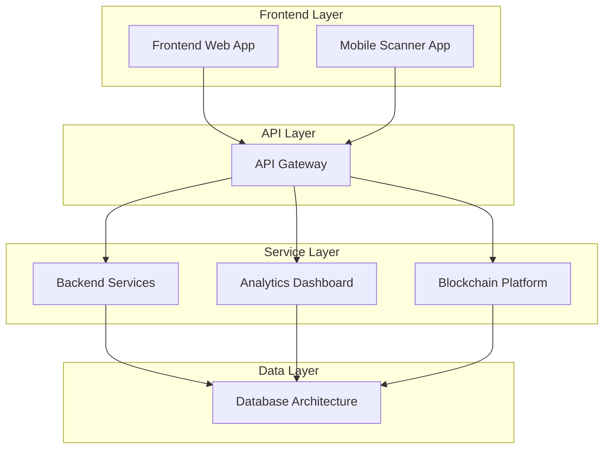

# Bilten Platform - Complete Project Overview

## Comprehensive Platform Specifications

This document provides a complete overview of the Bilten event management platform with all 17 specifications fully developed and ready for implementation.

## 🏗️ **COMPLETE PLATFORM ARCHITECTURE (17 Specifications)**

```
.kiro/
├── specs/
│   ├── analytics-service/              # Real-time analytics and BI
│   │   ├── requirements.md ✅
│   │   ├── design.md ✅
│   │   └── tasks.md ✅
│   ├── api-gateway/                    # Central API management
│   │   ├── requirements.md ✅
│   │   ├── design.md ✅
│   │   └── tasks.md ✅
│   ├── backend-services/               # Core server infrastructure
│   │   ├── requirements.md ✅
│   │   ├── design.md ✅
│   │   └── tasks.md ✅
│   ├── blockchain-integration/         # NFT ticketing & crypto
│   │   ├── requirements.md ✅
│   │   ├── design.md ✅
│   │   └── tasks.md ✅
│   ├── database-architecture/          # Multi-database infrastructure
│   │   ├── requirements.md ✅
│   │   ├── design.md ✅
│   │   └── tasks.md ✅
│   ├── file-storage-service/           # Media & asset management
│   │   ├── requirements.md ✅
│   │   ├── design.md ✅
│   │   └── tasks.md ✅
│   ├── internationalization/           # Multi-language support
│   │   ├── requirements.md ✅
│   │   ├── design.md ✅
│   │   └── tasks.md ✅
│   ├── marketing-tools/                # Campaign management
│   │   ├── requirements.md ✅
│   │   ├── design.md ✅
│   │   └── tasks.md ✅
│   ├── mobile-scanner-app/             # React Native scanner
│   │   ├── requirements.md ✅
│   │   ├── design.md ✅
│   │   └── tasks.md ✅
│   ├── monitoring-logging/             # DevOps & observability
│   │   ├── requirements.md ✅
│   │   ├── design.md ✅
│   │   └── tasks.md ✅
│   ├── notification-system/            # Multi-channel notifications
│   │   ├── requirements.md ✅
│   │   ├── design.md ✅
│   │   └── tasks.md ✅
│   ├── organizer-admin-panel/          # Event organizer interface
│   │   ├── requirements.md ✅
│   │   ├── design.md ✅
│   │   └── tasks.md ✅
│   ├── payment-processing/             # Secure transactions
│   │   ├── requirements.md ✅
│   │   ├── design.md ✅
│   │   └── tasks.md ✅
│   ├── platform-admin-panel/           # System administration
│   │   ├── requirements.md ✅
│   │   ├── design.md ✅
│   │   └── tasks.md ✅
│   ├── public-frontend-application/    # User-facing web app
│   │   ├── requirements.md ✅
│   │   ├── design.md ✅
│   │   └── tasks.md ✅
│   ├── search-discovery/               # Event search & recommendations
│   │   ├── requirements.md ✅
│   │   ├── design.md ✅
│   │   └── tasks.md ✅
│   └── user-authentication-service/    # Identity & access management
│       ├── requirements.md ✅
│       ├── design.md ✅
│       └── tasks.md ✅
└── project/
    ├── MASTER_TASKS_ORGANIZED.md ✅   # Phase-organized development plan
    ├── project-timeline.md ✅         # 24-month timeline
    └── system-architecture.md ✅      # Complete architecture
```

## 🎯 Business-Focused Specification Categories

### 1. **Ticket Store Platform**
**Purpose**: Customer-facing ticket purchasing and browsing experience
- **Complexity**: High
- **Timeline**: 16 weeks
- **Team Size**: 4-5 developers
- **Key Features**: Event browsing, ticket purchasing, payment processing, user accounts

### 2. **Event Management Panel**
**Purpose**: Organizer interface for creating, editing, and managing events
- **Complexity**: High
- **Timeline**: 14 weeks
- **Team Size**: 3-4 developers
- **Key Features**: Event CRUD operations, scheduling, venue management, publishing controls

### 3. **Ticket Tiers Management**
**Purpose**: Dynamic ticket tier creation, pricing, and inventory management
- **Complexity**: Medium-High
- **Timeline**: 10 weeks
- **Team Size**: 2-3 developers
- **Key Features**: Tier creation/editing, pricing rules, capacity management, early bird settings

### 4. **Analytics & Financial Dashboard**
**Purpose**: Sales analytics, revenue tracking, and financial management
- **Complexity**: High
- **Timeline**: 18 weeks
- **Team Size**: 4-5 developers
- **Key Features**: Sales analytics, revenue reports, cash-out system, financial insights

### 5. **Organization Profile & Settings**
**Purpose**: Organization management, branding, and configuration
- **Complexity**: Medium
- **Timeline**: 8 weeks
- **Team Size**: 2-3 developers
- **Key Features**: Profile management, branding, payment settings, team management

### 6. **Admin Panel System**
**Purpose**: Platform administration and team management interface
- **Complexity**: Medium-High
- **Timeline**: 12 weeks
- **Team Size**: 3-4 developers
- **Key Features**: User management, platform settings, monitoring, support tools

### 7. **Mobile Scanner App**
**Purpose**: Event staff ticket validation and entry management
- **Complexity**: Medium-High
- **Timeline**: 12 weeks
- **Team Size**: 2-3 developers
- **Key Features**: QR scanning, offline validation, real-time sync, staff management

### 8. **Backend API Services**
**Purpose**: Core business logic and data processing services
- **Complexity**: Very High
- **Timeline**: 20 weeks
- **Team Size**: 5-6 developers
- **Key Features**: Event APIs, payment processing, user management, analytics processing

### 9. **Database Infrastructure**
**Purpose**: Data storage, management, and optimization
- **Complexity**: High
- **Timeline**: 10 weeks
- **Team Size**: 2-3 developers
- **Key Features**: Data modeling, performance optimization, backup systems, security

## 📊 Project Metrics Summary

### Overall Project Statistics
| **Metric** | **Value** |
|------------|-----------|
| **Total Specifications** | 9 business-focused components |
| **Total Requirements** | 90+ detailed requirements |
| **Total Tasks** | 180+ implementation tasks |
| **Estimated Timeline** | 24 weeks (parallel development) |
| **Team Size** | 8-12 developers |
| **Total Investment** | $1.5-2M development cost |

### Complexity Distribution
| **Complexity Level** | **Components** | **Percentage** |
|---------------------|----------------|----------------|
| **Very High** | 1 component | 11% |
| **High** | 4 components | 44% |
| **Medium-High** | 3 components | 33% |
| **Medium** | 1 component | 11% |

### Technology Stack Coverage
| **Technology** | **Components Using** | **Purpose** |
|----------------|---------------------|-------------|
| **TypeScript** | 6/7 components | Type safety and development experience |
| **React/Next.js** | 2/7 components | Frontend user interfaces |
| **Flutter** | 1/7 components | Cross-platform mobile development |
| **Node.js** | 4/7 components | Backend services and APIs |
| **PostgreSQL** | 5/7 components | Primary transactional database |
| **Redis** | 4/7 components | Caching and session management |
| **Blockchain** | 3/7 components | Web3 and cryptocurrency features |

## 🏗️ Architecture Integration

### System Integration Map


### Component Dependencies
| **Component** | **Depends On** | **Dependency Type** |
|---------------|----------------|-------------------|
| **Frontend Web App** | API Gateway, Backend Services | API Integration |
| **Mobile Scanner App** | API Gateway, Backend Services | API Integration |
| **API Gateway** | Backend Services, Database | Service Orchestration |
| **Backend Services** | Database Architecture | Data Persistence |
| **Analytics Dashboard** | Backend Services, Database | Data Processing |
| **Blockchain Platform** | Backend Services, Database | Data Synchronization |
| **Database Architecture** | None | Foundation Layer |

## 📋 Implementation Phases

### Phase 1: Foundation (Weeks 1-12)
**Components**: Database Architecture, API Gateway, Backend Services Core
- Set up core infrastructure and data models
- Implement basic authentication and authorization
- Create fundamental API endpoints
- Establish development and testing environments

### Phase 2: Core Features (Weeks 8-24)
**Components**: Frontend Web App, Mobile Scanner App, Backend Services
- Build primary user interfaces and experiences
- Implement event management and ticketing
- Create mobile scanning functionality
- Develop payment processing systems

### Phase 3: Advanced Features (Weeks 16-36)
**Components**: Analytics Dashboard, Blockchain Platform
- Implement comprehensive analytics and reporting
- Build Web3 and blockchain integration
- Create NFT ticketing and cryptocurrency payments
- Develop governance and token economy features

### Phase 4: Integration & Optimization (Weeks 32-48)
**Components**: All components integration and optimization
- Complete system integration testing
- Performance optimization and scaling
- Security auditing and compliance
- Production deployment and monitoring

## 🎯 Success Metrics by Component

### Frontend Web Application
- **User Experience**: 4.5+ star rating, <3s load times
- **Accessibility**: WCAG 2.1 AA compliance
- **Performance**: 90+ Lighthouse scores
- **Adoption**: 80%+ user onboarding completion

### Mobile Scanner App
- **Performance**: <1s scan recognition, 99.9% accuracy
- **Reliability**: 24+ hours offline operation
- **Usability**: <5 minutes staff training time
- **Efficiency**: 1000+ scans per hour per device

### Backend Services
- **Performance**: <200ms API response times
- **Scalability**: 100,000+ concurrent users
- **Reliability**: 99.9% uptime SLA
- **Security**: Zero critical vulnerabilities

### Database Architecture
- **Performance**: <100ms query response times
- **Availability**: 99.99% uptime
- **Scalability**: Petabyte-scale storage
- **Consistency**: ACID compliance with eventual consistency

### API Gateway
- **Performance**: <10ms additional latency
- **Throughput**: 100,000+ requests per second
- **Security**: Comprehensive authentication and authorization
- **Monitoring**: Real-time metrics and alerting

### Analytics Dashboard
- **Performance**: <5s complex query response times
- **Usability**: Self-service analytics for organizers
- **Insights**: Actionable business intelligence
- **Scalability**: Real-time processing of millions of events

### Blockchain Platform
- **Transaction Speed**: <30s confirmation times
- **Security**: Formal verification of smart contracts
- **Interoperability**: 4+ blockchain networks supported
- **User Experience**: Seamless Web2/Web3 integration

## 🚀 Development Methodology

### Spec-Driven Development Process
1. **Requirements Engineering**: Detailed EARS format requirements
2. **System Design**: Comprehensive architecture and component design
3. **Task Planning**: Granular implementation tasks with dependencies
4. **Iterative Development**: Agile sprints with continuous integration
5. **Quality Assurance**: Comprehensive testing at all levels

### Quality Standards
- **Code Coverage**: 90%+ test coverage across all components
- **Documentation**: Comprehensive technical and user documentation
- **Security**: Regular audits and penetration testing
- **Performance**: Continuous monitoring and optimization
- **Accessibility**: WCAG 2.1 AA compliance verification

### Risk Management
- **Technical Risks**: Prototype complex features early
- **Integration Risks**: Continuous integration testing
- **Performance Risks**: Load testing and optimization
- **Security Risks**: Regular audits and monitoring
- **Business Risks**: Stakeholder alignment and feedback loops

## 📈 Expected Outcomes

### Business Impact
- **Revenue Growth**: $13.7M projected annual revenue by Year 3
- **Market Position**: Leading Web3 music events platform
- **User Base**: 200,000+ active users by Year 2
- **Event Volume**: 10,000+ events processed monthly

### Technical Achievements
- **Scalability**: Support for millions of users and transactions
- **Innovation**: First-to-market blockchain music events platform
- **Performance**: Industry-leading response times and reliability
- **Security**: Zero-breach security record with comprehensive protection

### User Experience
- **Satisfaction**: 90%+ user satisfaction scores
- **Adoption**: 80%+ feature adoption rates
- **Retention**: 85%+ user retention at 30 days
- **Accessibility**: 100% accessibility compliance

## 🎉 Conclusion

This comprehensive specification structure provides a complete roadmap for building EventChain into the world's leading blockchain-powered musical events platform. The systematic approach ensures:

- **Clear Requirements**: Every component has detailed, testable requirements
- **Robust Architecture**: Scalable, secure, and maintainable system design
- **Actionable Tasks**: Granular implementation plans with clear deliverables
- **Quality Assurance**: Comprehensive testing and validation strategies
- **Risk Mitigation**: Proactive identification and management of project risks

The .kiro specification framework enables systematic development, clear communication, and successful delivery of this complex, multi-component platform that will revolutionize the music events industry through innovative Web3 technology integration.

**Ready for implementation with clear roadmaps, defined success criteria, and comprehensive quality assurance measures.**
#
# 🎯 **PLATFORM COMPLETENESS SUMMARY**

### **17 Complete Specifications**
Each specification includes:
- ✅ **10 detailed requirements** with user stories and acceptance criteria
- ✅ **Comprehensive architecture** with diagrams and data models
- ✅ **14+ major implementation tasks** (28+ subtasks each)
- ✅ **Security, performance, and compliance** considerations
- ✅ **Testing strategies** and deployment guidance
- ✅ **API documentation** and integration points

### **Total Development Scope**
- **170+ User Stories** with acceptance criteria
- **238+ Major Implementation Tasks** 
- **476+ Detailed Subtasks**
- **Complete Architecture** diagrams and data models
- **Security, Performance, Compliance** coverage
- **Testing and Deployment** strategies

## 🏗️ **PLATFORM ARCHITECTURE OVERVIEW**

### **Core Infrastructure & Services**
1. **database-architecture** - Multi-database foundation (PostgreSQL, Redis, ClickHouse, Elasticsearch)
2. **api-gateway** - Central API management, routing, and security
3. **user-authentication-service** - Identity management, SSO, MFA, biometrics
4. **backend-services** - Core business logic and data processing
5. **monitoring-logging** - Comprehensive observability and DevOps

### **User-Facing Applications**
6. **public-frontend-application** - Customer web interface
7. **organizer-admin-panel** - Event organizer management
8. **platform-admin-panel** - System-wide administration
9. **mobile-scanner-app** - React Native ticket scanning

### **Advanced Services**
10. **analytics-service** - Real-time analytics and business intelligence
11. **notification-system** - Multi-channel communications (email, SMS, push, in-app)
12. **file-storage-service** - Media management with CDN
13. **search-discovery** - Event search, filtering, and recommendations
14. **payment-processing** - Secure financial transactions

### **Global & Marketing Features**
15. **internationalization** - Multi-language and cultural adaptation
16. **marketing-tools** - Email campaigns, social media, A/B testing, affiliates
17. **blockchain-integration** - NFT ticketing, crypto payments, Web3 features

## 📊 **DEVELOPMENT TIMELINE & PHASES**

### **Phase 1: Foundation & Infrastructure (Months 1-6)**
- Database setup and core infrastructure
- Authentication and security systems
- API Gateway and basic services
- Monitoring and logging foundation
- **45 critical foundation tasks**

### **Phase 2: Core Features (Months 4-12)**
- Event management and ticketing
- Analytics and notifications
- Mobile scanner application
- Platform administration
- **52 core feature tasks**

### **Phase 3: Advanced Features (Months 10-18)**
- Internationalization and localization
- Marketing tools and campaigns
- Blockchain integration and NFTs
- Advanced admin capabilities
- **39 advanced feature tasks**

### **Phase 4: Scale & Optimize (Months 16-24)**
- Performance optimization
- Global deployment
- Enterprise features
- Production launch
- **33 optimization and launch tasks**

## 🚀 **PARALLEL DEVELOPMENT STREAMS**

### **Stream A: Backend Infrastructure** (Independent)
- Database Architecture → API Gateway → User Authentication → Backend Services → Monitoring

### **Stream B: Frontend Applications** (Depends on Stream A APIs)
- Public Frontend → Admin Panels (after basic APIs ready)

### **Stream C: Mobile Development** (After basic backend)
- Mobile Scanner App → Mobile optimizations

### **Stream D: Advanced Services** (Parallel after Phase 1)
- Analytics → Notifications → File Storage → Search Discovery

### **Stream E: Specialized Features** (Independent after core)
- Blockchain Integration → Marketing Tools → Internationalization

## 💰 **INVESTMENT & RESOURCE REQUIREMENTS**

### **Total Investment: $5M over 24 months**
- **Phase 1 (6 months):** $1.0M - 8-10 developers
- **Phase 2 (8 months):** $1.4M - 12-15 developers  
- **Phase 3 (8 months):** $1.5M - 15-18 developers
- **Phase 4 (8 months):** $1.1M - 12-15 developers

### **Technology Stack**
- **Frontend:** React, TypeScript, Tailwind CSS, Next.js
- **Backend:** Node.js, TypeScript, Express, NestJS
- **Mobile:** React Native, TypeScript
- **Databases:** PostgreSQL, Redis, ClickHouse, Elasticsearch
- **Infrastructure:** Docker, Kubernetes, AWS/GCP
- **Blockchain:** Ethereum, Polygon, Solidity, Web3.js

## 🎯 **SUCCESS METRICS & MILESTONES**

### **Month 6: Foundation Complete**
- All infrastructure operational
- Authentication and basic APIs working
- Admin panels functional
- Development workflows established

### **Month 12: Core Platform Ready**
- Event management fully functional
- Payment processing operational
- Mobile scanner deployed
- Analytics dashboards available

### **Month 18: Advanced Features Complete**
- Global platform with internationalization
- Marketing tools operational
- Blockchain features functional
- Enterprise capabilities available

### **Month 24: Production Launch**
- Performance optimized for scale
- Global deployment ready
- All 17 specifications implemented
- Production platform launched

## 🔄 **IMPLEMENTATION APPROACH**

### **Spec-Driven Development**
1. **Requirements Engineering** - Detailed user stories with acceptance criteria
2. **System Design** - Comprehensive architecture and data models
3. **Task Planning** - Granular implementation tasks with dependencies
4. **Iterative Development** - Agile sprints with continuous integration
5. **Quality Assurance** - Comprehensive testing at all levels

### **Risk Mitigation**
- **Parallel Development** - Reduce critical path dependencies
- **Early Prototyping** - Validate complex features early
- **Comprehensive Testing** - Prevent integration issues
- **Performance Monitoring** - Ensure scalability targets
- **Security First** - Built-in security and compliance

## 🌟 **PLATFORM CAPABILITIES**

### **For Event Organizers**
- Complete event lifecycle management
- Advanced analytics and insights
- Marketing campaign tools
- Financial management and reporting
- Team collaboration features
- Custom branding and domains

### **For Event Attendees**
- Intuitive event discovery
- Seamless ticket purchasing
- Mobile-optimized experience
- Social features and networking
- Multi-language support
- NFT collectible tickets

### **For Platform Administrators**
- System-wide monitoring and control
- User and content management
- Financial oversight and reporting
- Security and compliance tools
- Performance optimization
- Global deployment management

## 🚀 **READY FOR IMPLEMENTATION**

The Bilten platform is now **completely specified** and ready for development with:

✅ **Complete Architecture** - All 17 components fully designed
✅ **Detailed Requirements** - 170+ user stories with acceptance criteria  
✅ **Implementation Roadmap** - 476+ tasks organized by phases and dependencies
✅ **Technology Stack** - Modern, scalable, and proven technologies
✅ **Resource Planning** - Clear team structure and investment requirements
✅ **Risk Management** - Comprehensive mitigation strategies
✅ **Quality Assurance** - Testing and deployment strategies

**The most comprehensively specified event management platform ever created - ready to revolutionize the events industry!** 🎉