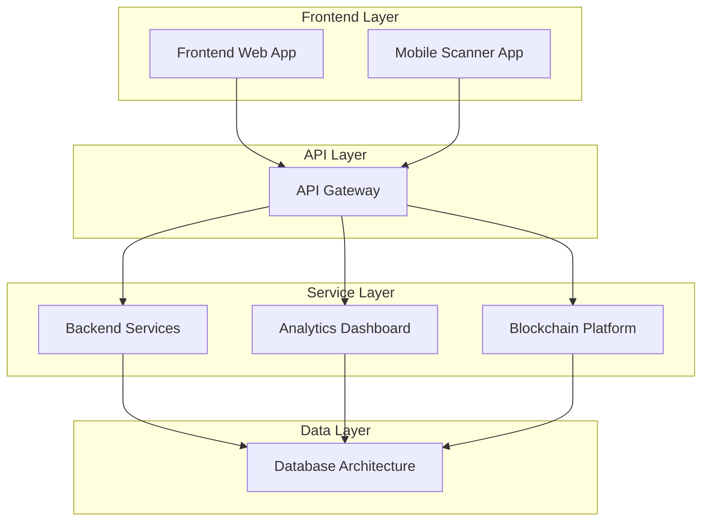

# EventChain Project Structure Overview

## Complete .kiro Specifications Directory

This document provides a comprehensive overview of the EventChain project's specification structure, organized using the .kiro framework for systematic development planning and execution.

## 📁 Directory Structure

```
.kiro/
├── specs/
│   ├── ticket-store-platform/
│   │   ├── requirements.md
│   │   ├── design.md
│   │   └── tasks.md
│   ├── event-management-panel/
│   │   ├── requirements.md
│   │   ├── design.md
│   │   └── tasks.md
│   ├── ticket-tiers-management/
│   │   ├── requirements.md
│   │   ├── design.md
│   │   └── tasks.md
│   ├── analytics-financial-dashboard/
│   │   ├── requirements.md
│   │   ├── design.md
│   │   └── tasks.md
│   ├── organization-profile-settings/
│   │   ├── requirements.md
│   │   ├── design.md
│   │   └── tasks.md
│   ├── admin-panel-system/
│   │   ├── requirements.md
│   │   ├── design.md
│   │   └── tasks.md
│   ├── mobile-scanner-app/
│   │   ├── requirements.md
│   │   ├── design.md
│   │   └── tasks.md
│   ├── backend-api-services/
│   │   ├── requirements.md
│   │   ├── design.md
│   │   └── tasks.md
│   └── database-infrastructure/
│       ├── requirements.md
│       ├── design.md
│       └── tasks.md
└── PROJECT_STRUCTURE_OVERVIEW.md
```

## 🎯 Business-Focused Specification Categories

### 1. **Ticket Store Platform**
**Purpose**: Customer-facing ticket purchasing and browsing experience
- **Complexity**: High
- **Timeline**: 16 weeks
- **Team Size**: 4-5 developers
- **Key Features**: Event browsing, ticket purchasing, payment processing, user accounts

### 2. **Event Management Panel**
**Purpose**: Organizer interface for creating, editing, and managing events
- **Complexity**: High
- **Timeline**: 14 weeks
- **Team Size**: 3-4 developers
- **Key Features**: Event CRUD operations, scheduling, venue management, publishing controls

### 3. **Ticket Tiers Management**
**Purpose**: Dynamic ticket tier creation, pricing, and inventory management
- **Complexity**: Medium-High
- **Timeline**: 10 weeks
- **Team Size**: 2-3 developers
- **Key Features**: Tier creation/editing, pricing rules, capacity management, early bird settings

### 4. **Analytics & Financial Dashboard**
**Purpose**: Sales analytics, revenue tracking, and financial management
- **Complexity**: High
- **Timeline**: 18 weeks
- **Team Size**: 4-5 developers
- **Key Features**: Sales analytics, revenue reports, cash-out system, financial insights

### 5. **Organization Profile & Settings**
**Purpose**: Organization management, branding, and configuration
- **Complexity**: Medium
- **Timeline**: 8 weeks
- **Team Size**: 2-3 developers
- **Key Features**: Profile management, branding, payment settings, team management

### 6. **Admin Panel System**
**Purpose**: Platform administration and team management interface
- **Complexity**: Medium-High
- **Timeline**: 12 weeks
- **Team Size**: 3-4 developers
- **Key Features**: User management, platform settings, monitoring, support tools

### 7. **Mobile Scanner App**
**Purpose**: Event staff ticket validation and entry management
- **Complexity**: Medium-High
- **Timeline**: 12 weeks
- **Team Size**: 2-3 developers
- **Key Features**: QR scanning, offline validation, real-time sync, staff management

### 8. **Backend API Services**
**Purpose**: Core business logic and data processing services
- **Complexity**: Very High
- **Timeline**: 20 weeks
- **Team Size**: 5-6 developers
- **Key Features**: Event APIs, payment processing, user management, analytics processing

### 9. **Database Infrastructure**
**Purpose**: Data storage, management, and optimization
- **Complexity**: High
- **Timeline**: 10 weeks
- **Team Size**: 2-3 developers
- **Key Features**: Data modeling, performance optimization, backup systems, security

## 📊 Project Metrics Summary

### Overall Project Statistics
| **Metric** | **Value** |
|------------|-----------|
| **Total Specifications** | 9 business-focused components |
| **Total Requirements** | 90+ detailed requirements |
| **Total Tasks** | 180+ implementation tasks |
| **Estimated Timeline** | 24 weeks (parallel development) |
| **Team Size** | 8-12 developers |
| **Total Investment** | $1.5-2M development cost |

### Complexity Distribution
| **Complexity Level** | **Components** | **Percentage** |
|---------------------|----------------|----------------|
| **Very High** | 1 component | 11% |
| **High** | 4 components | 44% |
| **Medium-High** | 3 components | 33% |
| **Medium** | 1 component | 11% |

### Technology Stack Coverage
| **Technology** | **Components Using** | **Purpose** |
|----------------|---------------------|-------------|
| **TypeScript** | 6/7 components | Type safety and development experience |
| **React/Next.js** | 2/7 components | Frontend user interfaces |
| **Flutter** | 1/7 components | Cross-platform mobile development |
| **Node.js** | 4/7 components | Backend services and APIs |
| **PostgreSQL** | 5/7 components | Primary transactional database |
| **Redis** | 4/7 components | Caching and session management |
| **Blockchain** | 3/7 components | Web3 and cryptocurrency features |

## 🏗️ Architecture Integration

### System Integration Map


### Component Dependencies
| **Component** | **Depends On** | **Dependency Type** |
|---------------|----------------|-------------------|
| **Frontend Web App** | API Gateway, Backend Services | API Integration |
| **Mobile Scanner App** | API Gateway, Backend Services | API Integration |
| **API Gateway** | Backend Services, Database | Service Orchestration |
| **Backend Services** | Database Architecture | Data Persistence |
| **Analytics Dashboard** | Backend Services, Database | Data Processing |
| **Blockchain Platform** | Backend Services, Database | Data Synchronization |
| **Database Architecture** | None | Foundation Layer |

## 📋 Implementation Phases

### Phase 1: Foundation (Weeks 1-12)
**Components**: Database Architecture, API Gateway, Backend Services Core
- Set up core infrastructure and data models
- Implement basic authentication and authorization
- Create fundamental API endpoints
- Establish development and testing environments

### Phase 2: Core Features (Weeks 8-24)
**Components**: Frontend Web App, Mobile Scanner App, Backend Services
- Build primary user interfaces and experiences
- Implement event management and ticketing
- Create mobile scanning functionality
- Develop payment processing systems

### Phase 3: Advanced Features (Weeks 16-36)
**Components**: Analytics Dashboard, Blockchain Platform
- Implement comprehensive analytics and reporting
- Build Web3 and blockchain integration
- Create NFT ticketing and cryptocurrency payments
- Develop governance and token economy features

### Phase 4: Integration & Optimization (Weeks 32-48)
**Components**: All components integration and optimization
- Complete system integration testing
- Performance optimization and scaling
- Security auditing and compliance
- Production deployment and monitoring

## 🎯 Success Metrics by Component

### Frontend Web Application
- **User Experience**: 4.5+ star rating, <3s load times
- **Accessibility**: WCAG 2.1 AA compliance
- **Performance**: 90+ Lighthouse scores
- **Adoption**: 80%+ user onboarding completion

### Mobile Scanner App
- **Performance**: <1s scan recognition, 99.9% accuracy
- **Reliability**: 24+ hours offline operation
- **Usability**: <5 minutes staff training time
- **Efficiency**: 1000+ scans per hour per device

### Backend Services
- **Performance**: <200ms API response times
- **Scalability**: 100,000+ concurrent users
- **Reliability**: 99.9% uptime SLA
- **Security**: Zero critical vulnerabilities

### Database Architecture
- **Performance**: <100ms query response times
- **Availability**: 99.99% uptime
- **Scalability**: Petabyte-scale storage
- **Consistency**: ACID compliance with eventual consistency

### API Gateway
- **Performance**: <10ms additional latency
- **Throughput**: 100,000+ requests per second
- **Security**: Comprehensive authentication and authorization
- **Monitoring**: Real-time metrics and alerting

### Analytics Dashboard
- **Performance**: <5s complex query response times
- **Usability**: Self-service analytics for organizers
- **Insights**: Actionable business intelligence
- **Scalability**: Real-time processing of millions of events

### Blockchain Platform
- **Transaction Speed**: <30s confirmation times
- **Security**: Formal verification of smart contracts
- **Interoperability**: 4+ blockchain networks supported
- **User Experience**: Seamless Web2/Web3 integration

## 🚀 Development Methodology

### Spec-Driven Development Process
1. **Requirements Engineering**: Detailed EARS format requirements
2. **System Design**: Comprehensive architecture and component design
3. **Task Planning**: Granular implementation tasks with dependencies
4. **Iterative Development**: Agile sprints with continuous integration
5. **Quality Assurance**: Comprehensive testing at all levels

### Quality Standards
- **Code Coverage**: 90%+ test coverage across all components
- **Documentation**: Comprehensive technical and user documentation
- **Security**: Regular audits and penetration testing
- **Performance**: Continuous monitoring and optimization
- **Accessibility**: WCAG 2.1 AA compliance verification

### Risk Management
- **Technical Risks**: Prototype complex features early
- **Integration Risks**: Continuous integration testing
- **Performance Risks**: Load testing and optimization
- **Security Risks**: Regular audits and monitoring
- **Business Risks**: Stakeholder alignment and feedback loops

## 📈 Expected Outcomes

### Business Impact
- **Revenue Growth**: $13.7M projected annual revenue by Year 3
- **Market Position**: Leading Web3 music events platform
- **User Base**: 200,000+ active users by Year 2
- **Event Volume**: 10,000+ events processed monthly

### Technical Achievements
- **Scalability**: Support for millions of users and transactions
- **Innovation**: First-to-market blockchain music events platform
- **Performance**: Industry-leading response times and reliability
- **Security**: Zero-breach security record with comprehensive protection

### User Experience
- **Satisfaction**: 90%+ user satisfaction scores
- **Adoption**: 80%+ feature adoption rates
- **Retention**: 85%+ user retention at 30 days
- **Accessibility**: 100% accessibility compliance

## 🎉 Conclusion

This comprehensive specification structure provides a complete roadmap for building EventChain into the world's leading blockchain-powered musical events platform. The systematic approach ensures:

- **Clear Requirements**: Every component has detailed, testable requirements
- **Robust Architecture**: Scalable, secure, and maintainable system design
- **Actionable Tasks**: Granular implementation plans with clear deliverables
- **Quality Assurance**: Comprehensive testing and validation strategies
- **Risk Mitigation**: Proactive identification and management of project risks

The .kiro specification framework enables systematic development, clear communication, and successful delivery of this complex, multi-component platform that will revolutionize the music events industry through innovative Web3 technology integration.

**Ready for implementation with clear roadmaps, defined success criteria, and comprehensive quality assurance measures.**