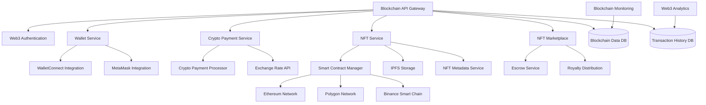

# Blockchain Integration Design Document

## Overview

The Blockchain Integration system provides comprehensive Web3 capabilities for the Bilten platform, including NFT ticketing, cryptocurrency payments, smart contract management, and decentralized marketplace features. The system uses a hybrid architecture that bridges traditional web services with blockchain networks while maintaining security, scalability, and user experience standards.

## Architecture



## Components and Interfaces

### Blockchain API Gateway
- **Purpose**: Central API for all blockchain operations and Web3 interactions
- **Key Methods**:
  - `connectWallet(walletType, signature)`
  - `processPayment(amount, currency, recipient)`
  - `mintNFT(eventId, ticketData, metadata)`
  - `listNFTForSale(tokenId, price, currency)`

### Web3 Authentication Service
- **Purpose**: Handle wallet connections and signature-based authentication
- **Key Methods**:
  - `verifyWalletSignature(address, signature, message)`
  - `generateAuthChallenge(address)`
  - `linkWalletToUser(userId, walletAddress)`
  - `getWalletProfile(address)`

### Smart Contract Manager
- **Purpose**: Deploy and interact with smart contracts across multiple blockchains
- **Key Methods**:
  - `deployTicketContract(eventData, royaltyInfo)`
  - `mintTicket(contractAddress, recipient, tokenURI)`
  - `transferTicket(contractAddress, tokenId, from, to)`
  - `setRoyalties(contractAddress, percentage, recipient)`

### NFT Metadata Service
- **Purpose**: Generate and manage NFT metadata with IPFS storage
- **Key Methods**:
  - `generateMetadata(eventData, ticketInfo, branding)`
  - `uploadToIPFS(metadata, image)`
  - `updateMetadata(tokenId, newMetadata)`
  - `getMetadataFromIPFS(ipfsHash)`

### Crypto Payment Processor
- **Purpose**: Handle cryptocurrency payments with multi-chain support
- **Key Methods**:
  - `createPaymentRequest(amount, currency, recipient)`
  - `monitorPayment(transactionHash, network)`
  - `processRefund(originalTxHash, amount, recipient)`
  - `getExchangeRate(fromCurrency, toCurrency)`

### NFT Marketplace Service
- **Purpose**: Facilitate NFT ticket trading with escrow and royalty management
- **Key Methods**:
  - `listTicketForSale(tokenId, price, currency)`
  - `purchaseTicket(listingId, buyerAddress)`
  - `cancelListing(listingId, sellerAddress)`
  - `distributeRoyalties(saleAmount, royaltyInfo)`

## Data Models

### NFT Ticket Model
```typescript
interface NFTTicket {
  tokenId: string;
  contractAddress: string;
  network: 'ethereum' | 'polygon' | 'bsc';
  
  // Event information
  eventId: string;
  eventName: string;
  eventDate: Date;
  venue: string;
  
  // Ticket information
  seatNumber?: string;
  ticketType: string;
  originalPrice: number;
  currency: string;
  
  // NFT metadata
  tokenURI: string;
  ipfsHash: string;
  imageUrl: string;
  attributes: NFTAttribute[];
  
  // Ownership
  currentOwner: string;
  originalOwner: string;
  transferHistory: TransferRecord[];
  
  // Marketplace
  isListed: boolean;
  listingPrice?: number;
  listingCurrency?: string;
  
  // Utility features
  utilities: TicketUtility[];
  
  createdAt: Date;
  updatedAt: Date;
}

interface NFTAttribute {
  trait_type: string;
  value: string | number;
  display_type?: 'number' | 'date' | 'boost_percentage' | 'boost_number';
}

interface TicketUtility {
  type: 'discount' | 'exclusive_access' | 'merchandise' | 'vip_upgrade';
  description: string;
  value?: number;
  isUsed: boolean;
  usedAt?: Date;
}
```

### Smart Contract Model
```typescript
interface SmartContract {
  id: string;
  address: string;
  network: 'ethereum' | 'polygon' | 'bsc';
  type: 'ticket_nft' | 'marketplace' | 'royalty';
  
  // Contract details
  name: string;
  symbol: string;
  version: string;
  abi: any[];
  
  // Deployment info
  deployedBy: string;
  deploymentTxHash: string;
  deployedAt: Date;
  gasUsed: number;
  
  // Event association
  eventId?: string;
  organizerId?: string;
  
  // Configuration
  royaltyPercentage: number;
  royaltyRecipient: string;
  maxSupply?: number;
  currentSupply: number;
  
  // Status
  isActive: boolean;
  isPaused: boolean;
  
  createdAt: Date;
  updatedAt: Date;
}
```

### Crypto Payment Model
```typescript
interface CryptoPayment {
  id: string;
  orderId: string;
  userId: string;
  
  // Payment details
  amount: number;
  currency: 'ETH' | 'BTC' | 'USDC' | 'USDT' | 'MATIC';
  fiatAmount: number;
  fiatCurrency: string;
  exchangeRate: number;
  
  // Blockchain details
  network: string;
  transactionHash?: string;
  blockNumber?: number;
  confirmations: number;
  requiredConfirmations: number;
  
  // Addresses
  fromAddress: string;
  toAddress: string;
  
  // Status
  status: 'pending' | 'confirming' | 'confirmed' | 'failed' | 'refunded';
  
  // Gas information
  gasPrice?: number;
  gasUsed?: number;
  gasFee?: number;
  
  // Timestamps
  createdAt: Date;
  confirmedAt?: Date;
  expiresAt: Date;
}
```

### Wallet Connection Model
```typescript
interface WalletConnection {
  id: string;
  userId: string;
  
  // Wallet details
  address: string;
  walletType: 'metamask' | 'walletconnect' | 'coinbase' | 'trust';
  network: string;
  
  // Authentication
  signature: string;
  message: string;
  signedAt: Date;
  
  // Status
  isActive: boolean;
  isPrimary: boolean;
  
  // Metadata
  ensName?: string;
  balance?: Record<string, number>;
  lastSyncAt?: Date;
  
  createdAt: Date;
  updatedAt: Date;
}
```

## Error Handling

### Blockchain Errors
- **InsufficientFundsError**: When wallet lacks funds for transaction
- **TransactionFailedError**: When blockchain transaction fails
- **NetworkCongestionError**: When network is congested and gas prices are high
- **SmartContractError**: When smart contract execution fails
- **WalletConnectionError**: When wallet connection or signature fails

### NFT Errors
- **TokenNotFoundError**: When NFT token doesn't exist
- **UnauthorizedTransferError**: When user doesn't own the NFT
- **MetadataUploadError**: When IPFS upload fails
- **ContractDeploymentError**: When smart contract deployment fails

### Error Response Format
```json
{
  "error": {
    "code": "INSUFFICIENT_FUNDS",
    "message": "Wallet has insufficient funds for transaction",
    "details": "Required: 0.1 ETH, Available: 0.05 ETH",
    "timestamp": "2024-01-15T10:30:00Z",
    "transactionHash": "0x123...",
    "network": "ethereum"
  }
}
```

## Testing Strategy

### Unit Testing
- Smart contract function testing
- Wallet signature verification
- NFT metadata generation
- Payment processing logic
- Marketplace transaction handling

### Integration Testing
- Multi-chain smart contract deployment
- IPFS metadata storage and retrieval
- Wallet provider integration
- Exchange rate API integration
- Blockchain network interaction

### Security Testing
- Smart contract security audits
- Wallet signature validation
- Private key handling security
- Transaction replay protection
- Access control verification

### Performance Testing
- High-volume NFT minting
- Concurrent marketplace transactions
- Multi-chain transaction processing
- IPFS upload performance
- Gas optimization validation

## Security Considerations

### Smart Contract Security
- Comprehensive security audits
- Reentrancy attack protection
- Access control mechanisms
- Upgrade patterns and governance
- Emergency pause functionality

### Wallet Security
- Secure signature verification
- Private key never stored
- Session management
- Multi-signature support
- Hardware wallet integration

### Transaction Security
- Transaction validation
- Gas limit protection
- MEV protection strategies
- Slippage protection
- Front-running prevention

## Performance Optimization

### Blockchain Optimization
- Gas optimization strategies
- Batch transaction processing
- Layer 2 scaling solutions
- Cross-chain bridge integration
- Transaction priority management

### Data Optimization
- Blockchain data caching
- IPFS content caching
- Metadata compression
- Efficient smart contract design
- Off-chain computation where possible

### User Experience Optimization
- Progressive Web3 onboarding
- Gasless transactions for users
- Transaction status tracking
- Mobile wallet optimization
- Fallback to traditional payments

## API Endpoints

### Wallet Operations
```
POST /api/web3/wallet/connect
POST /api/web3/wallet/disconnect
GET /api/web3/wallet/balance
GET /api/web3/wallet/transactions
```

### NFT Operations
```
POST /api/web3/nft/mint
GET /api/web3/nft/{tokenId}
POST /api/web3/nft/{tokenId}/transfer
GET /api/web3/nft/collection/{userId}
```

### Marketplace Operations
```
POST /api/web3/marketplace/list
POST /api/web3/marketplace/buy
DELETE /api/web3/marketplace/cancel
GET /api/web3/marketplace/listings
```

### Payment Operations
```
POST /api/web3/payment/create
GET /api/web3/payment/{id}/status
POST /api/web3/payment/{id}/confirm
GET /api/web3/payment/rates
```