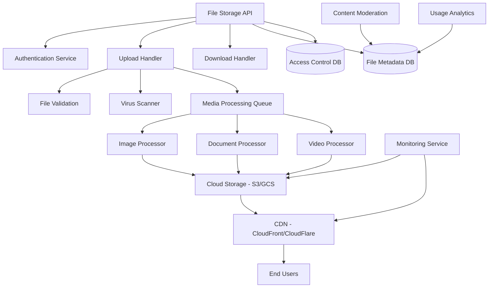

# File Storage Service Design Document

## Overview

The File Storage Service is a scalable, secure media management platform that handles file uploads, processing, storage, and delivery for the Bilten platform. The system uses cloud storage with CDN integration, automated image processing, content moderation, and comprehensive access controls to provide fast, secure, and reliable file management capabilities.

## Architecture



## Components and Interfaces

### File Storage API Service
- **Purpose**: Central API for file operations and management
- **Key Methods**:
  - `uploadFile(file, metadata, permissions)`
  - `getFile(fileId, accessToken)`
  - `deleteFile(fileId, userId)`
  - `updateFileMetadata(fileId, metadata)`
  - `generateSignedUrl(fileId, operation, expiration)`

### Upload Handler
- **Purpose**: Process file uploads with validation and security checks
- **Key Methods**:
  - `validateFile(file, constraints)`
  - `scanForVirus(file)`
  - `generateThumbnails(imageFile)`
  - `extractMetadata(file)`

### Media Processing Service
- **Purpose**: Asynchronous processing of uploaded media files
- **Features**:
  - Image resizing and format conversion
  - Document text extraction and indexing
  - Video transcoding and thumbnail generation
  - Metadata extraction and enrichment

### Content Moderation Service
- **Purpose**: Automated and manual content review
- **Key Methods**:
  - `scanContent(fileId)`
  - `flagForReview(fileId, reason)`
  - `approveContent(fileId, moderatorId)`
  - `rejectContent(fileId, reason)`

### Access Control Service
- **Purpose**: Manage file permissions and access policies
- **Key Methods**:
  - `checkAccess(fileId, userId, operation)`
  - `setPermissions(fileId, permissions)`
  - `generateAccessToken(fileId, userId, expiration)`
  - `revokeAccess(fileId, userId)`

## Data Models

### File Metadata Model
```typescript
interface FileMetadata {
  id: string;
  filename: string;
  originalFilename: string;
  mimeType: string;
  size: number;
  checksum: string;
  uploadedBy: string;
  organizationId?: string;
  
  // Storage information
  storageProvider: 'aws_s3' | 'gcp_storage' | 'azure_blob';
  storagePath: string;
  storageRegion: string;
  storageClass: 'standard' | 'infrequent' | 'archive';
  
  // Processing information
  processingStatus: 'pending' | 'processing' | 'completed' | 'failed';
  variants: FileVariant[];
  
  // Content information
  contentType: 'image' | 'document' | 'video' | 'audio' | 'other';
  dimensions?: { width: number; height: number };
  duration?: number; // for video/audio
  
  // Moderation
  moderationStatus: 'pending' | 'approved' | 'rejected' | 'flagged';
  moderationScore?: number;
  moderatedBy?: string;
  moderatedAt?: Date;
  
  // Metadata
  tags: string[];
  description?: string;
  altText?: string;
  
  // Timestamps
  createdAt: Date;
  updatedAt: Date;
  lastAccessedAt?: Date;
  expiresAt?: Date;
}

interface FileVariant {
  id: string;
  type: 'thumbnail' | 'small' | 'medium' | 'large' | 'webp' | 'avif';
  width?: number;
  height?: number;
  size: number;
  storagePath: string;
  mimeType: string;
}
```

### Access Control Model
```typescript
interface FilePermissions {
  fileId: string;
  ownerId: string;
  organizationId?: string;
  
  // Access levels
  public: boolean;
  allowedUsers: string[];
  allowedRoles: string[];
  
  // Operation permissions
  canRead: boolean;
  canWrite: boolean;
  canDelete: boolean;
  canShare: boolean;
  
  // Time-based access
  validFrom?: Date;
  validUntil?: Date;
  
  // Usage restrictions
  maxDownloads?: number;
  downloadCount: number;
  
  createdAt: Date;
  updatedAt: Date;
}
```

### Upload Session Model
```typescript
interface UploadSession {
  id: string;
  userId: string;
  filename: string;
  fileSize: number;
  mimeType: string;
  
  // Multipart upload
  uploadId?: string; // S3 multipart upload ID
  parts: UploadPart[];
  
  // Progress tracking
  status: 'initiated' | 'uploading' | 'completed' | 'failed' | 'cancelled';
  bytesUploaded: number;
  
  // Security
  signedUrls: Record<string, string>;
  expiresAt: Date;
  
  createdAt: Date;
  updatedAt: Date;
}

interface UploadPart {
  partNumber: number;
  size: number;
  etag?: string;
  uploadedAt?: Date;
}
```

## Error Handling

### File Storage Errors
- **FileSizeExceededError**: When uploaded file exceeds size limits
- **UnsupportedFileTypeError**: When file type is not allowed
- **VirusDetectedError**: When malware is found in uploaded file
- **StorageQuotaExceededError**: When user/organization storage limit is reached
- **FileNotFoundError**: When requested file doesn't exist
- **AccessDeniedError**: When user lacks permission for file operation

### Processing Errors
- **ImageProcessingError**: When image processing fails
- **VideoTranscodingError**: When video processing fails
- **MetadataExtractionError**: When metadata extraction fails
- **ContentModerationError**: When content scanning fails

### Error Response Format
```json
{
  "error": {
    "code": "FILE_SIZE_EXCEEDED",
    "message": "File size exceeds maximum allowed limit",
    "details": "Maximum file size is 10MB, uploaded file is 15MB",
    "timestamp": "2024-01-15T10:30:00Z",
    "fileId": "file_123456"
  }
}
```

## Testing Strategy

### Unit Testing
- File validation and security checks
- Image processing and resizing
- Access control and permission checking
- Metadata extraction and storage
- Upload session management

### Integration Testing
- Cloud storage provider integration
- CDN configuration and delivery
- Content moderation service integration
- Database transaction handling
- API endpoint functionality

### Performance Testing
- Large file upload performance
- Concurrent upload handling
- CDN cache performance
- Image processing throughput
- Database query optimization

### Security Testing
- File upload security validation
- Access control enforcement
- Virus scanning effectiveness
- Data encryption verification
- API authentication and authorization

## Security Considerations

### Upload Security
- File type validation and sanitization
- Virus and malware scanning
- Content-based file type detection
- Upload size and rate limiting
- Secure temporary file handling

### Storage Security
- Encryption at rest and in transit
- Secure access key management
- Regular security audits
- Backup and disaster recovery
- Data retention and deletion policies

### Access Control
- Role-based access control (RBAC)
- Time-limited access tokens
- IP-based access restrictions
- Audit logging for all operations
- Secure file sharing mechanisms

## Performance Optimization

### Storage Optimization
- Intelligent storage tiering
- Automatic compression for images
- Deduplication for identical files
- Lifecycle policies for old files
- Multi-region replication

### Delivery Optimization
- Global CDN with edge caching
- Adaptive image delivery
- Progressive image loading
- WebP and AVIF format support
- Bandwidth optimization

### Processing Optimization
- Asynchronous processing queues
- Parallel processing for variants
- Caching of processed results
- Batch processing for efficiency
- Resource usage monitoring

## API Endpoints

### File Operations
```
POST /api/files/upload
GET /api/files/{id}
PUT /api/files/{id}
DELETE /api/files/{id}
POST /api/files/{id}/variants

GET /api/files/{id}/download
GET /api/files/{id}/signed-url
POST /api/files/batch-upload
```

### File Management
```
GET /api/files/search
GET /api/files/user/{userId}
GET /api/files/organization/{orgId}
POST /api/files/{id}/move
POST /api/files/{id}/copy
```

### Permissions and Sharing
```
GET /api/files/{id}/permissions
PUT /api/files/{id}/permissions
POST /api/files/{id}/share
DELETE /api/files/{id}/share/{shareId}
```

### Analytics and Monitoring
```
GET /api/files/analytics/usage
GET /api/files/analytics/storage
GET /api/files/health
GET /api/files/metrics
```