# Marketing Tools Design Document

## Overview

The Marketing Tools system provides a comprehensive digital marketing platform for event organizers, featuring email marketing, social media management, promotional campaigns, A/B testing, affiliate programs, and advanced analytics. The system integrates with external marketing platforms and social networks while providing unified campaign management and performance tracking capabilities.

## Architecture

```mermaid
graph TB
    MarketingAPI[Marketing Tools API] --> CampaignService[Campaign Management Service]
    MarketingAPI --> EmailService[Email Marketing Service]
    MarketingAPI --> SocialService[Social Media Service]
    MarketingAPI --> PromoService[Promotional Code Service]
    MarketingAPI --> AffiliateService[Affiliate Program Service]
    MarketingAPI --> AnalyticsService[Marketing Analytics Service]
    
    CampaignService --> CampaignDB[(Campaign Database)]
    CampaignService --> ABTestEngine[A/B Testing Engine]
    CampaignService --> AutomationEngine[Marketing Automation Engine]
    
    EmailService --> EmailProvider[Email Service Provider]
    EmailService --> TemplateEngine[Email Template Engine]
    EmailService --> DeliveryTracking[Email Delivery Tracking]
    
    SocialService --> SocialAPIs[Social Media APIs]
    SocialAPIs --> Facebook[Facebook API]
    SocialAPIs --> Instagram[Instagram API]
    SocialAPIs --> Twitter[Twitter API]
    SocialAPIs --> LinkedIn[LinkedIn API]
    SocialAPIs --> TikTok[TikTok API]
    
    PromoService --> PromoCodeDB[(Promotional Codes DB)]
    PromoService --> RedemptionTracking[Redemption Tracking]
    
    AffiliateService --> AffiliateDB[(Affiliate Database)]
    AffiliateService --> CommissionEngine[Commission Calculation]
    AffiliateService --> PaymentProcessor[Affiliate Payments]
    
    AnalyticsService --> AnalyticsDB[(Marketing Analytics DB)]
    AnalyticsService --> ReportingEngine[Reporting Engine]
    AnalyticsService --> PredictiveAnalytics[Predictive Analytics]
    
    LandingPageBuilder[Landing Page Builder] --> ContentDB[(Content Database)]
    LandingPageBuilder --> SEOOptimizer[SEO Optimizer]
    
    InfluencerPlatform[Influencer Management] --> InfluencerDB[(Influencer Database)]
    InfluencerPlatform --> PerformanceTracker[Performance Tracker]
    
    ExternalIntegrations[External Integrations] --> CRM[CRM Systems]
    ExternalIntegrations --> MarketingPlatforms[Marketing Platforms]
    ExternalIntegrations --> AnalyticsPlatforms[Analytics Platforms]
```



## Components and Interfaces

### Marketing Tools API Service
- **Purpose**: Central API for all marketing operations and campaign management
- **Key Methods**:
  - `createCampaign(campaignData, channels, targeting)`
  - `launchABTest(testConfig, variations, metrics)`
  - `generatePromoCode(discountRules, restrictions)`
  - `trackConversion(campaignId, userId, eventType, value)`

### Campaign Management Service
- **Purpose**: Orchestrate multi-channel marketing campaigns and automation
- **Key Methods**:
  - `createMultiChannelCampaign(channels, content, schedule)`
  - `setupAutomationWorkflow(triggers, actions, conditions)`
  - `manageCampaignLifecycle(campaignId, status, updates)`
  - `optimizeCampaignPerformance(campaignId, metrics)`

### Email Marketing Service
- **Purpose**: Handle email campaign creation, delivery, and tracking
- **Key Methods**:
  - `createEmailCampaign(template, audience, personalization)`
  - `sendEmail(campaignId, recipients, schedule)`
  - `trackEmailMetrics(campaignId, metrics, timeframe)`
  - `manageEmailList(listId, subscribers, segmentation)`

### Social Media Service
- **Purpose**: Manage social media content and cross-platform posting
- **Key Methods**:
  - `createSocialPost(content, platforms, schedule)`
  - `manageSocialAccounts(organizerId, platforms, credentials)`
  - `trackSocialEngagement(postId, metrics, platform)`
  - `generateSocialContent(eventData, platform, template)`

### Promotional Code Service
- **Purpose**: Create and manage discount codes and promotional campaigns
- **Key Methods**:
  - `createPromoCode(code, discount, restrictions, usage)`
  - `validatePromoCode(code, userId, eventId, orderValue)`
  - `trackRedemption(code, userId, orderValue, timestamp)`
  - `analyzePromoPerformance(code, metrics, timeframe)`

## Data Models

### Marketing Campaign Model
```typescript
interface MarketingCampaign {
  id: string;
  organizerId: string;
  eventId?: string;
  
  // Campaign details
  name: string;
  description: string;
  type: 'email' | 'social' | 'landing_page' | 'multi_channel';
  status: 'draft' | 'scheduled' | 'active' | 'paused' | 'completed' | 'cancelled';
  
  // Targeting and audience
  targetAudience: AudienceSegment;
  personalization: PersonalizationRules;
  
  // Content and channels
  channels: CampaignChannel[];
  content: CampaignContent;
  
  // Scheduling
  scheduledAt?: Date;
  startDate: Date;
  endDate?: Date;
  timezone: string;
  
  // Budget and goals
  budget?: number;
  goals: CampaignGoal[];
  
  // Performance tracking
  metrics: CampaignMetrics;
  
  // A/B testing
  abTest?: ABTestConfig;
  
  // Automation
  automationRules?: AutomationRule[];
  
  createdAt: Date;
  updatedAt: Date;
}

interface AudienceSegment {
  id: string;
  name: string;
  criteria: SegmentationCriteria[];
  size: number;
  description?: string;
}

interface CampaignChannel {
  type: 'email' | 'facebook' | 'instagram' | 'twitter' | 'linkedin' | 'tiktok' | 'sms';
  config: Record<string, any>;
  isActive: boolean;
}
```

### Email Campaign Model
```typescript
interface EmailCampaign {
  id: string;
  campaignId: string;
  
  // Email details
  subject: string;
  preheader?: string;
  fromName: string;
  fromEmail: string;
  replyTo?: string;
  
  // Content
  template: EmailTemplate;
  htmlContent: string;
  textContent: string;
  
  // Recipients
  recipients: EmailRecipient[];
  segmentation: AudienceSegment[];
  
  // Personalization
  personalizationTokens: Record<string, string>;
  dynamicContent: DynamicContentRule[];
  
  // Delivery
  deliveryStatus: 'draft' | 'scheduled' | 'sending' | 'sent' | 'failed';
  scheduledAt?: Date;
  sentAt?: Date;
  
  // Tracking
  trackOpens: boolean;
  trackClicks: boolean;
  trackUnsubscribes: boolean;
  
  // Performance metrics
  metrics: EmailMetrics;
  
  createdAt: Date;
  updatedAt: Date;
}

interface EmailMetrics {
  sent: number;
  delivered: number;
  bounced: number;
  opened: number;
  clicked: number;
  unsubscribed: number;
  complained: number;
  converted: number;
  
  // Rates
  deliveryRate: number;
  openRate: number;
  clickRate: number;
  conversionRate: number;
  unsubscribeRate: number;
}
```

### Promotional Code Model
```typescript
interface PromotionalCode {
  id: string;
  organizerId: string;
  eventId?: string;
  
  // Code details
  code: string;
  name: string;
  description?: string;
  
  // Discount configuration
  discountType: 'percentage' | 'fixed_amount' | 'buy_one_get_one' | 'free_shipping';
  discountValue: number;
  minimumOrderValue?: number;
  maximumDiscountAmount?: number;
  
  // Usage restrictions
  usageLimit?: number;
  usagePerUser?: number;
  usageCount: number;
  
  // Validity
  validFrom: Date;
  validUntil?: Date;
  isActive: boolean;
  
  // Targeting
  applicableEvents: string[];
  applicableTicketTypes: string[];
  userSegments: string[];
  
  // Tracking
  redemptions: PromoRedemption[];
  metrics: PromoMetrics;
  
  createdAt: Date;
  updatedAt: Date;
}

interface PromoRedemption {
  id: string;
  userId: string;
  orderId: string;
  discountAmount: number;
  orderValue: number;
  redeemedAt: Date;
}
```

### A/B Test Model
```typescript
interface ABTest {
  id: string;
  campaignId: string;
  
  // Test configuration
  name: string;
  description: string;
  testType: 'email_subject' | 'email_content' | 'landing_page' | 'social_post' | 'promo_offer';
  
  // Variations
  variations: ABTestVariation[];
  trafficSplit: number[]; // percentage allocation for each variation
  
  // Test parameters
  sampleSize: number;
  confidenceLevel: number;
  minimumDetectableEffect: number;
  
  // Metrics
  primaryMetric: string;
  secondaryMetrics: string[];
  
  // Status and results
  status: 'draft' | 'running' | 'completed' | 'stopped';
  startDate: Date;
  endDate?: Date;
  
  // Results
  results?: ABTestResults;
  winner?: string;
  statisticalSignificance?: number;
  
  createdAt: Date;
  updatedAt: Date;
}

interface ABTestVariation {
  id: string;
  name: string;
  content: Record<string, any>;
  trafficPercentage: number;
  metrics: VariationMetrics;
}
```

### Affiliate Program Model
```typescript
interface AffiliateProgram {
  id: string;
  organizerId: string;
  eventId?: string;
  
  // Program details
  name: string;
  description: string;
  type: 'referral' | 'affiliate' | 'influencer';
  
  // Commission structure
  commissionType: 'percentage' | 'fixed_amount' | 'tiered';
  commissionRate: number;
  tieredRates?: TieredCommission[];
  
  // Terms and conditions
  cookieDuration: number; // days
  minimumPayout: number;
  paymentSchedule: 'weekly' | 'monthly' | 'quarterly';
  
  // Restrictions
  isActive: boolean;
  maxAffiliates?: number;
  requireApproval: boolean;
  
  // Tracking
  affiliates: Affiliate[];
  totalCommissions: number;
  totalSales: number;
  
  createdAt: Date;
  updatedAt: Date;
}

interface Affiliate {
  id: string;
  userId: string;
  programId: string;
  
  // Affiliate details
  referralCode: string;
  trackingLink: string;
  
  // Performance
  clicks: number;
  conversions: number;
  sales: number;
  commissions: number;
  
  // Status
  status: 'pending' | 'approved' | 'active' | 'suspended';
  joinedAt: Date;
  
  // Payment info
  paymentMethod: string;
  paymentDetails: Record<string, any>;
  lastPayment?: Date;
}
```

## Error Handling

### Marketing Tools Errors
- **CampaignCreationError**: When campaign setup fails due to invalid configuration
- **EmailDeliveryError**: When email campaigns fail to send or deliver
- **SocialMediaAPIError**: When social media platform integration fails
- **PromoCodeValidationError**: When promotional code validation or redemption fails
- **AffiliateTrackingError**: When affiliate link tracking or commission calculation fails

### Integration Errors
- **ExternalServiceError**: When third-party marketing platform integration fails
- **TemplateRenderingError**: When email or landing page templates fail to render
- **AnalyticsTrackingError**: When marketing analytics data collection fails
- **ABTestConfigError**: When A/B test configuration is invalid or incomplete

### Error Response Format
```json
{
  "error": {
    "code": "EMAIL_DELIVERY_FAILED",
    "message": "Email campaign delivery failed",
    "details": "SMTP server connection timeout",
    "timestamp": "2024-01-15T10:30:00Z",
    "campaignId": "camp_123456",
    "affectedRecipients": 150
  }
}
```

## Testing Strategy

### Unit Testing
- Campaign creation and management logic
- Email template rendering and personalization
- Promotional code validation and redemption
- A/B test statistical analysis
- Affiliate commission calculations

### Integration Testing
- Email service provider integration
- Social media platform API integration
- Analytics and tracking functionality
- Payment processing for affiliate commissions
- Landing page builder and SEO optimization

### Performance Testing
- High-volume email campaign delivery
- Concurrent social media posting
- Large-scale A/B test management
- Real-time analytics processing
- Campaign automation workflow performance

### Marketing Effectiveness Testing
- Campaign conversion rate validation
- A/B test statistical significance verification
- Attribution model accuracy testing
- ROI calculation validation
- Cross-channel campaign coordination

## Security Considerations

### Data Protection
- Encryption of customer data and marketing lists
- Secure storage of social media credentials
- PII protection in marketing communications
- GDPR compliance for marketing data
- Secure affiliate payment processing

### API Security
- OAuth 2.0 for social media integrations
- Rate limiting for external API calls
- Secure webhook handling for tracking
- API key management for third-party services
- Audit logging for all marketing activities

### Campaign Security
- Validation of promotional code usage
- Prevention of affiliate fraud
- Secure tracking link generation
- Protection against email spoofing
- Content validation for social posts

## Performance Optimization

### Campaign Delivery Optimization
- Batch processing for large email campaigns
- Intelligent send time optimization
- Social media posting queue management
- Real-time campaign performance monitoring
- Automated campaign optimization

### Analytics Performance
- Real-time metrics aggregation
- Efficient data warehouse queries
- Caching of frequently accessed reports
- Asynchronous analytics processing
- Optimized attribution modeling

### Scalability Features
- Horizontal scaling of campaign services
- Load balancing for high-volume campaigns
- Database sharding for marketing data
- CDN delivery for marketing assets
- Microservice architecture for components

## API Endpoints

### Campaign Management
```
POST /api/marketing/campaigns
GET /api/marketing/campaigns/{campaignId}
PUT /api/marketing/campaigns/{campaignId}
DELETE /api/marketing/campaigns/{campaignId}
POST /api/marketing/campaigns/{campaignId}/launch
```

### Email Marketing
```
POST /api/marketing/email/campaigns
POST /api/marketing/email/send
GET /api/marketing/email/metrics/{campaignId}
POST /api/marketing/email/templates
GET /api/marketing/email/lists
```

### Social Media
```
POST /api/marketing/social/accounts
POST /api/marketing/social/posts
GET /api/marketing/social/metrics
POST /api/marketing/social/schedule
```

### Promotional Codes
```
POST /api/marketing/promo-codes
GET /api/marketing/promo-codes/{code}/validate
POST /api/marketing/promo-codes/{code}/redeem
GET /api/marketing/promo-codes/analytics
```

### Affiliate Programs
```
POST /api/marketing/affiliate/programs
POST /api/marketing/affiliate/join
GET /api/marketing/affiliate/performance
POST /api/marketing/affiliate/payouts
```