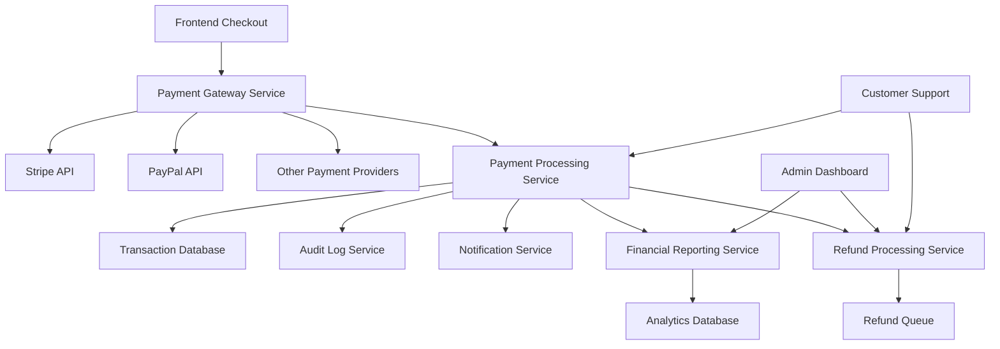
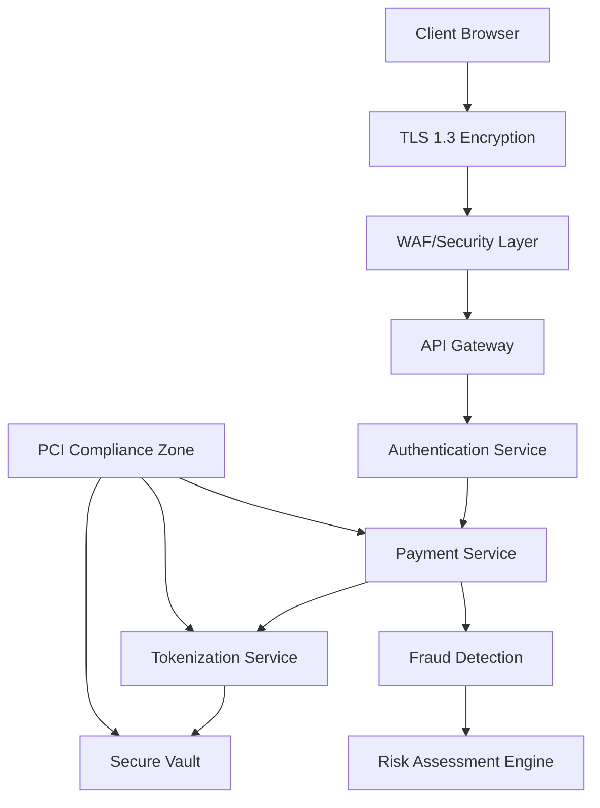
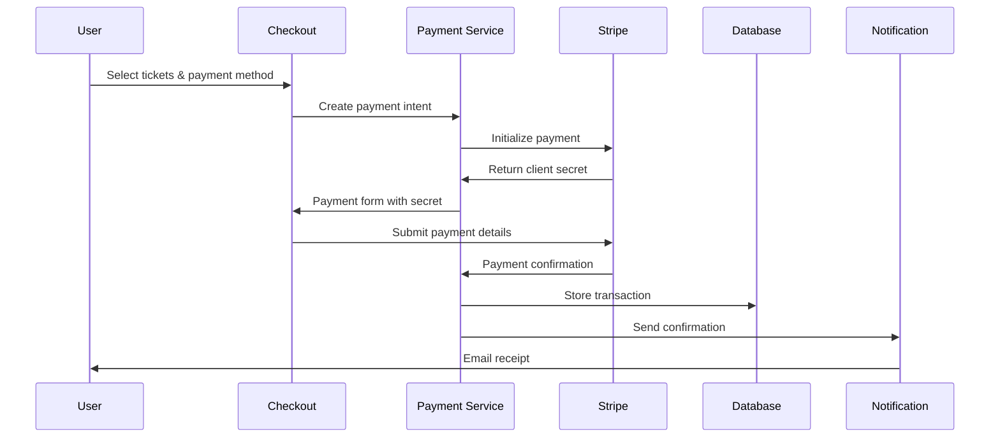

# Design Document

## Overview

The Payment Processing system is designed as a secure, scalable, and compliant financial transaction platform that integrates with multiple payment gateways while maintaining PCI DSS compliance. The system follows a microservices architecture with clear separation between payment processing, financial reporting, and user-facing checkout interfaces. The design emphasizes security, reliability, and user experience while providing comprehensive financial management capabilities for event organizers.

## Architecture

### High-Level Architecture



### Security Architecture



### Data Flow Architecture



## Components and Interfaces

### Payment Gateway Service

#### Core Payment Interface
```javascript
const PaymentGatewayService = {
  providers: {
    stripe: 'StripeProvider',
    paypal: 'PayPalProvider',
    square: 'SquareProvider'
  },
  methods: {
    createPaymentIntent: 'Initialize payment process',
    processPayment: 'Execute payment transaction',
    capturePayment: 'Capture authorized payment',
    refundPayment: 'Process refund transaction',
    validatePayment: 'Verify payment details'
  },
  security: {
    tokenization: 'PCI-compliant token management',
    encryption: 'End-to-end encryption',
    fraudDetection: 'Real-time fraud analysis'
  }
}
```

#### Stripe Integration
```javascript
const StripeProvider = {
  configuration: {
    apiVersion: '2023-10-16',
    webhookEndpoints: '/api/webhooks/stripe',
    supportedMethods: ['card', 'apple_pay', 'google_pay'],
    currencies: ['USD', 'EUR', 'GBP', 'CAD']
  },
  features: {
    paymentIntents: 'Secure payment processing',
    setupIntents: 'Save payment methods',
    subscriptions: 'Recurring payments',
    connect: 'Marketplace payments'
  }
}
```

### Checkout Interface Components

#### Checkout Form Component
```javascript
const CheckoutForm = {
  props: {
    eventId: 'string',
    ticketSelection: 'TicketSelection[]',
    totalAmount: 'number',
    currency: 'string'
  },
  features: [
    'Multi-step checkout process',
    'Real-time payment validation',
    'Mobile-optimized interface',
    'Accessibility compliance',
    'Error handling and recovery'
  ],
  integrations: [
    'Stripe Elements',
    'PayPal Smart Buttons',
    'Apple Pay integration',
    'Google Pay integration'
  ]
}
```

#### Payment Method Selection
```javascript
const PaymentMethodSelector = {
  supportedMethods: [
    'Credit/Debit Cards',
    'PayPal',
    'Apple Pay',
    'Google Pay',
    'Bank Transfer',
    'Digital Wallets'
  ],
  features: [
    'Saved payment methods',
    'One-click payments',
    'Payment method validation',
    'Regional payment options'
  ]
}
```

### Transaction Management

#### Transaction Model
```javascript
const TransactionModel = {
  id: 'uuid',
  eventId: 'uuid',
  userId: 'uuid',
  orderId: 'uuid',
  amount: 'decimal',
  currency: 'string',
  paymentMethod: 'string',
  gatewayTransactionId: 'string',
  status: 'pending | completed | failed | refunded',
  fees: {
    platformFee: 'decimal',
    paymentProcessingFee: 'decimal',
    totalFees: 'decimal'
  },
  metadata: {
    ipAddress: 'string',
    userAgent: 'string',
    riskScore: 'number'
  },
  timestamps: {
    createdAt: 'datetime',
    completedAt: 'datetime',
    updatedAt: 'datetime'
  }
}
```

#### Transaction Processing Service
```javascript
const TransactionProcessor = {
  methods: {
    processPayment: 'Handle payment execution',
    validateTransaction: 'Verify transaction integrity',
    updateTransactionStatus: 'Update transaction state',
    calculateFees: 'Compute platform and processing fees',
    generateReceipt: 'Create transaction receipt'
  },
  features: [
    'Atomic transaction processing',
    'Idempotency handling',
    'Retry mechanisms',
    'Dead letter queues'
  ]
}
```

### Refund Management System

#### Refund Processing Service
```javascript
const RefundProcessor = {
  policies: {
    fullRefund: 'Complete refund processing',
    partialRefund: 'Partial amount refunds',
    policyValidation: 'Event-specific refund rules',
    timeBasedRefunds: 'Time-sensitive refund policies'
  },
  workflow: [
    'Refund request validation',
    'Policy compliance check',
    'Gateway refund initiation',
    'Status tracking and updates',
    'Notification dispatch'
  ]
}
```

#### Refund Model
```javascript
const RefundModel = {
  id: 'uuid',
  transactionId: 'uuid',
  orderId: 'uuid',
  amount: 'decimal',
  reason: 'string',
  status: 'requested | approved | processing | completed | failed',
  refundMethod: 'original_payment_method | store_credit',
  processedBy: 'uuid',
  gatewayRefundId: 'string',
  timestamps: {
    requestedAt: 'datetime',
    processedAt: 'datetime',
    completedAt: 'datetime'
  }
}
```

### Financial Reporting System

#### Revenue Analytics Service
```javascript
const RevenueAnalytics = {
  metrics: {
    grossRevenue: 'Total revenue before fees',
    netRevenue: 'Revenue after platform fees',
    processingFees: 'Payment gateway fees',
    refundAmount: 'Total refunded amount',
    conversionRate: 'Payment success rate'
  },
  reporting: {
    realTimeMetrics: 'Live revenue tracking',
    periodicReports: 'Daily, weekly, monthly reports',
    customReports: 'User-defined report generation',
    exportFormats: ['PDF', 'CSV', 'Excel', 'JSON']
  }
}
```

#### Financial Dashboard Components
```javascript
const FinancialDashboard = {
  widgets: [
    'RevenueOverview',
    'PaymentMethodBreakdown',
    'RefundAnalytics',
    'FeeAnalysis',
    'ConversionMetrics'
  ],
  features: [
    'Real-time data updates',
    'Interactive charts',
    'Date range filtering',
    'Export capabilities',
    'Drill-down analytics'
  ]
}
```

## Data Models

### Payment Intent Model
```javascript
const PaymentIntentModel = {
  id: 'uuid',
  clientSecret: 'string',
  amount: 'decimal',
  currency: 'string',
  paymentMethodTypes: 'string[]',
  status: 'requires_payment_method | requires_confirmation | succeeded',
  metadata: {
    eventId: 'uuid',
    userId: 'uuid',
    ticketIds: 'uuid[]'
  },
  automaticPaymentMethods: {
    enabled: 'boolean'
  }
}
```

### Discount Code Model
```javascript
const DiscountCodeModel = {
  id: 'uuid',
  code: 'string',
  eventId: 'uuid',
  discountType: 'percentage | fixed_amount',
  discountValue: 'decimal',
  usageLimit: 'number',
  usedCount: 'number',
  validFrom: 'datetime',
  validUntil: 'datetime',
  isActive: 'boolean',
  applicableTicketTypes: 'uuid[]'
}
```

### Payout Model
```javascript
const PayoutModel = {
  id: 'uuid',
  organizerId: 'uuid',
  amount: 'decimal',
  currency: 'string',
  status: 'pending | processing | completed | failed',
  payoutMethod: 'bank_transfer | paypal | stripe_express',
  accountDetails: 'encrypted_string',
  transactionIds: 'uuid[]',
  scheduledDate: 'datetime',
  processedDate: 'datetime'
}
```

## Error Handling

### Payment Error Management
```javascript
const PaymentErrorHandler = {
  errorTypes: {
    cardDeclined: 'Insufficient funds or card issues',
    authenticationRequired: '3D Secure authentication needed',
    processingError: 'Gateway processing failures',
    networkError: 'Connectivity issues',
    validationError: 'Invalid payment data'
  },
  recovery: {
    retryMechanism: 'Automatic retry with exponential backoff',
    alternativePayments: 'Suggest different payment methods',
    userGuidance: 'Clear error messages and next steps',
    supportEscalation: 'Automatic support ticket creation'
  }
}
```

### Fraud Detection System
```javascript
const FraudDetection = {
  riskFactors: [
    'Unusual spending patterns',
    'Geographic inconsistencies',
    'Multiple failed attempts',
    'Suspicious user behavior',
    'Blacklisted payment methods'
  ],
  actions: {
    lowRisk: 'Process payment normally',
    mediumRisk: 'Require additional verification',
    highRisk: 'Block transaction and flag for review',
    criticalRisk: 'Immediate account suspension'
  }
}
```

## Testing Strategy

### Payment Testing Framework
```javascript
const PaymentTesting = {
  unitTests: [
    'Payment processing logic',
    'Fee calculations',
    'Refund processing',
    'Validation functions'
  ],
  integrationTests: [
    'Gateway API integration',
    'Webhook handling',
    'Database transactions',
    'Email notifications'
  ],
  e2eTests: [
    'Complete checkout flow',
    'Refund process',
    'Multi-payment scenarios',
    'Error handling flows'
  ]
}
```

### Security Testing
```javascript
const SecurityTesting = {
  penetrationTesting: 'Regular security assessments',
  vulnerabilityScanning: 'Automated security scans',
  complianceAudits: 'PCI DSS compliance verification',
  loadTesting: 'High-volume transaction testing'
}
```

## Security Implementation

### PCI DSS Compliance
```javascript
const PCICompliance = {
  requirements: [
    'Secure network architecture',
    'Cardholder data protection',
    'Vulnerability management',
    'Access control measures',
    'Network monitoring',
    'Information security policies'
  ],
  implementation: {
    tokenization: 'Replace sensitive data with tokens',
    encryption: 'AES-256 encryption for data at rest',
    tls: 'TLS 1.3 for data in transit',
    accessControl: 'Role-based access restrictions'
  }
}
```

### Audit Logging
```javascript
const AuditLogging = {
  events: [
    'Payment attempts and results',
    'Refund requests and processing',
    'Administrative actions',
    'Security events and alerts',
    'System access and authentication'
  ],
  retention: '7 years for compliance',
  monitoring: 'Real-time log analysis and alerting'
}
```

## Performance Optimization

### Caching Strategy
```javascript
const CachingStrategy = {
  paymentMethods: 'Cache supported payment methods',
  exchangeRates: 'Cache currency conversion rates',
  fraudRules: 'Cache fraud detection rules',
  userPreferences: 'Cache user payment preferences'
}
```

### Database Optimization
```javascript
const DatabaseOptimization = {
  indexing: 'Optimized indexes for transaction queries',
  partitioning: 'Time-based table partitioning',
  archiving: 'Automated old data archiving',
  replication: 'Read replicas for reporting queries'
}
```

## Monitoring and Alerting

### Payment Monitoring
```javascript
const PaymentMonitoring = {
  metrics: [
    'Payment success rates',
    'Average processing time',
    'Error rates by type',
    'Gateway response times',
    'Fraud detection accuracy'
  ],
  alerts: [
    'High failure rates',
    'Unusual transaction patterns',
    'Gateway downtime',
    'Security incidents',
    'Performance degradation'
  ]
}
```

### Business Intelligence
```javascript
const BusinessIntelligence = {
  dashboards: [
    'Real-time payment metrics',
    'Revenue analytics',
    'Customer payment behavior',
    'Gateway performance comparison',
    'Fraud detection effectiveness'
  ],
  reporting: 'Automated daily, weekly, and monthly reports'
}
```