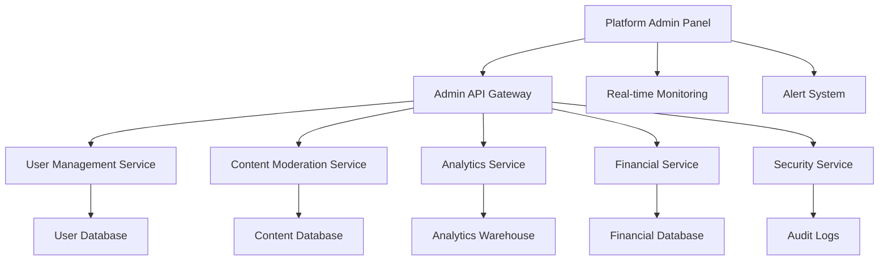

# Design Document

## Overview

The Platform Admin Panel is designed as a high-level administrative interface for managing the entire Bilten platform ecosystem. Built with React.js and modern web technologies, it provides comprehensive tools for system administration, user management, content moderation, and platform analytics. The design emphasizes security, scalability, and operational efficiency while maintaining a clear separation from organizer-specific functionality.

## Architecture

### High-Level Architecture



### Component Architecture

The platform admin panel follows a modular architecture:

- **Core Components**: PlatformLayout, AdminSidebar, SystemHeader
- **Management Components**: UserManager, EventModerator, FinancialOverview
- **Monitoring Components**: SystemHealth, SecurityDashboard, AnalyticsDashboard
- **Configuration Components**: PlatformSettings, BrandingManager, IntegrationConfig

### State Management

```javascript
const PlatformAdminState = {
  contexts: [
    'PlatformAuthContext - Admin authentication and permissions',
    'SystemHealthContext - Real-time system monitoring',
    'UserManagementContext - User data and operations',
    'ModerationContext - Content moderation state',
    'FinancialContext - Platform financial data',
    'SecurityContext - Security monitoring and alerts'
  ]
}
```

## Components and Interfaces

### Core Layout Components

#### PlatformLayout Component
```javascript
const PlatformLayout = {
  props: {
    children: 'ReactNode',
    alertCount: 'number',
    systemStatus: 'healthy | warning | critical'
  },
  features: [
    'System status indicator',
    'Real-time alert notifications',
    'Admin-specific navigation',
    'Security context display',
    'Multi-tenant switching'
  ]
}
```

#### Platform Sidebar Navigation
```javascript
const PlatformSidebar = {
  sections: [
    { name: 'Dashboard', icon: 'ChartBarIcon', path: '/platform/dashboard' },
    { name: 'Users', icon: 'UsersIcon', path: '/platform/users' },
    { name: 'Events', icon: 'CalendarIcon', path: '/platform/events' },
    { name: 'Moderation', icon: 'ShieldCheckIcon', path: '/platform/moderation' },
    { name: 'Financial', icon: 'CurrencyDollarIcon', path: '/platform/financial' },
    { name: 'Analytics', icon: 'ChartPieIcon', path: '/platform/analytics' },
    { name: 'Branding', icon: 'SwatchIcon', path: '/platform/branding' },
    { name: 'Security', icon: 'LockClosedIcon', path: '/platform/security' },
    { name: 'Settings', icon: 'CogIcon', path: '/platform/settings' }
  ],
  features: [
    'Role-based menu visibility',
    'System health indicators',
    'Alert badges on menu items',
    'Quick action shortcuts'
  ]
}
```

### Dashboard Components

#### System Health Dashboard
```javascript
const SystemHealthDashboard = {
  widgets: [
    'ServerStatus - Real-time server monitoring',
    'DatabaseHealth - Database performance metrics',
    'ServiceAvailability - Microservice status grid',
    'ErrorRates - System error tracking',
    'ResponseTimes - API performance monitoring',
    'ResourceUsage - CPU, memory, storage metrics'
  ],
  alerts: [
    'Critical system failures',
    'Performance degradation',
    'Security incidents',
    'Capacity warnings'
  ]
}
```

#### Platform Analytics
```javascript
const PlatformAnalytics = {
  metrics: [
    'UserGrowth - Registration and activation trends',
    'EventMetrics - Event creation and success rates',
    'RevenueAnalytics - Platform revenue and fee collection',
    'EngagementMetrics - User activity and retention',
    'GeographicDistribution - Global usage patterns',
    'PerformanceMetrics - Platform performance indicators'
  ],
  reports: [
    'Monthly platform summary',
    'Financial performance report',
    'User engagement analysis',
    'Event success metrics'
  ]
}
```

### User Management Components

#### User Management Interface
```javascript
const UserManagement = {
  features: [
    'User search and filtering',
    'Bulk user operations',
    'Role assignment and permissions',
    'Account status management',
    'Activity monitoring',
    'Audit trail viewing'
  ],
  actions: [
    'Activate/deactivate accounts',
    'Reset passwords',
    'Assign/revoke roles',
    'View user activity logs',
    'Process account appeals'
  ]
}
```

### Content Moderation Components

#### Event Moderation Dashboard
```javascript
const EventModeration = {
  queues: [
    'PendingApproval - New events awaiting review',
    'FlaggedContent - Reported events and content',
    'PolicyViolations - Automated policy violations',
    'Appeals - Event rejection appeals'
  ],
  tools: [
    'Content review interface',
    'Automated flagging rules',
    'Moderation decision tracking',
    'Communication templates'
  ]
}
```

### Financial Management Components

#### Financial Overview Dashboard
```javascript
const FinancialOverview = {
  sections: [
    'RevenueTracking - Platform fee collection',
    'PayoutManagement - Organizer payment processing',
    'TransactionMonitoring - Payment processing status',
    'FinancialReporting - Tax and compliance reports',
    'FraudDetection - Suspicious transaction monitoring'
  ],
  features: [
    'Real-time financial metrics',
    'Automated payout scheduling',
    'Transaction dispute resolution',
    'Financial audit trails'
  ]
}
```

### Platform Branding Components

#### Platform Branding Manager
```javascript
const PlatformBrandingManager = {
  routes: [
    '/platform/branding/global',
    '/platform/branding/white-label',
    '/platform/branding/themes',
    '/platform/branding/assets'
  ],
  features: [
    'Global platform branding configuration',
    'White-label tenant management',
    'Theme and template management',
    'Brand asset library',
    'Multi-domain branding support',
    'Brand compliance monitoring'
  ],
  capabilities: [
    'Platform-wide logo and color management',
    'Tenant-specific branding isolation',
    'Custom domain SSL management',
    'Brand guideline enforcement',
    'Asset version control'
  ]
}
```

## Data Models

### Platform User Model
```javascript
const PlatformUserModel = {
  id: 'uuid',
  email: 'string',
  role: 'user | organizer | admin | platform_admin',
  status: 'active | suspended | banned | pending',
  profile: {
    firstName: 'string',
    lastName: 'string',
    organization: 'string',
    verificationStatus: 'verified | pending | rejected'
  },
  permissions: 'string[]',
  lastActivity: 'datetime',
  createdAt: 'datetime',
  auditLog: 'AuditEntry[]'
}
```

### System Health Model
```javascript
const SystemHealthModel = {
  timestamp: 'datetime',
  services: {
    api: { status: 'healthy | degraded | down', responseTime: 'number' },
    database: { status: 'healthy | degraded | down', connections: 'number' },
    storage: { status: 'healthy | degraded | down', usage: 'percentage' },
    payments: { status: 'healthy | degraded | down', errorRate: 'percentage' }
  },
  metrics: {
    activeUsers: 'number',
    eventsCreated: 'number',
    transactionVolume: 'decimal',
    errorRate: 'percentage'
  }
}
```

### Platform Branding Model
```javascript
const PlatformBrandingModel = {
  id: 'uuid',
  tenantId: 'uuid | null', // null for global branding
  branding: {
    primaryColor: 'string',
    secondaryColor: 'string',
    logoUrl: 'string',
    faviconUrl: 'string',
    fontFamily: 'string',
    customCSS: 'text'
  },
  domains: {
    primary: 'string',
    aliases: 'string[]',
    sslStatus: 'active | pending | failed'
  },
  settings: {
    allowOrganizerBranding: 'boolean',
    enforceGuidelines: 'boolean',
    requireApproval: 'boolean'
  },
  createdAt: 'datetime',
  updatedAt: 'datetime'
}
```

## Security Architecture

### Authentication & Authorization
```javascript
const PlatformSecurity = {
  authentication: 'Multi-factor authentication required',
  authorization: 'Hierarchical role-based access control',
  sessionManagement: 'Secure session handling with timeout',
  auditLogging: 'Comprehensive action logging',
  encryption: 'End-to-end encryption for sensitive data'
}
```

### Access Control Matrix
```javascript
const AccessControl = {
  platformAdmin: [
    'Full system access',
    'User management',
    'Platform configuration',
    'Financial oversight',
    'Security monitoring'
  ],
  admin: [
    'Limited system access',
    'Content moderation',
    'User support',
    'Basic analytics'
  ],
  organizer: [
    'Event management only',
    'Own analytics only',
    'Limited user interaction'
  ]
}
```

## Performance Considerations

### Scalability Design
```javascript
const ScalabilityFeatures = {
  dataPartitioning: 'Tenant-based data isolation',
  caching: 'Multi-layer caching strategy',
  loadBalancing: 'Distributed load handling',
  monitoring: 'Real-time performance tracking',
  optimization: 'Automated performance tuning'
}
```

### Real-time Features
```javascript
const RealTimeCapabilities = {
  systemMonitoring: 'Live system health updates',
  userActivity: 'Real-time user action tracking',
  alertSystem: 'Instant notification delivery',
  dashboardUpdates: 'Live metric refreshing',
  moderationQueue: 'Real-time content flagging'
}
```

## Integration Architecture

### External Service Integration
```javascript
const ExternalIntegrations = {
  paymentProcessors: 'Multiple payment gateway support',
  emailServices: 'Transactional email providers',
  analyticsServices: 'Third-party analytics integration',
  securityServices: 'Fraud detection and prevention',
  complianceServices: 'Regulatory compliance monitoring'
}
```

### API Design
```javascript
const APIArchitecture = {
  restfulAPIs: 'RESTful service endpoints',
  graphqlSupport: 'GraphQL for complex queries',
  webhooks: 'Event-driven integrations',
  rateLimit: 'API rate limiting and throttling',
  versioning: 'API version management'
}
```