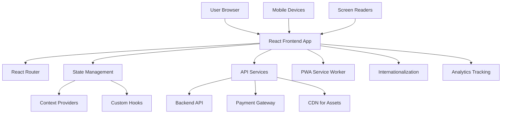
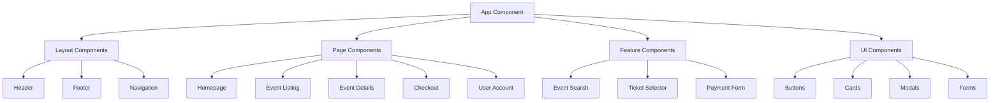
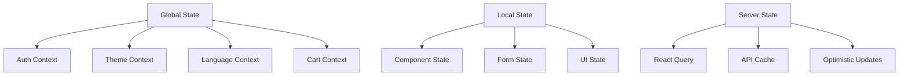

# Design Document

## Overview

The Public Frontend Application is designed as a modern, responsive React-based web application that provides an exceptional user experience for event discovery and ticket purchasing. The design emphasizes performance, accessibility, and internationalization while maintaining a clean, intuitive interface that works seamlessly across all devices. The application follows a component-based architecture with clear separation of concerns, efficient state management, and optimized rendering for superior performance.

## Architecture

### High-Level Architecture



### Component Architecture



### State Management Architecture



## Components and Interfaces

### Layout Components

#### Header Component
```javascript
const Header = {
  features: [
    'Responsive navigation menu',
    'User authentication status',
    'Language selector',
    'Theme toggle',
    'Search bar integration',
    'Shopping cart indicator'
  ],
  responsive: {
    desktop: 'Full navigation with all features',
    tablet: 'Collapsible menu with essential items',
    mobile: 'Hamburger menu with drawer navigation'
  }
}
```

#### Navigation Component
```javascript
const Navigation = {
  structure: [
    { label: 'Home', path: '/', icon: 'HomeIcon' },
    { label: 'Events', path: '/events', icon: 'CalendarIcon' },
    { label: 'Categories', path: '/categories', icon: 'TagIcon' },
    { label: 'My Tickets', path: '/tickets', icon: 'TicketIcon', auth: true },
    { label: 'Account', path: '/account', icon: 'UserIcon', auth: true }
  ],
  features: [
    'Active state indication',
    'Breadcrumb navigation',
    'Keyboard navigation support',
    'Mobile-friendly touch targets'
  ]
}
```

### Page Components

#### Homepage Component
```javascript
const Homepage = {
  sections: [
    'HeroSection',
    'FeaturedEvents',
    'PopularCategories',
    'UpcomingEvents',
    'TestimonialsSection',
    'NewsletterSignup'
  ],
  features: [
    'Dynamic content loading',
    'Personalized recommendations',
    'Social proof elements',
    'Call-to-action optimization'
  ],
  performance: {
    lazyLoading: 'Below-the-fold content',
    imageOptimization: 'WebP format with fallbacks',
    caching: 'Static content caching'
  }
}
```

#### Event Listing Component
```javascript
const EventListing = {
  layout: 'responsive-grid',
  features: [
    'Advanced filtering and sorting',
    'Infinite scroll pagination',
    'Map view integration',
    'Saved searches',
    'Real-time availability updates'
  ],
  filters: {
    date: 'Date range picker',
    location: 'Geographic radius search',
    category: 'Multi-select categories',
    price: 'Price range slider',
    features: 'Event features checkboxes'
  }
}
```

#### Event Details Component
```javascript
const EventDetails = {
  sections: [
    'EventHeader',
    'EventDescription',
    'TicketSelection',
    'VenueInformation',
    'EventSchedule',
    'SimilarEvents'
  ],
  features: [
    'Rich media gallery',
    'Social sharing integration',
    'Add to calendar functionality',
    'Venue maps and directions',
    'Real-time ticket availability'
  ]
}
```

### Feature Components

#### Event Search Component
```javascript
const EventSearch = {
  features: [
    'Autocomplete suggestions',
    'Search history',
    'Voice search support',
    'Advanced search filters',
    'Search result highlighting'
  ],
  implementation: {
    debouncing: 'Optimized API calls',
    caching: 'Search result caching',
    analytics: 'Search behavior tracking'
  }
}
```

#### Ticket Selector Component
```javascript
const TicketSelector = {
  features: [
    'Multiple ticket type selection',
    'Quantity controls with validation',
    'Real-time price calculation',
    'Discount code application',
    'Accessibility compliance'
  ],
  validation: [
    'Maximum quantity limits',
    'Minimum purchase requirements',
    'Age restrictions',
    'Availability checks'
  ]
}
```

#### Payment Form Component
```javascript
const PaymentForm = {
  integration: 'Stripe Elements',
  features: [
    'Secure payment processing',
    'Multiple payment methods',
    'Real-time validation',
    'Mobile wallet support',
    'PCI compliance'
  ],
  security: [
    'Tokenized payment data',
    'SSL encryption',
    'Fraud detection',
    'Secure form handling'
  ]
}
```

### UI Components

#### Event Card Component
```javascript
const EventCard = {
  variants: ['featured', 'standard', 'compact'],
  elements: [
    'Event image with lazy loading',
    'Event title and description',
    'Date and time display',
    'Venue and location',
    'Price range indicator',
    'Favorite/save button'
  ],
  interactions: [
    'Hover effects',
    'Click to view details',
    'Quick ticket purchase',
    'Social sharing'
  ]
}
```

#### Modal Component
```javascript
const Modal = {
  types: ['confirmation', 'form', 'gallery', 'alert'],
  features: [
    'Keyboard navigation support',
    'Focus trap management',
    'Backdrop click handling',
    'Responsive sizing',
    'Animation transitions'
  ],
  accessibility: [
    'ARIA labels and roles',
    'Screen reader announcements',
    'Focus management',
    'Escape key handling'
  ]
}
```

## Data Models

### Event Model
```javascript
const EventModel = {
  id: 'uuid',
  title: 'string',
  description: 'text',
  shortDescription: 'string',
  startDate: 'datetime',
  endDate: 'datetime',
  timezone: 'string',
  venue: {
    name: 'string',
    address: 'string',
    city: 'string',
    country: 'string',
    coordinates: { lat: 'number', lng: 'number' }
  },
  category: 'string',
  tags: 'string[]',
  images: {
    hero: 'string',
    gallery: 'string[]',
    thumbnail: 'string'
  },
  ticketTypes: 'TicketType[]',
  organizer: {
    id: 'uuid',
    name: 'string',
    logo: 'string'
  },
  status: 'draft | published | cancelled | completed',
  capacity: 'number',
  soldCount: 'number',
  pricing: {
    minPrice: 'decimal',
    maxPrice: 'decimal',
    currency: 'string'
  }
}
```

### User Model
```javascript
const UserModel = {
  id: 'uuid',
  email: 'string',
  firstName: 'string',
  lastName: 'string',
  avatar: 'string',
  preferences: {
    language: 'string',
    currency: 'string',
    timezone: 'string',
    categories: 'string[]',
    notifications: {
      email: 'boolean',
      push: 'boolean',
      sms: 'boolean'
    }
  },
  savedEvents: 'uuid[]',
  purchaseHistory: 'Order[]'
}
```

### Cart Model
```javascript
const CartModel = {
  items: [{
    eventId: 'uuid',
    ticketTypeId: 'uuid',
    quantity: 'number',
    price: 'decimal'
  }],
  discountCode: 'string',
  subtotal: 'decimal',
  discount: 'decimal',
  fees: 'decimal',
  total: 'decimal',
  currency: 'string'
}
```

## Error Handling

### Error Boundary Implementation
```javascript
const ErrorBoundary = {
  levels: [
    'Global error boundary',
    'Page-level error boundaries',
    'Component-level error boundaries'
  ],
  fallbacks: [
    'User-friendly error messages',
    'Retry mechanisms',
    'Alternative content',
    'Contact support options'
  ],
  logging: 'Automatic error reporting to monitoring service'
}
```

### API Error Handling
```javascript
const APIErrorHandling = {
  strategies: [
    'Retry with exponential backoff',
    'Graceful degradation',
    'Offline mode support',
    'User notification system'
  ],
  errorTypes: {
    network: 'Connection issues with retry options',
    authentication: 'Token refresh and re-authentication',
    validation: 'Form field error highlighting',
    server: 'Generic error with support contact'
  }
}
```

## Testing Strategy

### Component Testing
```javascript
const ComponentTesting = {
  framework: 'Jest + React Testing Library',
  coverage: 'Minimum 85% code coverage',
  focus: [
    'Component rendering',
    'User interactions',
    'Accessibility compliance',
    'Responsive behavior'
  ],
  tools: [
    'MSW for API mocking',
    'axe-core for accessibility testing',
    'Storybook for component documentation'
  ]
}
```

### Integration Testing
```javascript
const IntegrationTesting = {
  scope: [
    'User authentication flow',
    'Event search and filtering',
    'Ticket purchase process',
    'Payment integration'
  ],
  tools: 'Cypress for end-to-end testing',
  environments: 'Staging environment with test data'
}
```

### Performance Testing
```javascript
const PerformanceTesting = {
  metrics: [
    'First Contentful Paint < 1.5s',
    'Largest Contentful Paint < 2.5s',
    'Cumulative Layout Shift < 0.1',
    'First Input Delay < 100ms'
  ],
  tools: [
    'Lighthouse CI',
    'WebPageTest',
    'Bundle analyzer',
    'Performance monitoring'
  ]
}
```

## Accessibility Implementation

### WCAG 2.1 AA Compliance
```javascript
const AccessibilityFeatures = {
  structure: [
    'Semantic HTML elements',
    'Proper heading hierarchy',
    'Landmark regions',
    'Skip navigation links'
  ],
  interaction: [
    'Keyboard navigation support',
    'Focus management',
    'ARIA labels and descriptions',
    'Screen reader announcements'
  ],
  visual: [
    'Color contrast compliance',
    'Text scaling support',
    'High contrast mode',
    'Reduced motion preferences'
  ]
}
```

### Assistive Technology Support
```javascript
const AssistiveTechnology = {
  screenReaders: [
    'NVDA compatibility',
    'JAWS compatibility',
    'VoiceOver compatibility',
    'TalkBack compatibility'
  ],
  features: [
    'Alternative text for images',
    'Captions for videos',
    'Descriptive link text',
    'Form label associations'
  ]
}
```

## Performance Optimization

### Code Splitting Strategy
```javascript
const CodeSplitting = {
  routes: 'Route-based code splitting',
  components: 'Dynamic imports for heavy components',
  libraries: 'Vendor bundle optimization',
  implementation: [
    'React.lazy() and Suspense',
    'Webpack bundle analysis',
    'Tree shaking optimization',
    'Dynamic polyfill loading'
  ]
}
```

### Image Optimization
```javascript
const ImageOptimization = {
  formats: ['WebP with JPEG fallback', 'AVIF for modern browsers'],
  techniques: [
    'Responsive images with srcset',
    'Lazy loading with Intersection Observer',
    'Progressive JPEG loading',
    'Image compression optimization'
  ],
  cdn: 'CloudFront or similar CDN integration'
}
```

### Caching Strategy
```javascript
const CachingStrategy = {
  staticAssets: 'Long-term caching with versioning',
  apiResponses: 'React Query with stale-while-revalidate',
  images: 'Browser cache with CDN optimization',
  serviceWorker: 'PWA caching for offline support'
}
```

## Internationalization

### Multi-language Support
```javascript
const Internationalization = {
  framework: 'react-i18next',
  languages: ['en', 'ar', 'de', 'es', 'fr', 'it'],
  features: [
    'Dynamic language switching',
    'RTL layout support for Arabic',
    'Locale-specific formatting',
    'Pluralization handling'
  ],
  implementation: [
    'Lazy loading of translation files',
    'Namespace organization',
    'Fallback language support',
    'Translation key validation'
  ]
}
```

### Localization Features
```javascript
const Localization = {
  dateTime: 'Locale-specific date and time formatting',
  numbers: 'Currency and number formatting',
  addresses: 'Regional address formats',
  phoneNumbers: 'International phone number formats',
  rtl: 'Right-to-left layout support'
}
```

## Security Implementation

### Client-Side Security
```javascript
const ClientSecurity = {
  contentSecurityPolicy: 'Strict CSP headers',
  xssProtection: 'Input sanitization and validation',
  authentication: 'Secure token storage',
  dataProtection: 'Sensitive data encryption'
}
```

### Privacy Compliance
```javascript
const PrivacyCompliance = {
  gdpr: 'Cookie consent and data protection',
  tracking: 'User consent for analytics',
  dataMinimization: 'Collect only necessary data',
  userRights: 'Data export and deletion capabilities'
}
```

## Mobile Optimization

### Responsive Design
```javascript
const ResponsiveDesign = {
  breakpoints: {
    mobile: '320px - 768px',
    tablet: '768px - 1024px',
    desktop: '1024px+'
  },
  approach: 'Mobile-first responsive design',
  features: [
    'Touch-friendly interface',
    'Optimized tap targets',
    'Swipe gestures',
    'Mobile-specific layouts'
  ]
}
```

### Progressive Web App
```javascript
const PWAFeatures = {
  serviceWorker: 'Offline functionality',
  manifest: 'App installation capability',
  pushNotifications: 'Event reminders and updates',
  backgroundSync: 'Offline form submissions'
}
```

## Analytics and Monitoring

### User Analytics
```javascript
const UserAnalytics = {
  events: [
    'Page views and navigation',
    'Event searches and filters',
    'Ticket selections and purchases',
    'User engagement metrics'
  ],
  privacy: 'GDPR-compliant tracking with consent',
  tools: 'Google Analytics 4 with custom events'
}
```

### Performance Monitoring
```javascript
const PerformanceMonitoring = {
  realUserMonitoring: 'Core Web Vitals tracking',
  errorTracking: 'JavaScript error monitoring',
  performanceMetrics: 'Page load and interaction timing',
  alerting: 'Performance degradation alerts'
}
```