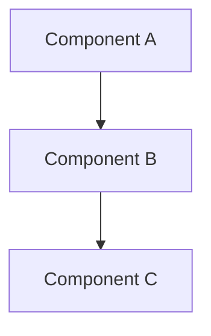

# Design Document

## Overview

[Provide a high-level overview of the feature design, including its purpose and how it fits into the Bilten platform architecture]

## Architecture

### System Context
[Describe how this feature fits within the overall Bilten system]

### Component Overview
[High-level component diagram or description]



## Components and Interfaces

### Core Components

#### Component 1
- **Purpose:** [What this component does]
- **Responsibilities:** [Key responsibilities]
- **Dependencies:** [What it depends on]

#### Component 2
- **Purpose:** [What this component does]
- **Responsibilities:** [Key responsibilities]
- **Dependencies:** [What it depends on]

### API Interfaces

#### REST Endpoints
```
GET /api/v1/[resource]
POST /api/v1/[resource]
PUT /api/v1/[resource]/{id}
DELETE /api/v1/[resource]/{id}
```

#### Internal Interfaces
[Describe internal service interfaces]

## Data Models

### Database Schema
```sql
CREATE TABLE [table_name] (
    id SERIAL PRIMARY KEY,
    [field_name] [data_type] [constraints],
    created_at TIMESTAMP DEFAULT CURRENT_TIMESTAMP,
    updated_at TIMESTAMP DEFAULT CURRENT_TIMESTAMP
);
```

### Data Transfer Objects
```typescript
interface [ModelName] {
    id: number;
    [fieldName]: [type];
    createdAt: Date;
    updatedAt: Date;
}
```

## Error Handling

### Error Types
- [List expected error types and their handling]

### Error Response Format
```json
{
    "error": {
        "code": "ERROR_CODE",
        "message": "Human readable message",
        "details": {}
    }
}
```

## Security Considerations

### Authentication
[Describe authentication requirements]

### Authorization
[Describe authorization rules]

### Data Protection
[Describe data protection measures]

## Testing Strategy

### Unit Testing
[Describe unit testing approach]

### Integration Testing
[Describe integration testing approach]

### End-to-End Testing
[Describe E2E testing approach]

## Performance Considerations

### Expected Load
[Describe expected performance requirements]

### Optimization Strategies
[Describe performance optimization approaches]

## Deployment Considerations

### Infrastructure Requirements
[Describe infrastructure needs]

### Configuration
[Describe configuration requirements]

### Monitoring
[Describe monitoring and alerting needs]