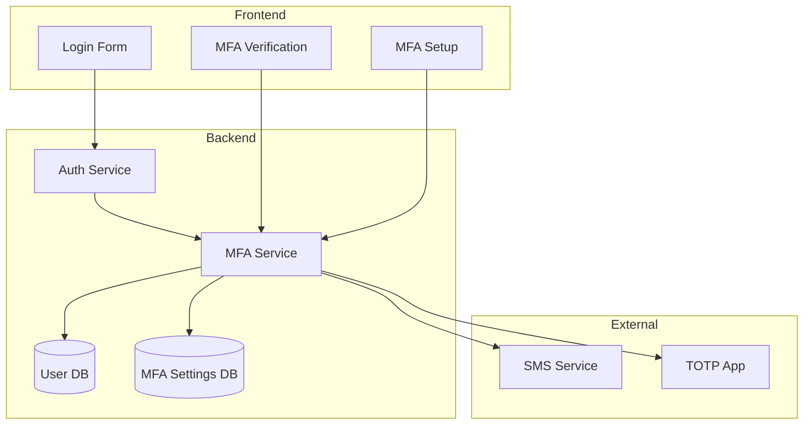

# Multi-Factor Authentication (MFA) Integration Guide

## Overview

Bilten platform includes comprehensive Multi-Factor Authentication (MFA) support with multiple verification methods including TOTP (Time-based One-Time Password), SMS, and backup codes. This guide covers setup, usage, and security considerations.

## 🔐 MFA Methods Supported

### 1. TOTP (Authenticator Apps)
- **Google Authenticator**
- **Authy**
- **Microsoft Authenticator**
- **Any TOTP-compatible app**
- **30-second time windows**
- **6-digit codes**

### 2. SMS Verification
- **6-digit codes**
- **5-minute expiration**
- **Phone number validation**

### 3. Backup Codes
- **8-character alphanumeric codes**
- **10 codes generated per user**
- **Single-use codes**
- **Secure storage**

## 🏗️ Architecture



## 🔧 Setup

### 1. Database Migration

Run the MFA database migration:

```bash
npm run db:migrate
```

This creates:
- `authentication.mfa_settings` table
- Adds MFA columns to `users.users` table

### 2. Environment Configuration

Add MFA configuration to your `.env`:

```bash
# MFA Configuration
MFA_ENFORCED=false
MFA_TOTP_WINDOW=2
MFA_BACKUP_CODE_COUNT=10
MFA_SMS_EXPIRY_MINUTES=5

# SMS Configuration (for SMS MFA)
TWILIO_ACCOUNT_SID=your_twilio_account_sid
TWILIO_AUTH_TOKEN=your_twilio_auth_token
TWILIO_PHONE_NUMBER=your_twilio_phone_number
```

## 🚀 Usage

### Frontend Integration

#### 1. MFA Setup Component

```jsx
import MFASetup from './components/MFASetup';

<MFASetup 
  onSetupComplete={() => {
    // Handle setup completion
    console.log('MFA setup completed');
  }} 
/>
```

#### 2. MFA Verification Component

```jsx
import MFAVerification from './components/MFAVerification';

<MFAVerification
  userId={userId}
  onVerificationComplete={(data) => {
    // Handle successful verification
    console.log('MFA verified:', data);
  }}
  onCancel={() => {
    // Handle cancellation
    console.log('MFA cancelled');
  }}
/>
```

### Backend API

#### 1. TOTP Setup

```bash
POST /api/v1/mfa/setup/totp
Authorization: Bearer <jwt_token>

Response:
{
  "success": true,
  "data": {
    "secret": "JBSWY3DPEHPK3PXP",
    "qrCodeUrl": "otpauth://totp/Bilten:user@example.com?secret=JBSWY3DPEHPK3PXP&issuer=Bilten",
    "backupCodes": ["ABC12345", "DEF67890", ...],
    "message": "TOTP setup initiated. Scan QR code with authenticator app."
  }
}
```

#### 2. Enable TOTP

```bash
POST /api/v1/mfa/enable/totp
Authorization: Bearer <jwt_token>
Content-Type: application/json

{
  "token": "123456"
}

Response:
{
  "success": true,
  "message": "TOTP enabled successfully"
}
```

#### 3. MFA Verification (Login Flow)

```bash
POST /api/v1/auth/verify-mfa
Content-Type: application/json

{
  "userId": "user-uuid",
  "method": "totp",
  "token": "123456"
}

Response:
{
  "data": {
    "user": { ... },
    "accessToken": "jwt-token",
    "refreshToken": "refresh-token"
  },
  "message": "Login successful"
}
```

#### 4. Get MFA Status

```bash
GET /api/v1/mfa/status
Authorization: Bearer <jwt_token>

Response:
{
  "success": true,
  "data": {
    "enabled": true,
    "totpEnabled": true,
    "smsEnabled": false,
    "emailEnabled": false,
    "backupCodesCount": 10,
    "usedBackupCodesCount": 0,
    "lastUsed": "2024-01-15T10:30:00Z"
  }
}
```

## 🔒 Security Features

### 1. TOTP Security
- **Cryptographically secure secrets**
- **Time window validation**
- **Clock skew tolerance**
- **Rate limiting**

### 2. SMS Security
- **6-digit codes**
- **Short expiration (5 minutes)**
- **Rate limiting per phone number**
- **Secure storage with TTL**

### 3. Backup Codes Security
- **Cryptographically random generation**
- **Single-use codes**
- **Secure hashing**
- **Usage tracking**

### 4. General Security
- **JWT integration**
- **Session management**
- **Activity logging**
- **Audit trails**

## 🧪 Testing

### Test TOTP Codes

For testing, you can use these TOTP secrets:

```javascript
// Test secret: JBSWY3DPEHPK3PXP
// Use with any TOTP app for testing
```

### Test SMS Codes

SMS codes are logged in development:

```bash
# Check logs for SMS codes
npm run logs:backend
```

### Test Backup Codes

Backup codes are generated during TOTP setup and can be used for testing.

## 📊 Monitoring

### 1. MFA Usage Analytics

Monitor MFA usage through the API:

```bash
GET /api/v1/mfa/status
```

### 2. Security Logs

MFA events are logged with detailed information:

```javascript
logger.info('TOTP verification successful', { userId });
logger.warn('Invalid TOTP token', { userId });
logger.error('MFA setup failed', { userId, error: error.message });
```

### 3. Audit Trail

All MFA activities are tracked in the database:
- Setup events
- Verification attempts
- Success/failure rates
- Method usage statistics

## 🔧 Configuration

### MFA Service Configuration

```javascript
// apps/bilten-backend/src/services/MFAService.js
class MFAService {
  constructor() {
    this.totpWindow = 2; // Allow 2 time windows for clock skew
    this.backupCodeLength = 8;
    this.backupCodeCount = 10;
  }
}
```

### Environment Variables

| Variable | Description | Default |
|----------|-------------|---------|
| `MFA_ENFORCED` | Force MFA for all users | `false` |
| `MFA_TOTP_WINDOW` | TOTP time window tolerance | `2` |
| `MFA_BACKUP_CODE_COUNT` | Number of backup codes | `10` |
| `MFA_SMS_EXPIRY_MINUTES` | SMS code expiration | `5` |

## 🚀 Deployment

### 1. Production Setup

1. **Enable MFA enforcement** (optional):
   ```bash
   MFA_ENFORCED=true
   ```

2. **Configure SMS service**:
   ```bash
   TWILIO_ACCOUNT_SID=your_live_sid
   TWILIO_AUTH_TOKEN=your_live_token
   TWILIO_PHONE_NUMBER=your_live_number
   ```

3. **Run migrations**:
   ```bash
   npm run db:migrate
   ```

### 2. Health Checks

```bash
# Check MFA service health
npm run health

# Test MFA endpoints
curl -X GET http://localhost:3001/api/v1/mfa/status
```

## 🔧 Troubleshooting

### Common Issues

1. **TOTP Code Not Working**
   - Check system clock synchronization
   - Verify secret is correctly entered
   - Ensure app supports TOTP standard

2. **SMS Not Received**
   - Check Twilio configuration
   - Verify phone number format
   - Check SMS service logs

3. **Backup Codes Not Working**
   - Ensure codes are entered exactly
   - Check if codes have been used
   - Generate new codes if needed

### Debug Commands

```bash
# Check MFA settings for user
curl -X GET http://localhost:3001/api/v1/mfa/status \
  -H "Authorization: Bearer <token>"

# Test TOTP generation
node -e "
const MFAService = require('./apps/bilten-backend/src/services/MFAService');
console.log(MFAService.generateTOTPToken('JBSWY3DPEHPK3PXP', Math.floor(Date.now() / 30000)));
"
```

## 📚 API Reference

### MFA Endpoints

| Endpoint | Method | Description |
|----------|--------|-------------|
| `/api/v1/mfa/setup/totp` | POST | Generate TOTP secret |
| `/api/v1/mfa/enable/totp` | POST | Enable TOTP |
| `/api/v1/mfa/disable/totp` | POST | Disable TOTP |
| `/api/v1/mfa/verify/totp` | POST | Verify TOTP token |
| `/api/v1/mfa/verify/backup` | POST | Verify backup code |
| `/api/v1/mfa/backup-codes/generate` | POST | Generate new backup codes |
| `/api/v1/mfa/backup-codes` | GET | Get backup codes (masked) |
| `/api/v1/mfa/sms/send` | POST | Send SMS verification |
| `/api/v1/mfa/sms/verify` | POST | Verify SMS code |
| `/api/v1/mfa/status` | GET | Get MFA status |

### Auth Endpoints

| Endpoint | Method | Description |
|----------|--------|-------------|
| `/api/v1/auth/verify-mfa` | POST | Complete login with MFA |

## 🤝 Support

### Documentation
- [TOTP RFC 6238](https://tools.ietf.org/html/rfc6238)
- [Twilio SMS API](https://www.twilio.com/docs/sms)
- [Google Authenticator](https://github.com/google/google-authenticator)

### Community
- [GitHub Issues](https://github.com/bilten/bilten-platform/issues)
- [Security Discussions](https://github.com/bilten/bilten-platform/discussions)

### Contact
- Technical Support: support@bilten.com
- Security Issues: security@bilten.com

---

**Last Updated**: January 2025  
**Version**: 1.0.0  
**Status**: Production Ready ✅
