# Component Hierarchy Diagram

This diagram shows the hierarchical structure of components in the Bilten platform, from high-level applications down to individual modules and services.

## Component Architecture Hierarchy

```mermaid
graph TB
    %% Platform Level
    subgraph "Bilten Platform"
        Platform[Bilten Event Management Platform]
    end
    
    %% Application Layer
    subgraph "Application Layer"
        PublicApp[🌐 Public Frontend Application]
        AdminApp[🛠️ Admin Panel Application]
        OrganizerApp[🎯 Organizer Panel Application]
        ScannerApp[📱 Scanner Mobile Application]
    end
    
    %% Frontend Components
    subgraph "Frontend Components"
        subgraph "Public Frontend"
            PublicUI[🎨 User Interface Components]
            PublicRouting[🗺️ Routing & Navigation]
            PublicState[📊 State Management]
            PublicAPI[🔌 API Integration]
        end
        
        subgraph "Admin Panel"
            AdminUI[🎨 Admin Interface Components]
            AdminRouting[🗺️ Admin Routing]
            AdminState[📊 Admin State Management]
            AdminAPI[🔌 Admin API Integration]
        end
        
        subgraph "Organizer Panel"
            OrganizerUI[🎨 Organizer Interface Components]
            OrganizerRouting[🗺️ Organizer Routing]
            OrganizerState[📊 Organizer State Management]
            OrganizerAPI[🔌 Organizer API Integration]
        end
        
        subgraph "Scanner App"
            ScannerUI[🎨 Scanner Interface Components]
            ScannerCamera[📷 Camera & QR Scanner]
            ScannerState[📊 Scanner State Management]
            ScannerAPI[🔌 Scanner API Integration]
        end
    end
    
    %% Backend Services
    subgraph "Backend Services"
        subgraph "Core Services"
            UserService[👤 User Service]
            EventService[🎪 Event Service]
            TicketService[🎫 Ticket Service]
            PaymentService[💳 Payment Service]
        end
        
        subgraph "Supporting Services"
            NotificationService[📧 Notification Service]
            AnalyticsService[📊 Analytics Service]
            MediaService[🖼️ Media Service]
            AuthService[🔐 Authentication Service]
        end
        
        subgraph "Infrastructure Services"
            APIGateway[🚪 API Gateway]
            LoadBalancer[⚖️ Load Balancer]
            CacheService[⚡ Cache Service]
            QueueService[📨 Message Queue Service]
        end
    end
    
    %% Service Components
    subgraph "Service Components"
        subgraph "User Service Components"
            UserController[🎮 User Controller]
            UserRepository[🗄️ User Repository]
            UserModel[📋 User Model]
            UserValidation[✅ User Validation]
        end
        
        subgraph "Event Service Components"
            EventController[🎮 Event Controller]
            EventRepository[🗄️ Event Repository]
            EventModel[📋 Event Model]
            EventValidation[✅ Event Validation]
        end
        
        subgraph "Ticket Service Components"
            TicketController[🎮 Ticket Controller]
            TicketRepository[🗄️ Ticket Repository]
            TicketModel[📋 Ticket Model]
            TicketValidation[✅ Ticket Validation]
        end
        
        subgraph "Payment Service Components"
            PaymentController[🎮 Payment Controller]
            PaymentRepository[🗄️ Payment Repository]
            PaymentModel[📋 Payment Model]
            PaymentValidation[✅ Payment Validation]
        end
    end
    
    %% Data Layer
    subgraph "Data Layer"
        subgraph "Primary Database"
            PostgreSQL[(🗄️ PostgreSQL Database)]
            UserTables[👥 User Tables]
            EventTables[🎪 Event Tables]
            TicketTables[🎫 Ticket Tables]
            PaymentTables[💳 Payment Tables]
        end
        
        subgraph "Cache Layer"
            Redis[(⚡ Redis Cache)]
            SessionCache[🔐 Session Cache]
            DataCache[📊 Data Cache]
            QueryCache[🔍 Query Cache]
        end
        
        subgraph "Analytics Database"
            ClickHouse[(📈 ClickHouse Analytics)]
            EventAnalytics[📊 Event Analytics]
            UserAnalytics[👤 User Analytics]
            BusinessAnalytics[💼 Business Analytics]
        end
        
        subgraph "File Storage"
            S3Storage[📁 S3 Storage]
            MediaFiles[🖼️ Media Files]
            Documents[📄 Documents]
            Backups[💾 Backups]
        end
    end
    
    %% External Integrations
    subgraph "External Integrations"
        PaymentGateway[💳 Payment Gateway]
        EmailService[📧 Email Service]
        SMSService[📱 SMS Service]
        CDN[🌍 CDN Service]
    end
    
    %% Connections - Platform to Applications
    Platform --> PublicApp
    Platform --> AdminApp
    Platform --> OrganizerApp
    Platform --> ScannerApp
    
    %% Applications to Components
    PublicApp --> PublicUI
    PublicApp --> PublicRouting
    PublicApp --> PublicState
    PublicApp --> PublicAPI
    
    AdminApp --> AdminUI
    AdminApp --> AdminRouting
    AdminApp --> AdminState
    AdminApp --> AdminAPI
    
    OrganizerApp --> OrganizerUI
    OrganizerApp --> OrganizerRouting
    OrganizerApp --> OrganizerState
    OrganizerApp --> OrganizerAPI
    
    ScannerApp --> ScannerUI
    ScannerApp --> ScannerCamera
    ScannerApp --> ScannerState
    ScannerApp --> ScannerAPI
    
    %% Frontend to Backend
    PublicAPI --> APIGateway
    AdminAPI --> APIGateway
    OrganizerAPI --> APIGateway
    ScannerAPI --> APIGateway
    
    %% API Gateway to Services
    APIGateway --> UserService
    APIGateway --> EventService
    APIGateway --> TicketService
    APIGateway --> PaymentService
    APIGateway --> NotificationService
    APIGateway --> AnalyticsService
    APIGateway --> MediaService
    APIGateway --> AuthService
    
    %% Service Components
    UserService --> UserController
    UserService --> UserRepository
    UserService --> UserModel
    UserService --> UserValidation
    
    EventService --> EventController
    EventService --> EventRepository
    EventService --> EventModel
    EventService --> EventValidation
    
    TicketService --> TicketController
    TicketService --> TicketRepository
    TicketService --> TicketModel
    TicketService --> TicketValidation
    
    PaymentService --> PaymentController
    PaymentService --> PaymentRepository
    PaymentService --> PaymentModel
    PaymentService --> PaymentValidation
    
    %% Services to Data Layer
    UserService --> PostgreSQL
    EventService --> PostgreSQL
    TicketService --> PostgreSQL
    PaymentService --> PostgreSQL
    
    UserService --> Redis
    EventService --> Redis
    TicketService --> Redis
    PaymentService --> Redis
    
    AnalyticsService --> ClickHouse
    MediaService --> S3Storage
    
    %% Database Tables
    PostgreSQL --> UserTables
    PostgreSQL --> EventTables
    PostgreSQL --> TicketTables
    PostgreSQL --> PaymentTables
    
    Redis --> SessionCache
    Redis --> DataCache
    Redis --> QueryCache
    
    ClickHouse --> EventAnalytics
    ClickHouse --> UserAnalytics
    ClickHouse --> BusinessAnalytics
    
    S3Storage --> MediaFiles
    S3Storage --> Documents
    S3Storage --> Backups
    
    %% External Integrations
    PaymentService --> PaymentGateway
    NotificationService --> EmailService
    NotificationService --> SMSService
    MediaService --> CDN
    
    %% Styling
    classDef platformClass fill:#e3f2fd,stroke:#1976d2,stroke-width:3px
    classDef appClass fill:#f3e5f5,stroke:#7b1fa2,stroke-width:2px
    classDef frontendClass fill:#fff3e0,stroke:#f57c00,stroke-width:2px
    classDef serviceClass fill:#e8f5e8,stroke:#388e3c,stroke-width:2px
    classDef componentClass fill:#fce4ec,stroke:#c2185b,stroke-width:2px
    classDef dataClass fill:#fff8e1,stroke:#f57f17,stroke-width:2px
    classDef externalClass fill:#f1f8e9,stroke:#689f38,stroke-width:2px
    
    class Platform platformClass
    class PublicApp,AdminApp,OrganizerApp,ScannerApp appClass
    class PublicUI,PublicRouting,PublicState,PublicAPI,AdminUI,AdminRouting,AdminState,AdminAPI,OrganizerUI,OrganizerRouting,OrganizerState,OrganizerAPI,ScannerUI,ScannerCamera,ScannerState,ScannerAPI frontendClass
    class UserService,EventService,TicketService,PaymentService,NotificationService,AnalyticsService,MediaService,AuthService,APIGateway,LoadBalancer,CacheService,QueueService serviceClass
    class UserController,UserRepository,UserModel,UserValidation,EventController,EventRepository,EventModel,EventValidation,TicketController,TicketRepository,TicketModel,TicketValidation,PaymentController,PaymentRepository,PaymentModel,PaymentValidation componentClass
    class PostgreSQL,UserTables,EventTables,TicketTables,PaymentTables,Redis,SessionCache,DataCache,QueryCache,ClickHouse,EventAnalytics,UserAnalytics,BusinessAnalytics,S3Storage,MediaFiles,Documents,Backups dataClass
    class PaymentGateway,EmailService,SMSService,CDN externalClass
```

## Component Categories

### 1. **Application Layer**
- **Public Frontend**: Main user-facing application
- **Admin Panel**: Platform administration interface
- **Organizer Panel**: Event organizer management interface
- **Scanner App**: Mobile QR code scanning application

### 2. **Frontend Components**
- **User Interface**: React components and UI elements
- **Routing**: Navigation and URL management
- **State Management**: Application state and data flow
- **API Integration**: Backend service communication

### 3. **Backend Services**
- **Core Services**: Essential business logic services
- **Supporting Services**: Auxiliary and utility services
- **Infrastructure Services**: Platform infrastructure components

### 4. **Service Components**
- **Controllers**: Request handling and business logic
- **Repositories**: Data access and persistence
- **Models**: Data structures and validation
- **Validation**: Input validation and business rules

### 5. **Data Layer**
- **Primary Database**: PostgreSQL for transactional data
- **Cache Layer**: Redis for performance optimization
- **Analytics Database**: ClickHouse for reporting
- **File Storage**: S3 for media and documents

### 6. **External Integrations**
- **Payment Gateway**: Financial transaction processing
- **Email Service**: Email delivery
- **SMS Service**: Text message delivery
- **CDN**: Content delivery network

## Component Relationships

### Dependency Hierarchy

### Communication Patterns
- **Synchronous**: Direct API calls between components
- **Asynchronous**: Event-driven communication via message queues
- **Caching**: Performance optimization through data caching
- **Load Balancing**: Traffic distribution across service instances

## Component Responsibilities

### Frontend Components
- **UI Components**: User interface rendering
- **State Management**: Application data management
- **Routing**: Navigation and URL handling
- **API Integration**: Backend communication

### Backend Components
- **Controllers**: Request processing and response handling
- **Services**: Business logic implementation
- **Repositories**: Data access abstraction
- **Models**: Data structure definition

### Infrastructure Components
- **API Gateway**: Request routing and authentication
- **Load Balancer**: Traffic distribution
- **Cache**: Performance optimization
- **Message Queue**: Asynchronous communication

## Component Design Principles

### 1. **Single Responsibility**
- Each component has one clear purpose
- Minimal coupling between components
- Clear separation of concerns

### 2. **Loose Coupling**
- Components communicate through well-defined interfaces
- Dependencies are injected rather than hard-coded
- Changes in one component don't affect others

### 3. **High Cohesion**
- Related functionality is grouped together
- Components are internally consistent
- Clear and focused component boundaries

### 4. **Reusability**
- Components can be reused across different contexts
- Generic components for common functionality
- Consistent interfaces and patterns

---

**Last Updated**: December 2024  
**Version**: 2.0  
**Maintained by**: Architecture Team
