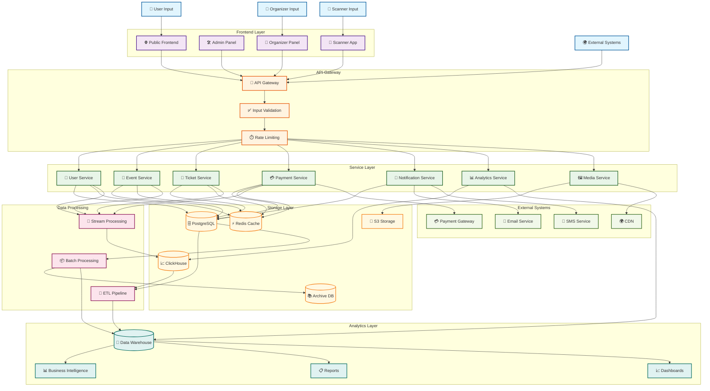
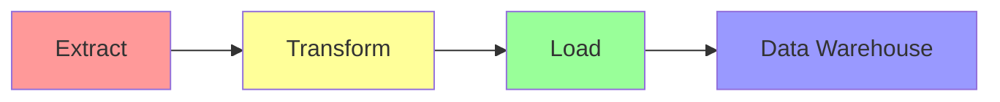
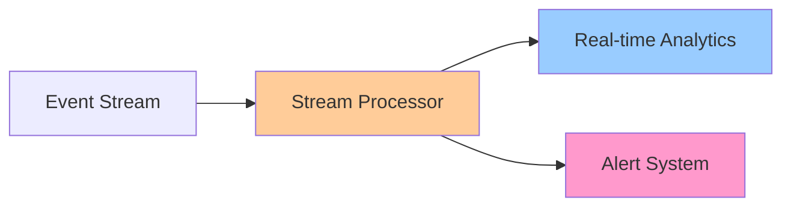
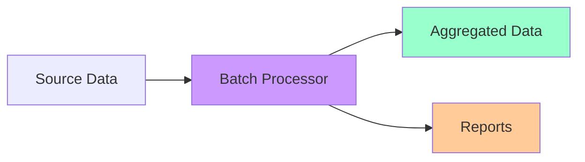

# Data Flow Diagram

This diagram shows how data flows through the Bilten platform, from user input to storage and analytics.

## Data Flow Architecture

## Data Flow Patterns

### 1. **Real-time Data Flow**
- **User Interactions**: Immediate processing of user actions
- **Event Streaming**: Real-time event processing
- **Live Updates**: Instant data synchronization

### 2. **Batch Data Flow**
- **Scheduled Processing**: Regular data aggregation
- **ETL Pipelines**: Data transformation and loading
- **Archival**: Long-term data storage

### 3. **Caching Strategy**
- **Hot Data**: Frequently accessed data in Redis
- **Warm Data**: Less frequent data in PostgreSQL
- **Cold Data**: Historical data in archive storage

## Data Categories

### Transactional Data
- **User Accounts**: Authentication and profiles
- **Events**: Event information and metadata
- **Tickets**: Ticket purchases and validation
- **Payments**: Financial transactions

### Analytical Data
- **User Behavior**: User interaction patterns
- **Event Analytics**: Event performance metrics
- **Business Intelligence**: Revenue and growth data
- **Operational Metrics**: System performance data

### Media Data
- **Images**: Event photos and graphics
- **Documents**: Event descriptions and files
- **Videos**: Event recordings and promotional content

## Data Processing Patterns

### ETL (Extract, Transform, Load)

### Stream Processing

### Batch Processing

## Data Security and Privacy

### Data Encryption
- **At Rest**: Database and storage encryption
- **In Transit**: TLS/SSL for data transmission
- **In Use**: Application-level encryption

### Data Privacy
- **GDPR Compliance**: User data protection
- **Data Anonymization**: Privacy-preserving analytics
- **Access Control**: Role-based data access

### Data Retention
- **Active Data**: Current operational data
- **Archive Data**: Historical data storage
- **Compliance Data**: Regulatory data retention

## Performance Optimization

### Data Partitioning
- **Time-based**: Partition by date/time
- **Geographic**: Partition by location
- **Functional**: Partition by business domain

### Indexing Strategy
- **Primary Indexes**: Unique identifiers
- **Secondary Indexes**: Query optimization
- **Composite Indexes**: Multi-column queries

### Caching Layers
- **Application Cache**: In-memory caching
- **Distributed Cache**: Redis cluster
- **CDN Cache**: Static content delivery

---

**Last Updated**: December 2024  
**Version**: 2.0  
**Maintained by**: Architecture Team
