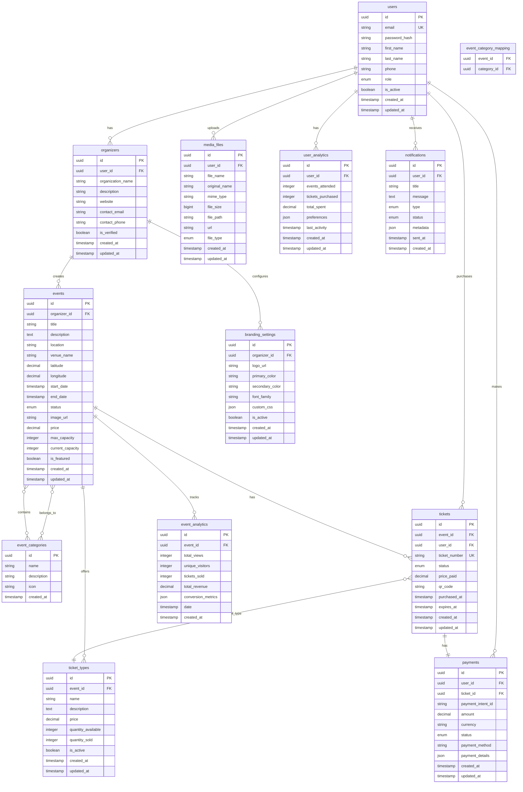

# Database Schema Diagram

This diagram shows the main database entities and their relationships in the Bilten platform.

## Entity Relationship Diagram

## Database Schema Details

### Core Tables

#### Users & Authentication
- **users**: Main user accounts with authentication details
- **organizers**: Extended profile for event organizers
- **branding_settings**: Custom branding configuration per organizer

#### Event Management
- **events**: Main event information and metadata
- **event_categories**: Event categorization system
- **event_category_mapping**: Many-to-many relationship between events and categories

#### Ticket System
- **tickets**: Individual ticket instances
- **ticket_types**: Different ticket categories (VIP, General, etc.)
- **payments**: Payment transaction records

#### Media & Files
- **media_files**: File upload management and metadata

#### Analytics & Tracking
- **event_analytics**: Event performance metrics
- **user_analytics**: User behavior and preferences

#### Communication
- **notifications**: User notification system

### Key Design Patterns

#### 1. **UUID Primary Keys**
- All tables use UUID primary keys for security and scalability
- Enables distributed ID generation
- Prevents enumeration attacks

#### 2. **Audit Trail**
- `created_at` and `updated_at` timestamps on all tables
- Tracks data lineage and changes
- Enables temporal queries

#### 3. **Soft Deletes**
- `is_active` flags for soft deletion
- Preserves data integrity
- Enables data recovery

#### 4. **JSON Fields**
- Flexible metadata storage
- Schema evolution without migrations
- Performance optimization for complex data

#### 5. **Enum Types**
- Status and type fields use enums
- Data consistency and validation
- Clear business logic representation

### Indexing Strategy

#### Primary Indexes
- UUID primary keys (automatically indexed)
- Unique constraints (email, ticket_number)

#### Performance Indexes
- `events(organizer_id, status)` - Organizer event queries
- `tickets(event_id, status)` - Event ticket queries
- `payments(user_id, status)` - User payment history
- `events(start_date, status)` - Upcoming events
- `tickets(user_id, purchased_at)` - User ticket history

#### Composite Indexes
- `events(latitude, longitude, start_date)` - Location-based queries
- `tickets(event_id, status, purchased_at)` - Event ticket analytics

### Data Relationships

#### One-to-Many
- User → Events (organizer relationship)
- Event → Tickets
- Event → Ticket Types
- User → Payments

#### Many-to-Many
- Events ↔ Categories (through mapping table)

#### One-to-One
- Ticket ↔ Payment (unique relationship)

### Data Integrity Constraints

#### Foreign Key Constraints
- All relationships properly constrained
- Cascade delete where appropriate
- Restrict delete for critical data

#### Check Constraints
- Price values must be positive
- Dates must be valid
- Status values must be valid enums

#### Unique Constraints
- User email addresses
- Ticket numbers
- Payment intent IDs

### Scalability Considerations

#### Partitioning Strategy
- Events table partitioned by date
- Analytics tables partitioned by date
- Logs partitioned by timestamp

#### Archival Strategy
- Old events moved to archive tables
- Analytics data aggregated over time
- Payment history retained for compliance

---

**Last Updated**: December 2024  
**Version**: 2.0  
**Maintained by**: Architecture Team
