# Infrastructure Overview

This diagram shows the complete infrastructure architecture for the Bilten platform deployment.

## Infrastructure Architecture Diagram

```mermaid
graph TB
    %% Internet
    Internet[🌐 Internet]
    
    %% CDN Layer
    subgraph "CDN & Edge"
        CloudFront[☁️ CloudFront CDN]
    end
    
    %% Load Balancer Layer
    subgraph "Load Balancing"
        ALB[⚖️ Application Load Balancer]
        WAF[🛡️ Web Application Firewall]
    end
    
    %% Container Orchestration
    subgraph "Container Orchestration"
        ECS[🐳 Amazon ECS]
        Fargate[🚀 AWS Fargate]
    end
    
    %% Application Services
    subgraph "Application Services"
        subgraph "Frontend Services"
            PublicApp[🌐 Public Frontend]
            AdminPanel[🛠️ Admin Panel]
            OrganizerPanel[🎯 Organizer Panel]
        end
        
        subgraph "Backend Services"
            Gateway[🚪 API Gateway]
            UserService[👤 User Service]
            EventService[🎪 Event Service]
            TicketService[🎫 Ticket Service]
            PaymentService[💳 Payment Service]
        end
    end
    
    %% Data Layer
    subgraph "Data Storage"
        RDS[(🗄️ Amazon RDS PostgreSQL)]
        ElastiCache[(⚡ ElastiCache Redis)]
        S3[📁 Amazon S3]
    end
    
    %% External Services
    subgraph "External Integrations"
        Stripe[💳 Stripe Payment]
        SendGrid[📧 SendGrid Email]
    end
    
    %% Monitoring & Observability
    subgraph "Monitoring Stack"
        CloudWatch[📊 CloudWatch]
        Prometheus[📈 Prometheus]
        Grafana[📊 Grafana]
    end
    
    %% Security & Compliance
    subgraph "Security Layer"
        IAM[🔐 AWS IAM]
        KMS[🔑 AWS KMS]
    end
    
    %% Network Layer
    subgraph "Network Infrastructure"
        VPC[🌐 VPC]
        SecurityGroups[🛡️ Security Groups]
    end
    
    %% Connections
    Internet --> CloudFront
    CloudFront --> ALB
    ALB --> WAF
    WAF --> ECS
    ECS --> Fargate
    
    Fargate --> PublicApp
    Fargate --> AdminPanel
    Fargate --> OrganizerPanel
    Fargate --> Gateway
    Fargate --> UserService
    Fargate --> EventService
    Fargate --> TicketService
    Fargate --> PaymentService
    
    UserService --> RDS
    EventService --> RDS
    TicketService --> RDS
    PaymentService --> RDS
    
    UserService --> ElastiCache
    EventService --> ElastiCache
    TicketService --> ElastiCache
    
    PaymentService --> Stripe
    UserService --> S3
    
    UserService --> CloudWatch
    EventService --> CloudWatch
    
    CloudWatch --> Prometheus
    Prometheus --> Grafana
    
    IAM --> ECS
    KMS --> RDS
    KMS --> S3
    
    VPC --> SecurityGroups
```

## Infrastructure Components

### CDN & Edge Layer
- **CloudFront**: Global content delivery network for static assets

### Load Balancing & Security
- **Application Load Balancer**: Traffic distribution across services
- **Web Application Firewall**: Security protection against attacks

### Container Orchestration
- **Amazon ECS**: Container orchestration service
- **AWS Fargate**: Serverless container compute

### Application Services
- **Frontend Services**: React applications for different user types
- **Backend Services**: Microservices architecture

### Data Storage
- **Amazon RDS PostgreSQL**: Primary relational database
- **ElastiCache Redis**: In-memory caching layer
- **Amazon S3**: Object storage for files and media

### External Integrations
- **Stripe**: Payment processing
- **SendGrid**: Email delivery service

### Monitoring & Observability
- **CloudWatch**: AWS native monitoring
- **Prometheus**: Metrics collection
- **Grafana**: Visualization and dashboards

### Security & Compliance
- **AWS IAM**: Identity and access management
- **AWS KMS**: Key management service

### Network Infrastructure
- **VPC**: Virtual private cloud
- **Security Groups**: Network security rules

---

**Last Updated**: December 2024  
**Version**: 2.0  
**Maintained by**: Architecture Team
