# Security Architecture Diagram

This diagram shows the comprehensive security architecture of the Bilten platform, including authentication, authorization, data protection, and network security.

## Security Architecture Overview

```mermaid
graph TB
    %% External Threats
    subgraph "External Threats"
        Malicious[🦹 Malicious Users]
        Bots[🤖 Bot Attacks]
        DDoS[💥 DDoS Attacks]
        Phishing[🎣 Phishing Attempts]
    end
    
    %% Network Security Layer
    subgraph "Network Security"
        WAF[🛡️ Web Application Firewall]
        DDoSProtection[🛡️ DDoS Protection]
        LoadBalancer[⚖️ Load Balancer]
        VPN[🔒 VPN Gateway]
    end
    
    %% Application Security Layer
    subgraph "Application Security"
        RateLimit[⏱️ Rate Limiting]
        InputValidation[✅ Input Validation]
        XSSProtection[🛡️ XSS Protection]
        CSRFProtection[🛡️ CSRF Protection]
        SQLInjection[🛡️ SQL Injection Protection]
    end
    
    %% Authentication Layer
    subgraph "Authentication & Authorization"
        AuthService[🔐 Authentication Service]
        JWT[🎫 JWT Tokens]
        OAuth[🔑 OAuth 2.0]
        RBAC[👥 Role-Based Access Control]
        MFA[🔐 Multi-Factor Authentication]
    end
    
    %% API Security
    subgraph "API Security"
        APIGateway[🚪 API Gateway]
        APIKey[🔑 API Key Management]
        OAuth2[🔐 OAuth 2.0]
        RateLimitAPI[⏱️ API Rate Limiting]
    end
    
    %% Data Security Layer
    subgraph "Data Security"
        Encryption[🔒 Data Encryption]
        KeyManagement[🗝️ Key Management]
        DataMasking[🎭 Data Masking]
        AuditLog[📝 Audit Logging]
    end
    
    %% Application Services
    subgraph "Application Services"
        UserService[👤 User Service]
        EventService[🎪 Event Service]
        TicketService[🎫 Ticket Service]
        PaymentService[💳 Payment Service]
    end
    
    %% Database Security
    subgraph "Database Security"
        DBEncryption[🔒 Database Encryption]
        ConnectionPool[🔗 Secure Connections]
        BackupEncryption[🔒 Backup Encryption]
        AccessControl[🚪 Access Control]
    end
    
    %% Monitoring & Compliance
    subgraph "Security Monitoring"
        SIEM[📊 Security Information & Event Management]
        IntrusionDetection[🚨 Intrusion Detection]
        VulnerabilityScan[🔍 Vulnerability Scanning]
        Compliance[📋 Compliance Monitoring]
    end
    
    %% Connections
    Malicious --> WAF
    Bots --> WAF
    DDoS --> DDoSProtection
    Phishing --> WAF
    
    WAF --> LoadBalancer
    DDoSProtection --> LoadBalancer
    LoadBalancer --> VPN
    
    VPN --> RateLimit
    VPN --> InputValidation
    VPN --> XSSProtection
    VPN --> CSRFProtection
    VPN --> SQLInjection
    
    RateLimit --> APIGateway
    InputValidation --> APIGateway
    XSSProtection --> APIGateway
    CSRFProtection --> APIGateway
    SQLInjection --> APIGateway
    
    APIGateway --> AuthService
    APIGateway --> APIKey
    APIGateway --> OAuth2
    APIGateway --> RateLimitAPI
    
    AuthService --> JWT
    AuthService --> OAuth
    AuthService --> RBAC
    AuthService --> MFA
    
    APIKey --> UserService
    OAuth2 --> UserService
    RateLimitAPI --> UserService
    RBAC --> UserService
    
    UserService --> Encryption
    EventService --> Encryption
    TicketService --> Encryption
    PaymentService --> Encryption
    
    Encryption --> KeyManagement
    Encryption --> DataMasking
    Encryption --> AuditLog
    
    UserService --> DBEncryption
    EventService --> DBEncryption
    TicketService --> DBEncryption
    PaymentService --> DBEncryption
    
    DBEncryption --> ConnectionPool
    DBEncryption --> BackupEncryption
    DBEncryption --> AccessControl
    
    UserService --> SIEM
    EventService --> SIEM
    TicketService --> SIEM
    PaymentService --> SIEM
    
    SIEM --> IntrusionDetection
    SIEM --> VulnerabilityScan
    SIEM --> Compliance
    
    %% Styling
    classDef threatClass fill:#ffebee,stroke:#c62828,stroke-width:2px
    classDef networkClass fill:#e3f2fd,stroke:#1565c0,stroke-width:2px
    classDef appClass fill:#f3e5f5,stroke:#6a1b9a,stroke-width:2px
    classDef authClass fill:#e8f5e8,stroke:#2e7d32,stroke-width:2px
    classDef apiClass fill:#fff3e0,stroke:#ef6c00,stroke-width:2px
    classDef dataClass fill:#fce4ec,stroke:#ad1457,stroke-width:2px
    classDef serviceClass fill:#e0f2f1,stroke:#00695c,stroke-width:2px
    classDef dbClass fill:#fff8e1,stroke:#f57f17,stroke-width:2px
    classDef monitoringClass fill:#f1f8e9,stroke:#33691e,stroke-width:2px
    
    class Malicious,Bots,DDoS,Phishing threatClass
    class WAF,DDoSProtection,LoadBalancer,VPN networkClass
    class RateLimit,InputValidation,XSSProtection,CSRFProtection,SQLInjection appClass
    class AuthService,JWT,OAuth,RBAC,MFA authClass
    class APIGateway,APIKey,OAuth2,RateLimitAPI apiClass
    class Encryption,KeyManagement,DataMasking,AuditLog dataClass
    class UserService,EventService,TicketService,PaymentService serviceClass
    class DBEncryption,ConnectionPool,BackupEncryption,AccessControl dbClass
    class SIEM,IntrusionDetection,VulnerabilityScan,Compliance monitoringClass
```

## Security Layers

### 1. **Network Security**
- **Web Application Firewall (WAF)**: Protects against web-based attacks
- **DDoS Protection**: Mitigates distributed denial-of-service attacks
- **Load Balancer**: Distributes traffic and provides additional security
- **VPN Gateway**: Secure remote access

### 2. **Application Security**
- **Rate Limiting**: Prevents abuse and brute force attacks
- **Input Validation**: Sanitizes user inputs
- **XSS Protection**: Prevents cross-site scripting attacks
- **CSRF Protection**: Prevents cross-site request forgery
- **SQL Injection Protection**: Prevents database injection attacks

### 3. **Authentication & Authorization**
- **Authentication Service**: Centralized user authentication
- **JWT Tokens**: Secure session management
- **OAuth 2.0**: Third-party authentication
- **Role-Based Access Control (RBAC)**: Granular permissions
- **Multi-Factor Authentication (MFA)**: Additional security layer

### 4. **API Security**
- **API Gateway**: Centralized API management
- **API Key Management**: Secure API access
- **OAuth 2.0**: API authentication
- **API Rate Limiting**: Prevents API abuse

### 5. **Data Security**
- **Data Encryption**: Encrypts sensitive data
- **Key Management**: Secure key storage and rotation
- **Data Masking**: Protects sensitive data in logs
- **Audit Logging**: Tracks all security events

### 6. **Database Security**
- **Database Encryption**: Encrypts data at rest
- **Secure Connections**: TLS/SSL database connections
- **Backup Encryption**: Encrypts database backups
- **Access Control**: Database-level permissions

### 7. **Security Monitoring**
- **SIEM**: Security information and event management
- **Intrusion Detection**: Detects security threats
- **Vulnerability Scanning**: Regular security assessments
- **Compliance Monitoring**: Ensures regulatory compliance

## Security Patterns

### Defense in Depth

### Zero Trust Architecture

## Security Controls

### Preventive Controls
- **Access Control**: Authentication and authorization
- **Input Validation**: Data sanitization
- **Encryption**: Data protection
- **Firewalls**: Network protection

### Detective Controls
- **Logging**: Security event tracking
- **Monitoring**: Real-time threat detection
- **Auditing**: Security assessment
- **Alerting**: Security notifications

### Corrective Controls
- **Incident Response**: Security incident handling
- **Backup Recovery**: Data restoration
- **Patch Management**: Security updates
- **Forensics**: Security investigation

## Compliance Framework

### GDPR Compliance
- **Data Protection**: User privacy protection
- **Right to Access**: User data access
- **Right to Erasure**: Data deletion
- **Data Portability**: Data export

### PCI DSS Compliance
- **Cardholder Data**: Payment data protection
- **Secure Networks**: Network security
- **Vulnerability Management**: Security updates
- **Access Control**: Restricted access

### SOC 2 Compliance
- **Security**: System security
- **Availability**: System availability
- **Processing Integrity**: Data accuracy
- **Confidentiality**: Data privacy
- **Privacy**: Personal information protection

## Security Metrics

### Key Performance Indicators
- **Security Incidents**: Number of security events
- **Response Time**: Time to detect and respond
- **Vulnerability Count**: Number of open vulnerabilities
- **Compliance Score**: Regulatory compliance percentage

### Security Monitoring
- **Real-time Alerts**: Immediate threat notifications
- **Security Dashboards**: Security status visualization
- **Compliance Reports**: Regulatory compliance reports
- **Risk Assessments**: Security risk evaluation

---

**Last Updated**: December 2024  
**Version**: 2.0  
**Maintained by**: Architecture Team
