# High-Level System Overview

This diagram shows the complete Bilten platform architecture with all major components and their interactions.

## System Architecture Diagram

```mermaid
graph TB
    %% External Users
    Users[👥 End Users]
    Organizers[🎪 Event Organizers]
    Admins[⚙️ Platform Admins]
    Scanners[📱 QR Scanners]
    
    %% Frontend Applications
    subgraph "Frontend Applications"
        PublicApp[🌐 Public Frontend]
        AdminPanel[🛠️ Admin Panel]
        OrganizerPanel[🎯 Organizer Panel]
        ScannerApp[📱 Scanner App]
    end
    
    %% API Gateway
    subgraph "API Gateway Layer"
        Gateway[🚪 API Gateway]
        Auth[🔐 Authentication]
        RateLimit[⏱️ Rate Limiting]
        LoadBalancer[⚖️ Load Balancer]
    end
    
    %% Backend Services
    subgraph "Backend Services"
        UserService[👤 User Service]
        EventService[🎪 Event Service]
        TicketService[🎫 Ticket Service]
        PaymentService[💳 Payment Service]
        NotificationService[📧 Notification Service]
        AnalyticsService[📊 Analytics Service]
        MediaService[🖼️ Media Service]
    end
    
    %% Data Layer
    subgraph "Data Layer"
        PostgreSQL[(🗄️ PostgreSQL)]
        Redis[(⚡ Redis Cache)]
        ClickHouse[(📈 ClickHouse Analytics)]
        FileStorage[📁 File Storage]
    end
    
    %% External Services
    subgraph "External Services"
        PaymentGateway[💳 Payment Gateway]
        EmailService[📧 Email Service]
        SMSService[📱 SMS Service]
        CDN[🌍 CDN]
    end
    
    %% Monitoring
    subgraph "Monitoring & Observability"
        Prometheus[📊 Prometheus]
        Grafana[📈 Grafana]
        Logstash[📝 Logstash]
        Elasticsearch[(🔍 Elasticsearch)]
    end
    
    %% Connections
    Users --> PublicApp
    Organizers --> OrganizerPanel
    Admins --> AdminPanel
    Scanners --> ScannerApp
    
    PublicApp --> Gateway
    AdminPanel --> Gateway
    OrganizerPanel --> Gateway
    ScannerApp --> Gateway
    
    Gateway --> Auth
    Gateway --> RateLimit
    Gateway --> LoadBalancer
    
    LoadBalancer --> UserService
    LoadBalancer --> EventService
    LoadBalancer --> TicketService
    LoadBalancer --> PaymentService
    LoadBalancer --> NotificationService
    LoadBalancer --> AnalyticsService
    LoadBalancer --> MediaService
    
    UserService --> PostgreSQL
    EventService --> PostgreSQL
    TicketService --> PostgreSQL
    PaymentService --> PostgreSQL
    NotificationService --> PostgreSQL
    AnalyticsService --> ClickHouse
    MediaService --> FileStorage
    
    UserService --> Redis
    EventService --> Redis
    TicketService --> Redis
    
    PaymentService --> PaymentGateway
    NotificationService --> EmailService
    NotificationService --> SMSService
    
    PublicApp --> CDN
    AdminPanel --> CDN
    OrganizerPanel --> CDN
    
    UserService --> Prometheus
    EventService --> Prometheus
    TicketService --> Prometheus
    PaymentService --> Prometheus
    
    Prometheus --> Grafana
    Logstash --> Elasticsearch
    
    %% Styling
    classDef userClass fill:#e1f5fe,stroke:#01579b,stroke-width:2px
    classDef frontendClass fill:#f3e5f5,stroke:#4a148c,stroke-width:2px
    classDef gatewayClass fill:#fff3e0,stroke:#e65100,stroke-width:2px
    classDef serviceClass fill:#e8f5e8,stroke:#1b5e20,stroke-width:2px
    classDef dataClass fill:#fce4ec,stroke:#880e4f,stroke-width:2px
    classDef externalClass fill:#f1f8e9,stroke:#33691e,stroke-width:2px
    classDef monitoringClass fill:#fff8e1,stroke:#f57f17,stroke-width:2px
    
    class Users,Organizers,Admins,Scanners userClass
    class PublicApp,AdminPanel,OrganizerPanel,ScannerApp frontendClass
    class Gateway,Auth,RateLimit,LoadBalancer gatewayClass
    class UserService,EventService,TicketService,PaymentService,NotificationService,AnalyticsService,MediaService serviceClass
    class PostgreSQL,Redis,ClickHouse,FileStorage dataClass
    class PaymentGateway,EmailService,SMSService,CDN externalClass
    class Prometheus,Grafana,Logstash,Elasticsearch monitoringClass
```

## Component Descriptions

### Frontend Applications
- **Public Frontend**: Main user-facing application for browsing and purchasing tickets
- **Admin Panel**: Platform administration interface for system management
- **Organizer Panel**: Event organizer interface for managing events and tickets
- **Scanner App**: Mobile application for QR code scanning and ticket validation

### API Gateway Layer
- **API Gateway**: Central entry point for all API requests
- **Authentication**: JWT-based authentication and authorization
- **Rate Limiting**: Request throttling and abuse prevention
- **Load Balancer**: Traffic distribution across backend services

### Backend Services
- **User Service**: User management, profiles, and authentication
- **Event Service**: Event creation, management, and discovery
- **Ticket Service**: Ticket generation, validation, and management
- **Payment Service**: Payment processing and financial transactions
- **Notification Service**: Email, SMS, and push notifications
- **Analytics Service**: Data analysis and reporting
- **Media Service**: File upload, storage, and CDN management

### Data Layer
- **PostgreSQL**: Primary relational database for transactional data
- **Redis**: In-memory cache for session storage and performance
- **ClickHouse**: Analytics database for reporting and insights
- **File Storage**: Object storage for media files and documents

### External Services
- **Payment Gateway**: Third-party payment processing (Stripe, PayPal)
- **Email Service**: Email delivery service
- **SMS Service**: Text message delivery service
- **CDN**: Content delivery network for static assets

### Monitoring & Observability
- **Prometheus**: Metrics collection and monitoring
- **Grafana**: Visualization and dashboarding
- **Logstash**: Log processing and aggregation
- **Elasticsearch**: Log storage and search

## Key Architecture Principles

1. **Microservices**: Each service has a single responsibility and can be deployed independently
2. **API-First**: All services communicate through well-defined APIs
3. **Event-Driven**: Services communicate asynchronously through events
4. **Scalable**: Horizontal scaling through containerization and load balancing
5. **Observable**: Comprehensive monitoring, logging, and tracing
6. **Secure**: Multi-layer security with authentication, authorization, and encryption

## Data Flow

1. **User Requests**: Users interact with frontend applications
2. **API Gateway**: All requests go through the API gateway for authentication and routing
3. **Service Processing**: Backend services process requests and interact with data stores
4. **External Integration**: Services integrate with external APIs for payments, notifications, etc.
5. **Response**: Results are returned through the API gateway to the frontend
6. **Monitoring**: All activities are logged and monitored for observability

---

**Last Updated**: December 2024  
**Version**: 2.0  
**Maintained by**: Architecture Team
