# Service Interaction Diagram

This diagram shows how different services interact and communicate within the Bilten platform, including both synchronous and asynchronous communication patterns.

## Service Communication Flow

```mermaid
sequenceDiagram
    participant User as 👥 End User
    participant Frontend as 🌐 Frontend App
    participant Gateway as 🚪 API Gateway
    participant Auth as 🔐 Auth Service
    participant UserSvc as 👤 User Service
    participant EventSvc as 🎪 Event Service
    participant TicketSvc as 🎫 Ticket Service
    participant PaymentSvc as 💳 Payment Service
    participant NotificationSvc as 📧 Notification Service
    participant AnalyticsSvc as 📊 Analytics Service
    participant MediaSvc as 🖼️ Media Service
    participant DB as 🗄️ PostgreSQL
    participant Cache as ⚡ Redis
    participant Queue as 📨 Message Queue
    participant External as 🌍 External Services

    %% User Authentication Flow
    User->>Frontend: Login Request
    Frontend->>Gateway: POST /auth/login
    Gateway->>Auth: Validate Credentials
    Auth->>DB: Check User Credentials
    DB-->>Auth: User Data
    Auth-->>Gateway: JWT Token
    Gateway-->>Frontend: Authentication Response
    Frontend-->>User: Login Success

    %% Event Creation Flow
    User->>Frontend: Create Event
    Frontend->>Gateway: POST /events
    Gateway->>Auth: Validate Token
    Auth-->>Gateway: User Info
    Gateway->>EventSvc: Create Event Request
    EventSvc->>DB: Store Event Data
    EventSvc->>MediaSvc: Upload Event Image
    MediaSvc->>External: Store in CDN
    MediaSvc-->>EventSvc: Image URL
    EventSvc->>Cache: Cache Event Data
    EventSvc-->>Gateway: Event Created
    Gateway-->>Frontend: Event Response
    Frontend-->>User: Event Created Successfully

    %% Ticket Purchase Flow
    User->>Frontend: Purchase Ticket
    Frontend->>Gateway: POST /tickets/purchase
    Gateway->>Auth: Validate Token
    Auth-->>Gateway: User Info
    Gateway->>TicketSvc: Create Ticket Request
    TicketSvc->>EventSvc: Check Event Availability
    EventSvc-->>TicketSvc: Event Details
    TicketSvc->>PaymentSvc: Process Payment
    PaymentSvc->>External: Payment Gateway
    External-->>PaymentSvc: Payment Confirmed
    PaymentSvc-->>TicketSvc: Payment Success
    TicketSvc->>DB: Store Ticket Data
    TicketSvc->>Cache: Cache Ticket Info
    TicketSvc->>Queue: Ticket Purchased Event
    Queue->>NotificationSvc: Send Confirmation
    NotificationSvc->>External: Send Email/SMS
    TicketSvc->>AnalyticsSvc: Track Purchase
    TicketSvc-->>Gateway: Ticket Created
    Gateway-->>Frontend: Purchase Response
    Frontend-->>User: Ticket Purchased

    %% Real-time Updates
    Note over Queue,NotificationSvc: Asynchronous Processing
    Queue->>AnalyticsSvc: Update Analytics
    Queue->>EventSvc: Update Event Capacity
    Queue->>Cache: Update Cache
```

## Service Communication Patterns

### 1. **Synchronous Communication**
- **Direct API Calls**: Services communicate directly via REST APIs
- **Request-Response**: Immediate response required
- **Error Handling**: Synchronous error propagation

### 2. **Asynchronous Communication**
- **Event-Driven**: Services communicate via message queues
- **Fire-and-Forget**: Non-blocking operations
- **Event Sourcing**: Track all state changes

### 3. **Caching Strategy**
- **Redis Cache**: Frequently accessed data
- **CDN**: Static assets and media files
- **Application Cache**: Service-level caching

## Service Dependencies

### Core Services
- **User Service**: Authentication, user management
- **Event Service**: Event creation, management
- **Ticket Service**: Ticket generation, validation

### Supporting Services
- **Payment Service**: Financial transactions
- **Notification Service**: Communication
- **Analytics Service**: Data analysis
- **Media Service**: File management

### Infrastructure Services
- **API Gateway**: Central entry point
- **Message Queue**: Event processing
- **Cache**: Performance optimization
- **Database**: Data persistence

## Error Handling Patterns

### Circuit Breaker Pattern

### Retry Pattern

## Performance Considerations

### Load Balancing
- **Round Robin**: Distribute requests evenly
- **Least Connections**: Route to least busy service
- **Health Checks**: Monitor service health

### Caching Strategy
- **L1 Cache**: Application memory
- **L2 Cache**: Redis distributed cache
- **L3 Cache**: CDN for static content

### Database Optimization
- **Connection Pooling**: Efficient database connections
- **Read Replicas**: Distribute read load
- **Query Optimization**: Indexed queries

---

**Last Updated**: December 2024  
**Version**: 2.0  
**Maintained by**: Architecture Team
