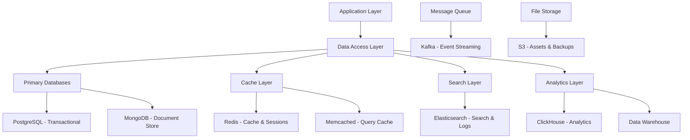
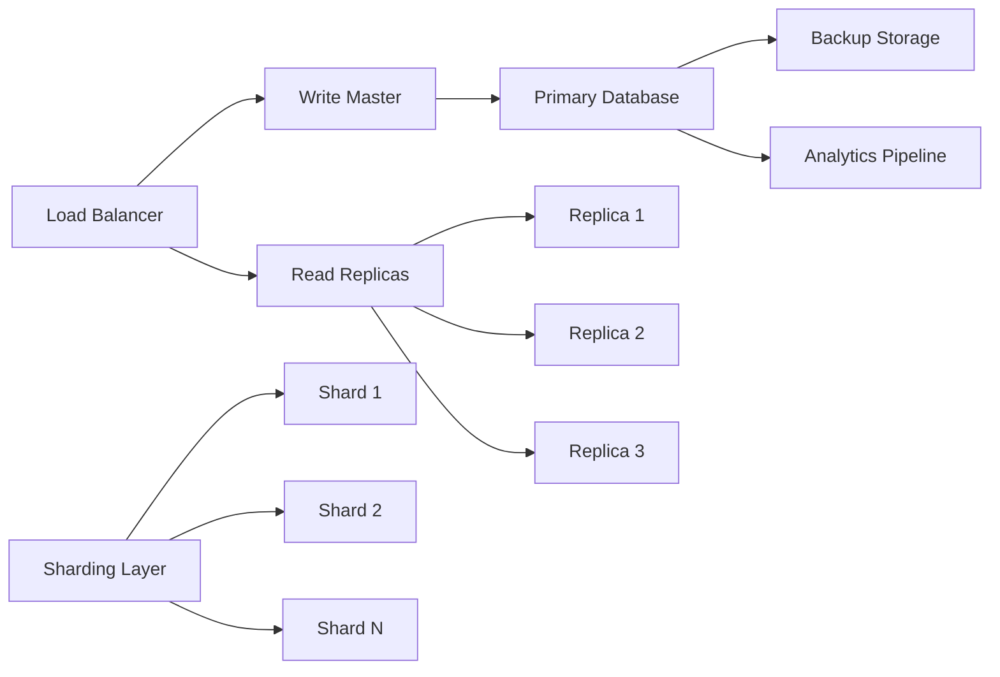
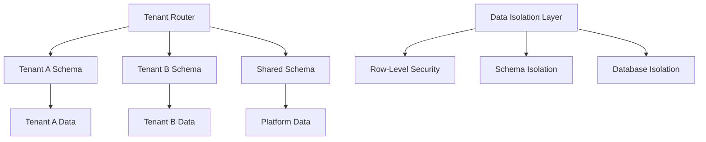

# Design Document

## Overview

The Database Architecture for the Bilten platform is designed as a polyglot persistence system that leverages multiple database technologies optimized for specific use cases. The architecture emphasizes scalability, performance, data consistency, and operational excellence while supporting the diverse data requirements of event management, user analytics, payment processing, and real-time features.

## Architecture

### High-Level Database Architecture



### Data Distribution Strategy



### Multi-Tenant Data Architecture



## Database Technologies

### PostgreSQL - Primary Transactional Database

#### Configuration and Design
```sql
-- Primary database for transactional data
CREATE DATABASE bilten_primary;

-- User and authentication data
CREATE SCHEMA users;
CREATE SCHEMA authentication;

-- Event and ticket management
CREATE SCHEMA events;
CREATE SCHEMA tickets;

-- Payment and financial data
CREATE SCHEMA payments;
CREATE SCHEMA financial;

-- Branding and customization
CREATE SCHEMA branding;
CREATE SCHEMA assets;

-- System and configuration
CREATE SCHEMA system;
CREATE SCHEMA audit;
```

#### Core Tables Design
```sql
-- Users table with comprehensive profile data
CREATE TABLE users.users (
    id UUID PRIMARY KEY DEFAULT gen_random_uuid(),
    email VARCHAR(255) UNIQUE NOT NULL,
    password_hash VARCHAR(255) NOT NULL,
    first_name VARCHAR(100),
    last_name VARCHAR(100),
    phone VARCHAR(20),
    date_of_birth DATE,
    role user_role DEFAULT 'user',
    status user_status DEFAULT 'active',
    email_verified BOOLEAN DEFAULT FALSE,
    profile_data JSONB,
    preferences JSONB,
    created_at TIMESTAMP WITH TIME ZONE DEFAULT NOW(),
    updated_at TIMESTAMP WITH TIME ZONE DEFAULT NOW(),
    deleted_at TIMESTAMP WITH TIME ZONE
);

-- Events table with full event lifecycle support
CREATE TABLE events.events (
    id UUID PRIMARY KEY DEFAULT gen_random_uuid(),
    organizer_id UUID NOT NULL REFERENCES users.users(id),
    title VARCHAR(255) NOT NULL,
    description TEXT,
    category VARCHAR(100),
    start_date TIMESTAMP WITH TIME ZONE NOT NULL,
    end_date TIMESTAMP WITH TIME ZONE NOT NULL,
    timezone VARCHAR(50) NOT NULL,
    location JSONB, -- venue, address, coordinates
    capacity INTEGER,
    status event_status DEFAULT 'draft',
    visibility event_visibility DEFAULT 'public',
    settings JSONB, -- event-specific settings
    metadata JSONB, -- additional metadata
    created_at TIMESTAMP WITH TIME ZONE DEFAULT NOW(),
    updated_at TIMESTAMP WITH TIME ZONE DEFAULT NOW(),
    deleted_at TIMESTAMP WITH TIME ZONE
);

-- Ticket types with comprehensive pricing and availability
CREATE TABLE tickets.ticket_types (
    id UUID PRIMARY KEY DEFAULT gen_random_uuid(),
    event_id UUID NOT NULL REFERENCES events.events(id),
    name VARCHAR(255) NOT NULL,
    description TEXT,
    price DECIMAL(10,2) NOT NULL,
    currency VARCHAR(3) DEFAULT 'USD',
    quantity INTEGER NOT NULL,
    sold INTEGER DEFAULT 0,
    reserved INTEGER DEFAULT 0,
    sales_start TIMESTAMP WITH TIME ZONE,
    sales_end TIMESTAMP WITH TIME ZONE,
    settings JSONB, -- transferable, refundable, etc.
    created_at TIMESTAMP WITH TIME ZONE DEFAULT NOW(),
    updated_at TIMESTAMP WITH TIME ZONE DEFAULT NOW()
);

-- Branding settings for organizers
CREATE TABLE branding.brand_settings (
    id UUID PRIMARY KEY DEFAULT gen_random_uuid(),
    organizer_id UUID NOT NULL REFERENCES users.users(id),
    primary_color VARCHAR(7), -- hex color
    secondary_color VARCHAR(7),
    logo_url TEXT,
    favicon_url TEXT,
    font_family VARCHAR(100),
    custom_css TEXT,
    custom_domain VARCHAR(255),
    ssl_status VARCHAR(20) DEFAULT 'pending',
    domain_verified BOOLEAN DEFAULT FALSE,
    guidelines JSONB, -- enforcement settings
    consistency_score INTEGER DEFAULT 0,
    created_at TIMESTAMP WITH TIME ZONE DEFAULT NOW(),
    updated_at TIMESTAMP WITH TIME ZONE DEFAULT NOW()
);
```

#### Indexing Strategy
```sql
-- Performance indexes for common queries
CREATE INDEX idx_users_email ON users.users(email);
CREATE INDEX idx_users_role_status ON users.users(role, status);
CREATE INDEX idx_events_organizer ON events.events(organizer_id);
CREATE INDEX idx_events_status_start ON events.events(status, start_date);
CREATE INDEX idx_events_category ON events.events(category);
CREATE INDEX idx_events_location_gin ON events.events USING GIN(location);
CREATE INDEX idx_tickets_event ON tickets.ticket_types(event_id);
CREATE INDEX idx_branding_organizer ON branding.brand_settings(organizer_id);

-- Full-text search indexes
CREATE INDEX idx_events_search ON events.events USING GIN(
    to_tsvector('english', title || ' ' || COALESCE(description, ''))
);
```

### Redis - Caching and Session Management

#### Cache Architecture
```javascript
const RedisConfiguration = {
  clusters: [
    {
      name: 'session-cache',
      purpose: 'User sessions and authentication tokens',
      ttl: '24 hours',
      evictionPolicy: 'allkeys-lru'
    },
    {
      name: 'application-cache',
      purpose: 'Application data and query results',
      ttl: '1-6 hours',
      evictionPolicy: 'allkeys-lru'
    },
    {
      name: 'real-time-cache',
      purpose: 'Real-time analytics and counters',
      ttl: '15 minutes',
      evictionPolicy: 'volatile-ttl'
    }
  ],
  keyPatterns: [
    'session:{userId}:{sessionId}',
    'user:profile:{userId}',
    'event:details:{eventId}',
    'analytics:live:{eventId}:{metric}',
    'branding:settings:{organizerId}'
  ]
}
```

#### Caching Strategies
```javascript
const CachingPatterns = {
  writeThrough: [
    'User profile updates',
    'Event status changes',
    'Branding settings updates'
  ],
  writeAround: [
    'Analytics data writes',
    'Audit log entries',
    'Large file uploads'
  ],
  writeBack: [
    'User activity tracking',
    'Real-time metrics',
    'Session data updates'
  ],
  readAside: [
    'Event details',
    'User preferences',
    'Branding configurations'
  ]
}
```

### ClickHouse - Analytics Database

#### Analytics Schema Design
```sql
-- Event tracking table for analytics
CREATE TABLE analytics.events (
    event_id UUID,
    session_id UUID,
    user_id Nullable(UUID),
    organizer_id Nullable(UUID),
    event_type String,
    event_name String,
    timestamp DateTime64(3),
    properties Map(String, String),
    user_agent String,
    ip_address String,
    referrer String,
    page_url String,
    created_date Date MATERIALIZED toDate(timestamp)
) ENGINE = MergeTree()
PARTITION BY toYYYYMM(created_date)
ORDER BY (created_date, organizer_id, event_type, timestamp);

-- Aggregated metrics table
CREATE TABLE analytics.metrics_daily (
    date Date,
    organizer_id UUID,
    event_id Nullable(UUID),
    metric_name String,
    metric_value Float64,
    dimensions Map(String, String)
) ENGINE = SummingMergeTree()
PARTITION BY toYYYYMM(date)
ORDER BY (date, organizer_id, metric_name);

-- Real-time analytics materialized view
CREATE MATERIALIZED VIEW analytics.events_realtime
TO analytics.metrics_realtime
AS SELECT
    toStartOfMinute(timestamp) as minute,
    organizer_id,
    event_id,
    event_type,
    count() as event_count,
    uniq(user_id) as unique_users,
    uniq(session_id) as unique_sessions
FROM analytics.events
GROUP BY minute, organizer_id, event_id, event_type;
```

### Elasticsearch - Search and Logging

#### Search Index Configuration
```json
{
  "events_index": {
    "settings": {
      "number_of_shards": 3,
      "number_of_replicas": 1,
      "analysis": {
        "analyzer": {
          "event_analyzer": {
            "type": "custom",
            "tokenizer": "standard",
            "filter": ["lowercase", "stop", "snowball"]
          }
        }
      }
    },
    "mappings": {
      "properties": {
        "id": {"type": "keyword"},
        "title": {
          "type": "text",
          "analyzer": "event_analyzer",
          "fields": {
            "keyword": {"type": "keyword"}
          }
        },
        "description": {
          "type": "text",
          "analyzer": "event_analyzer"
        },
        "category": {"type": "keyword"},
        "location": {
          "properties": {
            "coordinates": {"type": "geo_point"},
            "city": {"type": "keyword"},
            "country": {"type": "keyword"}
          }
        },
        "start_date": {"type": "date"},
        "price_range": {
          "type": "nested",
          "properties": {
            "min": {"type": "float"},
            "max": {"type": "float"},
            "currency": {"type": "keyword"}
          }
        },
        "organizer_id": {"type": "keyword"},
        "status": {"type": "keyword"},
        "tags": {"type": "keyword"}
      }
    }
  }
}
```

## Data Access Patterns

### Repository Pattern Implementation
```javascript
class BaseRepository {
  constructor(database, cache) {
    this.db = database;
    this.cache = cache;
  }

  async findById(id, useCache = true) {
    if (useCache) {
      const cached = await this.cache.get(`${this.entityName}:${id}`);
      if (cached) return JSON.parse(cached);
    }

    const entity = await this.db.query(
      `SELECT * FROM ${this.tableName} WHERE id = $1 AND deleted_at IS NULL`,
      [id]
    );

    if (entity && useCache) {
      await this.cache.setex(
        `${this.entityName}:${id}`,
        this.cacheTTL,
        JSON.stringify(entity)
      );
    }

    return entity;
  }

  async create(data) {
    const entity = await this.db.query(
      `INSERT INTO ${this.tableName} (${this.getColumns(data)}) 
       VALUES (${this.getPlaceholders(data)}) 
       RETURNING *`,
      Object.values(data)
    );

    // Invalidate related caches
    await this.invalidateCache(entity.id);
    
    return entity;
  }

  async update(id, data) {
    const entity = await this.db.query(
      `UPDATE ${this.tableName} 
       SET ${this.getUpdateClause(data)}, updated_at = NOW() 
       WHERE id = $${Object.keys(data).length + 1} 
       RETURNING *`,
      [...Object.values(data), id]
    );

    // Update cache
    await this.cache.setex(
      `${this.entityName}:${id}`,
      this.cacheTTL,
      JSON.stringify(entity)
    );

    return entity;
  }
}

class EventRepository extends BaseRepository {
  constructor(database, cache, searchIndex) {
    super(database, cache);
    this.tableName = 'events.events';
    this.entityName = 'event';
    this.cacheTTL = 3600; // 1 hour
    this.searchIndex = searchIndex;
  }

  async search(query, filters = {}) {
    const searchQuery = {
      index: 'events_index',
      body: {
        query: {
          bool: {
            must: [
              {
                multi_match: {
                  query: query,
                  fields: ['title^2', 'description', 'category']
                }
              }
            ],
            filter: this.buildFilters(filters)
          }
        },
        sort: [
          { start_date: { order: 'asc' } },
          { _score: { order: 'desc' } }
        ]
      }
    };

    return await this.searchIndex.search(searchQuery);
  }

  async findByOrganizer(organizerId, options = {}) {
    const cacheKey = `events:organizer:${organizerId}`;
    
    if (options.useCache) {
      const cached = await this.cache.get(cacheKey);
      if (cached) return JSON.parse(cached);
    }

    const events = await this.db.query(
      `SELECT * FROM events.events 
       WHERE organizer_id = $1 AND deleted_at IS NULL 
       ORDER BY start_date ASC`,
      [organizerId]
    );

    if (options.useCache) {
      await this.cache.setex(cacheKey, 1800, JSON.stringify(events));
    }

    return events;
  }
}
```

## Data Migration and Schema Management

### Migration Framework
```javascript
class MigrationManager {
  constructor(database) {
    this.db = database;
  }

  async runMigration(migrationFile) {
    const migration = require(migrationFile);
    
    await this.db.transaction(async (trx) => {
      // Record migration start
      await trx.query(
        'INSERT INTO system.migrations (name, started_at) VALUES ($1, NOW())',
        [migration.name]
      );

      try {
        // Run migration
        await migration.up(trx);
        
        // Record success
        await trx.query(
          'UPDATE system.migrations SET completed_at = NOW(), status = $1 WHERE name = $2',
          ['completed', migration.name]
        );
      } catch (error) {
        // Record failure
        await trx.query(
          'UPDATE system.migrations SET failed_at = NOW(), status = $1, error = $2 WHERE name = $3',
          ['failed', error.message, migration.name]
        );
        throw error;
      }
    });
  }
}

// Example migration
const migration_001_add_branding_tables = {
  name: '001_add_branding_tables',
  
  async up(trx) {
    await trx.query(`
      CREATE SCHEMA IF NOT EXISTS branding;
      
      CREATE TABLE branding.brand_settings (
        id UUID PRIMARY KEY DEFAULT gen_random_uuid(),
        organizer_id UUID NOT NULL REFERENCES users.users(id),
        primary_color VARCHAR(7),
        secondary_color VARCHAR(7),
        logo_url TEXT,
        custom_domain VARCHAR(255),
        settings JSONB DEFAULT '{}',
        created_at TIMESTAMP WITH TIME ZONE DEFAULT NOW(),
        updated_at TIMESTAMP WITH TIME ZONE DEFAULT NOW()
      );
      
      CREATE INDEX idx_branding_organizer ON branding.brand_settings(organizer_id);
    `);
  },
  
  async down(trx) {
    await trx.query(`
      DROP TABLE IF EXISTS branding.brand_settings;
      DROP SCHEMA IF EXISTS branding CASCADE;
    `);
  }
};
```

## Backup and Disaster Recovery

### Backup Strategy
```javascript
const BackupConfiguration = {
  postgresql: {
    fullBackup: {
      schedule: 'daily at 2:00 AM UTC',
      retention: '30 days',
      compression: 'gzip',
      encryption: 'AES-256'
    },
    incrementalBackup: {
      schedule: 'every 4 hours',
      retention: '7 days',
      walArchiving: true
    },
    pointInTimeRecovery: {
      enabled: true,
      retentionPeriod: '7 days'
    }
  },
  redis: {
    rdbSnapshot: {
      schedule: 'every 6 hours',
      retention: '3 days'
    },
    aofRewrite: {
      autoRewritePercentage: 100,
      autoRewriteMinSize: '64mb'
    }
  },
  clickhouse: {
    backup: {
      schedule: 'daily at 3:00 AM UTC',
      retention: '90 days',
      compression: 'lz4'
    }
  }
}
```

### Disaster Recovery Plan
```javascript
const DisasterRecoveryPlan = {
  rto: '15 minutes', // Recovery Time Objective
  rpo: '5 minutes',  // Recovery Point Objective
  
  procedures: {
    databaseFailure: [
      'Detect failure through monitoring',
      'Promote read replica to master',
      'Update application configuration',
      'Verify data consistency',
      'Resume normal operations'
    ],
    
    datacenterFailure: [
      'Activate disaster recovery site',
      'Restore from latest backup',
      'Update DNS and load balancers',
      'Verify all services operational',
      'Communicate status to stakeholders'
    ],
    
    dataCorruption: [
      'Identify corruption scope',
      'Stop affected services',
      'Restore from clean backup',
      'Replay transaction logs',
      'Validate data integrity'
    ]
  }
}
```

## Performance Optimization

### Query Optimization Framework
```sql
-- Automated query performance monitoring
CREATE OR REPLACE FUNCTION log_slow_queries()
RETURNS event_trigger AS $$
BEGIN
  IF tg_tag = 'SELECT' THEN
    INSERT INTO system.slow_queries (
      query_text,
      execution_time,
      rows_examined,
      rows_returned,
      timestamp
    )
    SELECT 
      query,
      total_time,
      rows,
      calls,
      NOW()
    FROM pg_stat_statements
    WHERE total_time > 1000; -- queries slower than 1 second
  END IF;
END;
$$ LANGUAGE plpgsql;

-- Index usage monitoring
CREATE VIEW system.index_usage AS
SELECT 
  schemaname,
  tablename,
  indexname,
  idx_tup_read,
  idx_tup_fetch,
  idx_scan,
  CASE 
    WHEN idx_scan = 0 THEN 'Unused'
    WHEN idx_scan < 10 THEN 'Low Usage'
    ELSE 'Active'
  END as usage_status
FROM pg_stat_user_indexes
ORDER BY idx_scan DESC;
```

### Connection Pool Configuration
```javascript
const ConnectionPoolConfig = {
  postgresql: {
    min: 5,
    max: 20,
    acquireTimeoutMillis: 30000,
    createTimeoutMillis: 30000,
    destroyTimeoutMillis: 5000,
    idleTimeoutMillis: 30000,
    reapIntervalMillis: 1000,
    createRetryIntervalMillis: 200
  },
  
  redis: {
    min: 2,
    max: 10,
    acquireTimeoutMillis: 10000,
    retryDelayOnFailover: 100,
    enableOfflineQueue: false,
    maxRetriesPerRequest: 3
  }
}
```