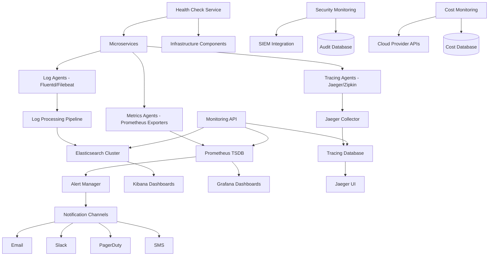

# Monitoring and Logging Design Document

## Overview

The Monitoring and Logging system provides comprehensive observability for the Bilten platform through centralized log collection, metrics aggregation, distributed tracing, and intelligent alerting. The system uses modern observability tools and practices to ensure high availability, performance optimization, and proactive incident management across all platform components.

## Architecture



## Components and Interfaces

### Log Collection and Processing
- **Purpose**: Centralized log aggregation and processing from all services
- **Key Methods**:
  - `collectLogs(source, logLevel, metadata)`
  - `processLogStream(stream, filters, enrichment)`
  - `searchLogs(query, timeRange, filters)`
  - `exportLogs(query, format, destination)`

### Metrics Collection and Storage
- **Purpose**: Time-series metrics collection and storage
- **Key Methods**:
  - `collectMetrics(serviceName, metricType, value, labels)`
  - `queryMetrics(query, timeRange, aggregation)`
  - `createAlert(metricQuery, threshold, conditions)`
  - `getServiceHealth(serviceName, timeRange)`

### Distributed Tracing Service
- **Purpose**: Request tracing across microservices
- **Key Methods**:
  - `startTrace(traceId, operationName, tags)`
  - `addSpan(traceId, spanId, parentSpanId, operation)`
  - `finishSpan(spanId, duration, status, logs)`
  - `queryTraces(serviceFilter, timeRange, tags)`

### Alerting and Incident Management
- **Purpose**: Intelligent alerting and incident response
- **Key Methods**:
  - `createAlertRule(condition, severity, channels)`
  - `evaluateAlerts(metrics, logs, traces)`
  - `sendNotification(alert, channels, escalation)`
  - `manageIncident(incidentId, status, assignee)`

### Health Monitoring Service
- **Purpose**: System and service health monitoring
- **Key Methods**:
  - `performHealthCheck(service, endpoint, timeout)`
  - `aggregateHealthStatus(services, dependencies)`
  - `trackUptime(service, availability, sla)`
  - `detectAnomalies(metrics, baseline, sensitivity)`

## Data Models

### Log Entry Model
```typescript
interface LogEntry {
  id: string;
  timestamp: Date;
  
  // Source information
  service: string;
  instance: string;
  version: string;
  environment: 'development' | 'staging' | 'production';
  
  // Log details
  level: 'debug' | 'info' | 'warn' | 'error' | 'fatal';
  message: string;
  logger: string;
  
  // Context information
  traceId?: string;
  spanId?: string;
  userId?: string;
  requestId?: string;
  
  // Structured data
  fields: Record<string, any>;
  tags: string[];
  
  // Error information
  error?: {
    name: string;
    message: string;
    stack: string;
    code?: string;
  };
  
  // Metadata
  host: string;
  container?: string;
  kubernetes?: {
    namespace: string;
    pod: string;
    container: string;
  };
}
```

### Metric Model
```typescript
interface Metric {
  id: string;
  timestamp: Date;
  
  // Metric identification
  name: string;
  type: 'counter' | 'gauge' | 'histogram' | 'summary';
  
  // Value and labels
  value: number;
  labels: Record<string, string>;
  
  // Source information
  service: string;
  instance: string;
  job: string;
  
  // Additional metadata
  unit?: string;
  description?: string;
  help?: string;
}
```

### Trace Model
```typescript
interface Trace {
  traceId: string;
  operationName: string;
  startTime: Date;
  duration: number;
  
  // Spans in the trace
  spans: Span[];
  
  // Trace metadata
  services: string[];
  tags: Record<string, any>;
  
  // Status and errors
  hasErrors: boolean;
  errorCount: number;
  
  // Performance metrics
  totalSpans: number;
  criticalPath: string[];
}

interface Span {
  spanId: string;
  parentSpanId?: string;
  operationName: string;
  
  // Timing
  startTime: Date;
  duration: number;
  
  // Service information
  service: string;
  component?: string;
  
  // Tags and logs
  tags: Record<string, any>;
  logs: SpanLog[];
  
  // Status
  status: 'ok' | 'error' | 'timeout';
  
  // References
  references: SpanReference[];
}
```

### Alert Rule Model
```typescript
interface AlertRule {
  id: string;
  name: string;
  description: string;
  
  // Rule definition
  query: string;
  condition: AlertCondition;
  severity: 'low' | 'medium' | 'high' | 'critical';
  
  // Evaluation
  evaluationInterval: number;
  evaluationTimeout: number;
  
  // Notification
  notificationChannels: string[];
  escalationPolicy?: EscalationPolicy;
  
  // Status
  isActive: boolean;
  lastEvaluation?: Date;
  lastTriggered?: Date;
  
  // Metadata
  tags: string[];
  runbook?: string;
  
  createdAt: Date;
  updatedAt: Date;
}

interface AlertCondition {
  operator: 'gt' | 'lt' | 'eq' | 'ne' | 'gte' | 'lte';
  threshold: number;
  duration: number; // seconds
  aggregation?: 'avg' | 'sum' | 'min' | 'max' | 'count';
}
```

### Health Check Model
```typescript
interface HealthCheck {
  id: string;
  service: string;
  endpoint: string;
  
  // Check configuration
  method: 'GET' | 'POST' | 'HEAD';
  timeout: number;
  interval: number;
  retries: number;
  
  // Expected response
  expectedStatus: number[];
  expectedBody?: string;
  expectedHeaders?: Record<string, string>;
  
  // Current status
  status: 'healthy' | 'unhealthy' | 'unknown';
  lastCheck: Date;
  lastSuccess: Date;
  consecutiveFailures: number;
  
  // Response details
  responseTime?: number;
  responseStatus?: number;
  errorMessage?: string;
  
  // Metadata
  tags: string[];
  dependencies: string[];
  
  createdAt: Date;
  updatedAt: Date;
}
```

## Error Handling

### Monitoring System Errors
- **LogIngestionError**: When log collection or processing fails
- **MetricCollectionError**: When metrics cannot be collected or stored
- **TracingError**: When distributed tracing fails or is incomplete
- **AlertEvaluationError**: When alert rules cannot be evaluated
- **NotificationError**: When alerts cannot be sent to notification channels

### Data Quality Issues
- **MissingDataError**: When expected metrics or logs are not received
- **DataCorruptionError**: When collected data is malformed or corrupted
- **TimestampSkewError**: When timestamps are significantly out of sync
- **DuplicateDataError**: When duplicate metrics or logs are detected

### Error Response Format
```json
{
  "error": {
    "code": "METRIC_COLLECTION_FAILED",
    "message": "Failed to collect metrics from service",
    "details": "Connection timeout to prometheus exporter",
    "timestamp": "2024-01-15T10:30:00Z",
    "service": "user-service",
    "component": "metrics-collector"
  }
}
```

## Testing Strategy

### Unit Testing
- Log parsing and enrichment logic
- Metric aggregation and calculation
- Alert rule evaluation algorithms
- Health check validation
- Notification delivery mechanisms

### Integration Testing
- End-to-end log collection pipeline
- Metrics collection from all services
- Distributed tracing across services
- Alert notification delivery
- Dashboard and visualization functionality

### Performance Testing
- High-volume log ingestion performance
- Metrics collection scalability
- Query performance on large datasets
- Alert evaluation under load
- Storage and retention performance

### Reliability Testing
- System behavior during service failures
- Data consistency during network partitions
- Recovery from storage failures
- Alert reliability and delivery guarantees
- Monitoring system self-monitoring

## Security Considerations

### Data Protection
- Encryption of logs and metrics in transit and at rest
- PII detection and masking in logs
- Access control for monitoring data
- Audit logging for monitoring system access
- Secure storage of sensitive configuration

### Access Control
- Role-based access to dashboards and data
- API authentication and authorization
- Service-to-service authentication for data collection
- Secure credential management
- Network security and isolation

### Compliance Features
- GDPR-compliant log retention and deletion
- Audit trail for all monitoring activities
- Data residency and geographic controls
- Compliance reporting and evidence collection
- Privacy-preserving monitoring techniques

## Performance Optimization

### Data Collection Optimization
- Efficient log shipping and batching
- Metrics sampling and aggregation
- Trace sampling strategies
- Compression and deduplication
- Resource-aware collection rates

### Storage Optimization
- Time-series database optimization
- Log retention and archival policies
- Index optimization for search performance
- Data compression and tiering
- Efficient query patterns

### Query and Visualization Optimization
- Dashboard caching and optimization
- Query result caching
- Efficient aggregation strategies
- Real-time vs. batch processing
- Progressive data loading

## API Endpoints

### Log Management
```
POST /api/monitoring/logs/ingest
GET /api/monitoring/logs/search
GET /api/monitoring/logs/export
DELETE /api/monitoring/logs/retention
```

### Metrics Management
```
POST /api/monitoring/metrics/ingest
GET /api/monitoring/metrics/query
GET /api/monitoring/metrics/series
POST /api/monitoring/metrics/alerts
```

### Tracing Operations
```
POST /api/monitoring/traces/ingest
GET /api/monitoring/traces/search
GET /api/monitoring/traces/{traceId}
GET /api/monitoring/traces/dependencies
```

### Health and Alerting
```
GET /api/monitoring/health/services
POST /api/monitoring/health/checks
GET /api/monitoring/alerts/rules
POST /api/monitoring/alerts/rules
PUT /api/monitoring/alerts/rules/{ruleId}
```