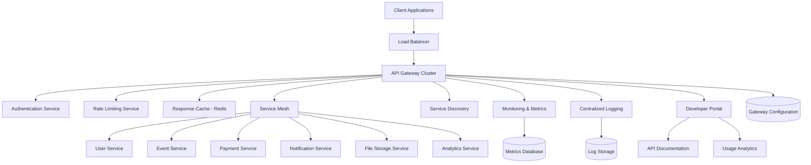

# API Gateway Design Document

## Overview

The API Gateway serves as the central entry point for all client requests to the Bilten platform, providing unified access to microservices through a scalable, secure, and feature-rich gateway architecture. The system implements authentication, rate limiting, request routing, service discovery, monitoring, and comprehensive API management capabilities using modern gateway technologies and patterns.

## Architecture



## Components and Interfaces

### API Gateway Core
- **Purpose**: Central request processing and routing engine
- **Key Methods**:
  - `routeRequest(request, context)`
  - `authenticateRequest(token, endpoint)`
  - `applyRateLimit(clientId, endpoint)`
  - `transformResponse(response, clientType)`

### Authentication & Authorization Service
- **Purpose**: Centralized security validation and token management
- **Key Methods**:
  - `validateToken(token, requiredScopes)`
  - `checkPermissions(userId, resource, action)`
  - `refreshToken(refreshToken)`
  - `revokeToken(token)`

### Rate Limiting Service
- **Purpose**: Traffic control and abuse prevention
- **Key Methods**:
  - `checkRateLimit(clientId, endpoint, timeWindow)`
  - `incrementCounter(clientId, endpoint)`
  - `getRemainingQuota(clientId, endpoint)`
  - `resetLimits(clientId)`

### Service Discovery & Registry
- **Purpose**: Dynamic service location and health monitoring
- **Key Methods**:
  - `registerService(serviceInfo, healthCheck)`
  - `discoverServices(serviceName, version)`
  - `getHealthyInstances(serviceName)`
  - `updateServiceHealth(serviceId, status)`

### Request/Response Transformation
- **Purpose**: Protocol adaptation and data format conversion
- **Key Methods**:
  - `transformRequest(request, targetService)`
  - `aggregateResponses(responses, aggregationRules)`
  - `compressResponse(response, clientCapabilities)`
  - `filterFields(response, fieldSelection)`

## Data Models

### Gateway Configuration Model
```typescript
interface GatewayConfig {
  id: string;
  version: string;
  
  // Routing configuration
  routes: RouteConfig[];
  upstreams: UpstreamConfig[];
  
  // Security configuration
  authentication: AuthConfig;
  rateLimiting: RateLimitConfig[];
  cors: CorsConfig;
  
  // Performance configuration
  caching: CacheConfig;
  compression: CompressionConfig;
  timeout: TimeoutConfig;
  
  // Monitoring configuration
  logging: LoggingConfig;
  metrics: MetricsConfig;
  tracing: TracingConfig;
  
  createdAt: Date;
  updatedAt: Date;
}

interface RouteConfig {
  id: string;
  path: string;
  methods: string[];
  upstream: string;
  
  // Route-specific settings
  authentication: boolean;
  rateLimit?: string;
  caching?: CacheRule;
  transformation?: TransformationRule;
  
  // Version and feature flags
  version: string;
  enabled: boolean;
  deprecated?: Date;
  
  metadata: Record<string, any>;
}
```

### Rate Limiting Model
```typescript
interface RateLimitRule {
  id: string;
  name: string;
  
  // Targeting
  clientType: 'user' | 'organization' | 'api_key' | 'ip';
  endpoints: string[];
  methods: string[];
  
  // Limits
  requestsPerSecond?: number;
  requestsPerMinute?: number;
  requestsPerHour?: number;
  requestsPerDay?: number;
  
  // Burst handling
  burstSize?: number;
  
  // Actions
  action: 'throttle' | 'block' | 'queue';
  blockDuration?: number;
  
  // Conditions
  conditions: LimitCondition[];
  
  isActive: boolean;
  createdAt: Date;
  updatedAt: Date;
}

interface LimitCondition {
  type: 'header' | 'query' | 'body' | 'ip_range' | 'time_window';
  field?: string;
  operator: 'equals' | 'contains' | 'regex' | 'in_range';
  value: any;
}
```

### Service Registry Model
```typescript
interface ServiceRegistration {
  id: string;
  name: string;
  version: string;
  
  // Network information
  host: string;
  port: number;
  protocol: 'http' | 'https' | 'grpc';
  basePath?: string;
  
  // Health check
  healthCheck: {
    endpoint: string;
    interval: number;
    timeout: number;
    retries: number;
  };
  
  // Load balancing
  weight: number;
  tags: string[];
  
  // Status
  status: 'healthy' | 'unhealthy' | 'draining';
  lastHealthCheck: Date;
  
  // Metadata
  metadata: {
    region?: string;
    zone?: string;
    capabilities?: string[];
    resources?: ResourceInfo;
  };
  
  registeredAt: Date;
  updatedAt: Date;
}
```

### API Analytics Model
```typescript
interface APIMetrics {
  id: string;
  timestamp: Date;
  
  // Request information
  endpoint: string;
  method: string;
  clientId?: string;
  userId?: string;
  organizationId?: string;
  
  // Performance metrics
  responseTime: number;
  requestSize: number;
  responseSize: number;
  
  // Status information
  statusCode: number;
  success: boolean;
  errorType?: string;
  
  // Geographic information
  clientIP: string;
  country?: string;
  region?: string;
  
  // User agent information
  userAgent?: string;
  clientType: 'web' | 'mobile' | 'api' | 'webhook';
  
  // Tracing information
  traceId: string;
  spanId: string;
  
  metadata: Record<string, any>;
}
```

## Error Handling

### Gateway Errors
- **ServiceUnavailableError**: When all upstream service instances are down
- **RateLimitExceededError**: When client exceeds configured rate limits
- **AuthenticationFailedError**: When token validation fails
- **AuthorizationDeniedError**: When user lacks required permissions
- **RequestTimeoutError**: When upstream services don't respond in time
- **CircuitBreakerOpenError**: When circuit breaker prevents requests

### Error Response Format
```json
{
  "error": {
    "code": "RATE_LIMIT_EXCEEDED",
    "message": "Request rate limit exceeded",
    "details": "Maximum 100 requests per minute allowed",
    "timestamp": "2024-01-15T10:30:00Z",
    "traceId": "trace_123456",
    "retryAfter": 60
  }
}
```

## Testing Strategy

### Unit Testing
- Route matching and request routing logic
- Authentication and authorization validation
- Rate limiting algorithms and counters
- Request/response transformation functions
- Service discovery and health checking

### Integration Testing
- End-to-end request flow through gateway
- Service mesh integration and communication
- Authentication service integration
- Rate limiting with Redis backend
- Monitoring and metrics collection

### Performance Testing
- High-throughput request processing
- Concurrent client request handling
- Rate limiting under load
- Service discovery performance
- Cache hit/miss ratios and performance

### Security Testing
- Authentication bypass attempts
- Authorization escalation testing
- Rate limiting evasion attempts
- Input validation and sanitization
- SSL/TLS configuration validation

## Security Considerations

### Authentication Security
- JWT token validation and signature verification
- Token expiration and refresh handling
- Secure token storage and transmission
- Multi-factor authentication support
- OAuth 2.0 and OpenID Connect compliance

### Network Security
- TLS termination and certificate management
- Request sanitization and validation
- DDoS protection and mitigation
- IP-based access controls
- Geographic restrictions and compliance

### Data Protection
- Request/response data masking
- PII detection and handling
- Audit logging and compliance
- Data residency requirements
- Encryption in transit and at rest

## Performance Optimization

### Caching Strategies
- Response caching with intelligent invalidation
- Service discovery result caching
- Authentication token caching
- Rate limiting counter optimization
- Configuration caching and hot reloading

### Load Balancing
- Intelligent upstream selection algorithms
- Health-based routing decisions
- Geographic proximity routing
- Weighted round-robin distribution
- Circuit breaker pattern implementation

### Resource Optimization
- Connection pooling and reuse
- Request batching and aggregation
- Compression and content optimization
- Memory usage optimization
- CPU-efficient request processing

## API Endpoints

### Gateway Management
```
GET /api/gateway/health
GET /api/gateway/metrics
GET /api/gateway/config
PUT /api/gateway/config
POST /api/gateway/reload
```

### Service Management
```
POST /api/gateway/services/register
DELETE /api/gateway/services/{serviceId}
GET /api/gateway/services
GET /api/gateway/services/{serviceId}/health
```

### Rate Limiting Management
```
GET /api/gateway/rate-limits
POST /api/gateway/rate-limits
PUT /api/gateway/rate-limits/{ruleId}
DELETE /api/gateway/rate-limits/{ruleId}
```

### Analytics and Monitoring
```
GET /api/gateway/analytics/requests
GET /api/gateway/analytics/performance
GET /api/gateway/analytics/errors
GET /api/gateway/analytics/usage
```