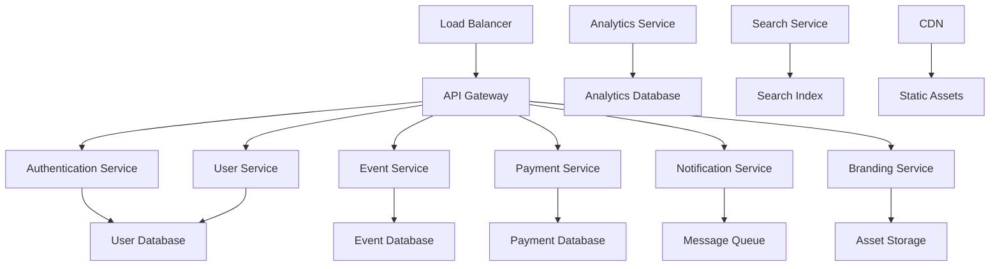
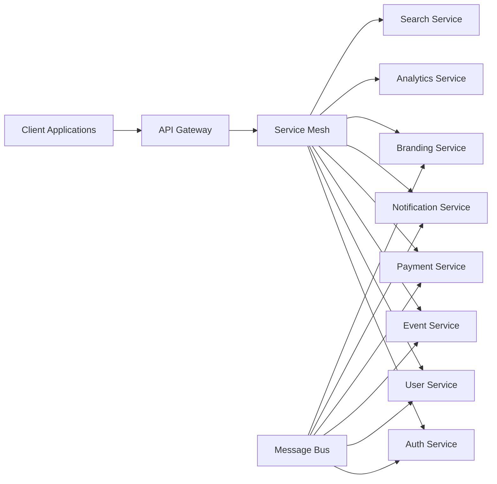
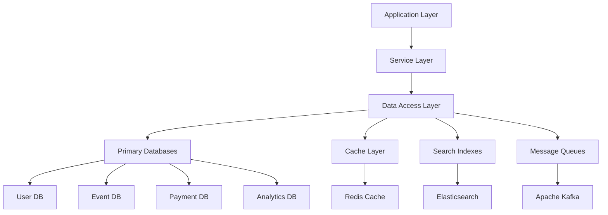

# Design Document

## Overview

The Backend Services architecture is designed as a distributed microservices system that provides scalable, secure, and maintainable APIs for the Bilten platform. Built using modern cloud-native technologies, it supports high availability, horizontal scaling, and comprehensive monitoring. The architecture emphasizes service isolation, data consistency, and operational excellence.

## Architecture

### High-Level Architecture



### Microservices Architecture



### Data Architecture



## Core Services

### Authentication Service

#### Service Design
```javascript
const AuthenticationService = {
  responsibilities: [
    'User registration and email verification',
    'Login and password authentication',
    'JWT token generation and validation',
    'Password reset and recovery',
    'Multi-factor authentication',
    'Session management and logout'
  ],
  endpoints: [
    'POST /auth/register - User registration',
    'POST /auth/login - User authentication',
    'POST /auth/refresh - Token refresh',
    'POST /auth/logout - Session termination',
    'POST /auth/forgot-password - Password reset',
    'POST /auth/verify-email - Email verification'
  ],
  security: [
    'bcrypt password hashing',
    'JWT with RS256 signing',
    'Rate limiting on auth endpoints',
    'Account lockout protection',
    'Secure password policies'
  ]
}
```

#### Authentication Flow
```javascript
const AuthFlow = {
  registration: [
    'Validate user input and email uniqueness',
    'Hash password with bcrypt',
    'Generate email verification token',
    'Send verification email',
    'Create user account in pending state'
  ],
  login: [
    'Validate credentials against database',
    'Check account status and lockout',
    'Generate JWT access and refresh tokens',
    'Log authentication event',
    'Return tokens and user profile'
  ],
  tokenRefresh: [
    'Validate refresh token signature',
    'Check token expiration and blacklist',
    'Generate new access token',
    'Optionally rotate refresh token',
    'Return new token pair'
  ]
}
```

### User Service

#### Service Design
```javascript
const UserService = {
  responsibilities: [
    'User profile management',
    'Role and permission management',
    'User preferences and settings',
    'Account status management',
    'User search and filtering',
    'Privacy and consent management'
  ],
  endpoints: [
    'GET /users/profile - Get user profile',
    'PUT /users/profile - Update user profile',
    'GET /users/{id} - Get user by ID',
    'GET /users/search - Search users',
    'PUT /users/{id}/role - Update user role',
    'DELETE /users/{id} - Delete user account'
  ],
  dataModel: {
    id: 'uuid',
    email: 'string (unique)',
    profile: 'UserProfile object',
    role: 'user | organizer | admin',
    status: 'active | suspended | deleted',
    preferences: 'UserPreferences object',
    createdAt: 'timestamp',
    updatedAt: 'timestamp'
  }
}
```

### Event Service

#### Service Design
```javascript
const EventService = {
  responsibilities: [
    'Event creation and management',
    'Ticket type configuration',
    'Event publishing and status management',
    'Event search and discovery',
    'Capacity management and validation',
    'Event analytics integration'
  ],
  endpoints: [
    'POST /events - Create new event',
    'GET /events/{id} - Get event details',
    'PUT /events/{id} - Update event',
    'DELETE /events/{id} - Delete event',
    'GET /events/search - Search events',
    'POST /events/{id}/publish - Publish event',
    'GET /events/{id}/tickets - Get ticket types'
  ],
  businessRules: [
    'Validate event dates and times',
    'Enforce capacity limits',
    'Check organizer permissions',
    'Validate ticket pricing',
    'Handle event state transitions'
  ]
}
```

#### Event Data Model
```javascript
const EventModel = {
  id: 'uuid',
  organizerId: 'uuid',
  title: 'string',
  description: 'text',
  category: 'string',
  startDate: 'datetime',
  endDate: 'datetime',
  timezone: 'string',
  location: {
    venue: 'string',
    address: 'string',
    city: 'string',
    country: 'string',
    coordinates: { lat: 'number', lng: 'number' }
  },
  capacity: 'number',
  status: 'draft | published | cancelled | completed',
  ticketTypes: 'TicketType[]',
  media: 'MediaFile[]',
  branding: 'BrandingSettings',
  settings: {
    allowWaitlist: 'boolean',
    requireApproval: 'boolean',
    isPublic: 'boolean',
    refundPolicy: 'string'
  },
  createdAt: 'timestamp',
  updatedAt: 'timestamp'
}
```

### Payment Service

#### Service Design
```javascript
const PaymentService = {
  responsibilities: [
    'Payment processing and gateway integration',
    'Order management and tracking',
    'Refund processing and management',
    'Payment method tokenization',
    'Transaction logging and auditing',
    'PCI DSS compliance'
  ],
  endpoints: [
    'POST /payments/process - Process payment',
    'GET /payments/{id} - Get payment details',
    'POST /payments/{id}/refund - Process refund',
    'GET /orders/{id} - Get order details',
    'GET /orders/user/{userId} - Get user orders',
    'POST /payments/webhooks/{provider} - Payment webhooks'
  ],
  integrations: [
    'Stripe payment processing',
    'PayPal payment processing',
    'Bank transfer processing',
    'Cryptocurrency payments',
    'Mobile payment solutions'
  ]
}
```

#### Payment Flow
```javascript
const PaymentFlow = {
  orderCreation: [
    'Validate ticket availability',
    'Calculate total amount and fees',
    'Create order record',
    'Reserve tickets temporarily',
    'Generate payment intent'
  ],
  paymentProcessing: [
    'Validate payment method',
    'Process payment with gateway',
    'Handle payment confirmation',
    'Update order status',
    'Confirm ticket reservations',
    'Send confirmation notifications'
  ],
  refundProcessing: [
    'Validate refund eligibility',
    'Calculate refund amount',
    'Process refund with gateway',
    'Update order and ticket status',
    'Send refund notifications'
  ]
}
```

### Notification Service

#### Service Design
```javascript
const NotificationService = {
  responsibilities: [
    'Multi-channel notification delivery',
    'Email template management',
    'Push notification handling',
    'SMS messaging integration',
    'Notification preferences management',
    'Delivery tracking and analytics'
  ],
  endpoints: [
    'POST /notifications/send - Send notification',
    'GET /notifications/templates - Get templates',
    'PUT /notifications/preferences - Update preferences',
    'GET /notifications/history - Get notification history',
    'POST /notifications/bulk - Send bulk notifications'
  ],
  channels: [
    'Email (transactional and marketing)',
    'Push notifications (web and mobile)',
    'SMS messaging',
    'In-app notifications',
    'Webhook notifications'
  ]
}
```

### Branding Service

#### Service Design
```javascript
const BrandingService = {
  responsibilities: [
    'Brand asset storage and management',
    'Brand settings configuration',
    'Custom domain management',
    'SSL certificate provisioning',
    'Brand consistency validation',
    'Multi-tenant branding support'
  ],
  endpoints: [
    'POST /branding/settings - Save brand settings',
    'GET /branding/settings/{organizerId} - Get brand settings',
    'POST /branding/assets - Upload brand assets',
    'GET /branding/assets/{assetId} - Get brand asset',
    'POST /branding/domains - Configure custom domain',
    'GET /branding/consistency/{organizerId} - Check consistency'
  ],
  features: [
    'Logo and image asset management',
    'Color palette configuration',
    'Typography and font management',
    'Custom CSS support',
    'Domain verification and SSL',
    'Brand guideline enforcement'
  ]
}
```

#### Branding Data Model
```javascript
const BrandingModel = {
  id: 'uuid',
  organizerId: 'uuid',
  settings: {
    primaryColor: 'string (hex)',
    secondaryColor: 'string (hex)',
    logoUrl: 'string',
    faviconUrl: 'string',
    fontFamily: 'string',
    customCSS: 'text'
  },
  assets: {
    logos: 'AssetFile[]',
    images: 'AssetFile[]',
    documents: 'AssetFile[]'
  },
  domains: {
    customDomain: 'string',
    sslStatus: 'pending | active | failed',
    verificationStatus: 'pending | verified | failed'
  },
  guidelines: {
    enforceColors: 'boolean',
    enforceLogos: 'boolean',
    enforceFonts: 'boolean',
    enforceSpacing: 'boolean'
  },
  consistencyScore: 'number (0-100)',
  createdAt: 'timestamp',
  updatedAt: 'timestamp'
}
```

## Infrastructure Components

### API Gateway

#### Gateway Configuration
```javascript
const APIGateway = {
  responsibilities: [
    'Request routing and load balancing',
    'Authentication and authorization',
    'Rate limiting and throttling',
    'Request/response transformation',
    'API versioning and deprecation',
    'Monitoring and analytics'
  ],
  features: [
    'JWT token validation',
    'CORS handling',
    'Request/response logging',
    'Circuit breaker patterns',
    'Caching strategies',
    'API documentation serving'
  ],
  routing: {
    '/auth/*': 'Authentication Service',
    '/users/*': 'User Service',
    '/events/*': 'Event Service',
    '/payments/*': 'Payment Service',
    '/notifications/*': 'Notification Service',
    '/branding/*': 'Branding Service'
  }
}
```

### Message Queue System

#### Messaging Architecture
```javascript
const MessageSystem = {
  technology: 'Apache Kafka / RabbitMQ',
  topics: [
    'user.events - User lifecycle events',
    'event.events - Event lifecycle events',
    'payment.events - Payment and order events',
    'notification.events - Notification requests',
    'branding.events - Branding update events',
    'analytics.events - Analytics tracking events'
  ],
  patterns: [
    'Event sourcing for audit trails',
    'CQRS for read/write separation',
    'Saga pattern for distributed transactions',
    'Dead letter queues for error handling'
  ]
}
```

### Database Design

#### Database Strategy
```javascript
const DatabaseArchitecture = {
  strategy: 'Database per service pattern',
  databases: {
    userDB: 'PostgreSQL - User profiles and authentication',
    eventDB: 'PostgreSQL - Events and ticket management',
    paymentDB: 'PostgreSQL - Orders and transactions',
    analyticsDB: 'ClickHouse - Analytics and metrics',
    cacheDB: 'Redis - Session and application cache',
    searchDB: 'Elasticsearch - Full-text search'
  },
  features: [
    'Connection pooling and management',
    'Read replicas for scaling',
    'Automated backups and recovery',
    'Database migration management',
    'Performance monitoring and optimization'
  ]
}
```

## Security Architecture

### Security Framework
```javascript
const SecurityDesign = {
  authentication: [
    'JWT tokens with RS256 signing',
    'Refresh token rotation',
    'Multi-factor authentication support',
    'OAuth2 and OpenID Connect integration'
  ],
  authorization: [
    'Role-based access control (RBAC)',
    'Resource-level permissions',
    'API key management',
    'Scope-based token validation'
  ],
  dataProtection: [
    'Encryption at rest (AES-256)',
    'Encryption in transit (TLS 1.3)',
    'PII tokenization and masking',
    'Secure key management (HSM/KMS)'
  ],
  compliance: [
    'PCI DSS for payment processing',
    'GDPR for data protection',
    'SOC 2 Type II compliance',
    'Regular security audits and penetration testing'
  ]
}
```

### API Security
```javascript
const APISecurity = {
  rateLimiting: [
    'Per-user rate limits',
    'Per-endpoint rate limits',
    'Burst protection',
    'Distributed rate limiting'
  ],
  validation: [
    'Input sanitization and validation',
    'SQL injection prevention',
    'XSS protection',
    'CSRF token validation'
  ],
  monitoring: [
    'Suspicious activity detection',
    'Failed authentication tracking',
    'API abuse monitoring',
    'Security event logging'
  ]
}
```

## Performance and Scalability

### Scaling Strategy
```javascript
const ScalingDesign = {
  horizontalScaling: [
    'Stateless service design',
    'Load balancing across instances',
    'Auto-scaling based on metrics',
    'Container orchestration (Kubernetes)'
  ],
  caching: [
    'Application-level caching (Redis)',
    'Database query result caching',
    'CDN for static assets',
    'API response caching'
  ],
  optimization: [
    'Database indexing and query optimization',
    'Connection pooling and reuse',
    'Asynchronous processing',
    'Lazy loading and pagination'
  ]
}
```

### Monitoring and Observability
```javascript
const MonitoringStack = {
  metrics: [
    'Application performance metrics (APM)',
    'Infrastructure metrics (CPU, memory, disk)',
    'Business metrics (orders, revenue, users)',
    'Custom metrics and KPIs'
  ],
  logging: [
    'Structured logging with correlation IDs',
    'Centralized log aggregation',
    'Log analysis and alerting',
    'Audit trail logging'
  ],
  tracing: [
    'Distributed tracing across services',
    'Request flow visualization',
    'Performance bottleneck identification',
    'Error propagation tracking'
  ],
  alerting: [
    'Real-time alert notifications',
    'Escalation policies and procedures',
    'Alert fatigue prevention',
    'Incident response automation'
  ]
}
```