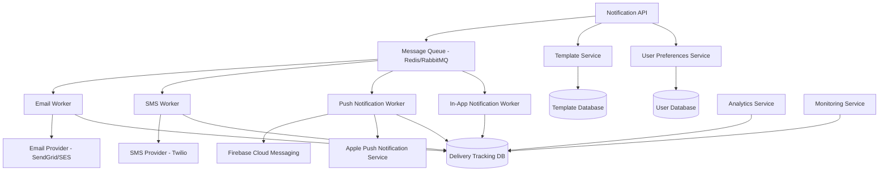

# Notification System Design Document

## Overview

The Notification System is a scalable, multi-channel communication platform that handles email, SMS, push notifications, and in-app messaging for the Bilten platform. The system uses a microservices architecture with message queues for reliable delivery, template management for branded communications, and comprehensive tracking for analytics and compliance.

## Architecture



## Components and Interfaces

### Notification API Service
- **Purpose**: Central API for triggering notifications and managing preferences
- **Key Methods**:
  - `sendNotification(type, recipients, template, data)`
  - `scheduleNotification(type, recipients, template, data, scheduledTime)`
  - `getUserPreferences(userId)`
  - `updateUserPreferences(userId, preferences)`
  - `getDeliveryStatus(notificationId)`

### Template Service
- **Purpose**: Manage notification templates with branding and localization
- **Key Methods**:
  - `getTemplate(templateId, organizerId, locale)`
  - `renderTemplate(templateId, data, branding)`
  - `createTemplate(template, organizerId)`
  - `validateTemplate(template)`

### Message Queue System
- **Purpose**: Reliable message processing with retry logic and dead letter queues
- **Features**:
  - Priority queues for urgent notifications
  - Retry mechanisms with exponential backoff
  - Dead letter queues for failed messages
  - Rate limiting per provider

### Notification Workers
- **Email Worker**: Processes email notifications via SendGrid/AWS SES
- **SMS Worker**: Handles SMS via Twilio with international support
- **Push Worker**: Manages mobile push notifications via FCM/APNS
- **In-App Worker**: Processes real-time in-app notifications via WebSocket

### User Preferences Service
- **Purpose**: Manage user communication preferences and compliance
- **Key Methods**:
  - `getPreferences(userId)`
  - `updatePreferences(userId, preferences)`
  - `checkOptIn(userId, notificationType)`
  - `processUnsubscribe(token)`

## Data Models

### Notification Request Model
```typescript
interface NotificationRequest {
  id: string;
  type: 'email' | 'sms' | 'push' | 'in_app';
  priority: 'low' | 'normal' | 'high' | 'urgent';
  recipients: Recipient[];
  templateId: string;
  data: Record<string, any>;
  organizerId?: string;
  scheduledAt?: Date;
  expiresAt?: Date;
  createdAt: Date;
  createdBy: string;
}

interface Recipient {
  userId: string;
  email?: string;
  phone?: string;
  deviceTokens?: string[];
  locale?: string;
  timezone?: string;
}
```

### Template Model
```typescript
interface NotificationTemplate {
  id: string;
  name: string;
  type: 'email' | 'sms' | 'push' | 'in_app';
  organizerId?: string; // null for system templates
  subject?: string; // for email
  htmlContent?: string; // for email
  textContent: string;
  variables: TemplateVariable[];
  branding: BrandingConfig;
  locale: string;
  isActive: boolean;
  createdAt: Date;
  updatedAt: Date;
}

interface TemplateVariable {
  name: string;
  type: 'string' | 'number' | 'date' | 'url';
  required: boolean;
  defaultValue?: string;
}
```

### User Preferences Model
```typescript
interface UserNotificationPreferences {
  userId: string;
  email: {
    transactional: boolean; // always true, cannot be disabled
    marketing: boolean;
    eventUpdates: boolean;
    reminders: boolean;
  };
  sms: {
    transactional: boolean;
    urgent: boolean;
    reminders: boolean;
  };
  push: {
    enabled: boolean;
    eventUpdates: boolean;
    recommendations: boolean;
    marketing: boolean;
  };
  inApp: {
    enabled: boolean;
    eventUpdates: boolean;
    system: boolean;
  };
  timezone: string;
  locale: string;
  unsubscribeToken: string;
  updatedAt: Date;
}
```

### Delivery Tracking Model
```typescript
interface DeliveryRecord {
  id: string;
  notificationId: string;
  userId: string;
  type: 'email' | 'sms' | 'push' | 'in_app';
  status: 'pending' | 'sent' | 'delivered' | 'failed' | 'bounced' | 'opened' | 'clicked';
  provider: string;
  providerMessageId?: string;
  recipient: string; // email, phone, or device token
  attempts: number;
  lastAttemptAt?: Date;
  deliveredAt?: Date;
  openedAt?: Date;
  clickedAt?: Date;
  errorMessage?: string;
  metadata: Record<string, any>;
  createdAt: Date;
}
```

## Error Handling

### Notification Service Errors
- **InvalidRecipientError**: When recipient data is malformed or missing
- **TemplateNotFoundError**: When specified template doesn't exist
- **PreferencesViolationError**: When notification violates user preferences
- **RateLimitExceededError**: When sending rate limits are exceeded
- **ProviderUnavailableError**: When external providers are down

### Retry Strategy
```typescript
interface RetryConfig {
  maxAttempts: 3;
  backoffStrategy: 'exponential';
  baseDelay: 1000; // 1 second
  maxDelay: 300000; // 5 minutes
  retryableErrors: [
    'PROVIDER_TIMEOUT',
    'PROVIDER_RATE_LIMIT',
    'TEMPORARY_FAILURE'
  ];
}
```

### Error Response Format
```json
{
  "error": {
    "code": "TEMPLATE_NOT_FOUND",
    "message": "Template with ID 'welcome-email' not found",
    "details": "Template may have been deleted or is not accessible",
    "timestamp": "2024-01-15T10:30:00Z",
    "notificationId": "notif_123456"
  }
}
```

## Testing Strategy

### Unit Testing
- Template rendering with various data inputs
- User preference validation and filtering
- Retry logic and error handling
- Message queue processing
- Provider integration mocking

### Integration Testing
- End-to-end notification delivery
- Template service integration
- User preferences service integration
- External provider integration (sandbox mode)
- Database transaction handling

### Performance Testing
- High-volume notification processing
- Concurrent user preference updates
- Template rendering performance
- Queue processing throughput
- Provider rate limit handling

### Compliance Testing
- GDPR data handling and deletion
- CAN-SPAM compliance verification
- Unsubscribe mechanism testing
- Audit trail validation
- Data retention policy enforcement

## Security Considerations

### Data Protection
- Encryption of sensitive user data (email, phone)
- Secure storage of provider API keys
- PII anonymization in logs
- Secure template variable handling

### Access Control
- API authentication and authorization
- Role-based template access
- User preference isolation
- Admin notification permissions

### Compliance Features
- Automatic unsubscribe handling
- Data retention and purging
- Audit logging for all operations
- GDPR-compliant data export/deletion

## Performance Optimization

### Scalability Features
- Horizontal scaling of worker processes
- Database read replicas for preferences
- Template caching with Redis
- Connection pooling for providers

### Delivery Optimization
- Batch processing for bulk notifications
- Priority queues for urgent messages
- Provider failover mechanisms
- Intelligent retry scheduling

### Monitoring and Alerting
- Real-time delivery rate monitoring
- Provider health checks
- Queue depth alerting
- Performance metrics tracking

## API Endpoints

### Core Notification APIs
```
POST /api/notifications/send
POST /api/notifications/schedule
GET /api/notifications/{id}/status
DELETE /api/notifications/{id}

GET /api/preferences/{userId}
PUT /api/preferences/{userId}
POST /api/preferences/unsubscribe

GET /api/templates
POST /api/templates
PUT /api/templates/{id}
DELETE /api/templates/{id}

GET /api/delivery/reports
GET /api/delivery/analytics
```

### Webhook Endpoints
```
POST /webhooks/email/delivery (SendGrid/SES)
POST /webhooks/sms/delivery (Twilio)
POST /webhooks/push/delivery (FCM/APNS)
```