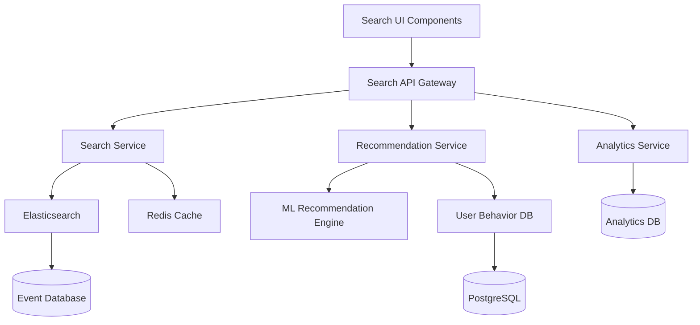

# Search and Discovery Design Document

## Overview

The Search and Discovery system provides comprehensive event search, filtering, and recommendation capabilities. The system consists of a search service with Elasticsearch backend, recommendation engine, and user interface components that work together to deliver fast, relevant, and personalized event discovery experiences.

## Architecture



## Components and Interfaces

### Search Service
- **Purpose**: Handle search queries, filtering, and result ranking
- **Key Methods**:
  - `searchEvents(query, filters, pagination)`
  - `getAutocompleteSuggestions(partialQuery)`
  - `getTrendingEvents(location, timeframe)`
  - `saveSearch(userId, searchCriteria)`

### Recommendation Engine
- **Purpose**: Generate personalized event recommendations
- **Key Methods**:
  - `getPersonalizedRecommendations(userId, limit)`
  - `getPopularEvents(location, category)`
  - `updateUserPreferences(userId, eventInteraction)`
  - `getSimilarEvents(eventId)`

### Search UI Components
- **SearchBar**: Main search input with autocomplete
- **FilterPanel**: Advanced filtering interface
- **ResultsList**: Display search results with pagination
- **RecommendationCards**: Show personalized recommendations
- **TrendingSection**: Display trending and popular events

### Search API Endpoints
```
GET /api/search/events
POST /api/search/save
GET /api/search/suggestions
GET /api/recommendations/personal
GET /api/recommendations/trending
GET /api/recommendations/popular
```

## Data Models

### Search Index Schema (Elasticsearch)
```json
{
  "event": {
    "properties": {
      "id": {"type": "keyword"},
      "title": {"type": "text", "analyzer": "standard"},
      "description": {"type": "text", "analyzer": "standard"},
      "category": {"type": "keyword"},
      "tags": {"type": "keyword"},
      "location": {
        "properties": {
          "name": {"type": "text"},
          "coordinates": {"type": "geo_point"},
          "city": {"type": "keyword"},
          "country": {"type": "keyword"}
        }
      },
      "date": {"type": "date"},
      "price": {"type": "float"},
      "organizer_id": {"type": "keyword"},
      "popularity_score": {"type": "float"},
      "created_at": {"type": "date"},
      "updated_at": {"type": "date"}
    }
  }
}
```

### Saved Search Model
```typescript
interface SavedSearch {
  id: string;
  userId: string;
  name: string;
  query: string;
  filters: {
    location?: string;
    category?: string[];
    dateRange?: {start: Date, end: Date};
    priceRange?: {min: number, max: number};
  };
  alertEnabled: boolean;
  createdAt: Date;
  lastExecuted: Date;
}
```

### User Preference Model
```typescript
interface UserPreferences {
  userId: string;
  categories: string[];
  locations: string[];
  priceRange: {min: number, max: number};
  eventTypes: string[];
  interactionHistory: EventInteraction[];
  updatedAt: Date;
}

interface EventInteraction {
  eventId: string;
  type: 'view' | 'bookmark' | 'register' | 'share';
  timestamp: Date;
  weight: number;
}
```

## Error Handling

### Search Service Errors
- **SearchTimeoutError**: When search queries exceed 5 seconds
- **InvalidFilterError**: When filter parameters are malformed
- **IndexUnavailableError**: When Elasticsearch is down
- **TooManyResultsError**: When result set exceeds maximum limit

### Recommendation Engine Errors
- **InsufficientDataError**: When user has no interaction history
- **ModelUnavailableError**: When ML model is not accessible
- **PreferenceUpdateError**: When user preference updates fail

### Error Response Format
```json
{
  "error": {
    "code": "SEARCH_TIMEOUT",
    "message": "Search request timed out",
    "details": "Query took longer than 5 seconds to execute",
    "timestamp": "2024-01-15T10:30:00Z"
  }
}
```

## Testing Strategy

### Unit Testing
- Search query parsing and validation
- Filter application logic
- Recommendation algorithm components
- Data model validation
- Error handling scenarios

### Integration Testing
- Elasticsearch integration
- Database query performance
- API endpoint functionality
- Cache behavior validation
- Cross-service communication

### Performance Testing
- Search response time under load
- Concurrent user search scenarios
- Large dataset search performance
- Recommendation generation speed
- Cache hit/miss ratios

### User Experience Testing
- Search result relevance
- Filter usability on mobile devices
- Recommendation accuracy
- Auto-complete responsiveness
- Search result pagination

### Test Data Requirements
- Minimum 10,000 test events with varied metadata
- 1,000 test users with interaction history
- Geographic data covering multiple cities/countries
- Events across all categories and price ranges
- Historical interaction data for recommendation testing

## Performance Considerations

### Search Optimization
- Elasticsearch index optimization for fast queries
- Query result caching with Redis
- Pagination to limit result set size
- Asynchronous search for complex queries

### Recommendation Performance
- Pre-computed recommendation caches
- Batch processing for preference updates
- Lazy loading of recommendation data
- Background model training and updates

### Mobile Optimization
- Compressed response payloads
- Progressive loading of search results
- Optimized image sizes for event thumbnails
- Efficient filter state management