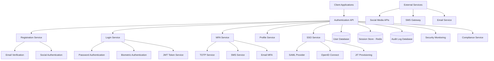

# User Authentication Service Design Document

## Overview

The User Authentication Service provides comprehensive identity and access management for the Bilten platform, implementing secure authentication, authorization, and user profile management. The system uses modern authentication protocols, multi-factor authentication, biometric support, and enterprise SSO integration while maintaining high security standards and regulatory compliance.

## Architecture



## Components and Interfaces

### Authentication API Service
- **Purpose**: Central API for all authentication and user management operations
- **Key Methods**:
  - `registerUser(userData, verificationMethod)`
  - `authenticateUser(credentials, mfaToken)`
  - `validateToken(token, requiredScopes)`
  - `refreshToken(refreshToken)`

### Registration Service
- **Purpose**: Handle new user registration and account verification
- **Key Methods**:
  - `createAccount(email, password, profile)`
  - `verifyEmail(token)`
  - `registerWithSocial(provider, socialToken)`
  - `checkEmailAvailability(email)`

### Multi-Factor Authentication Service
- **Purpose**: Manage MFA setup, validation, and recovery
- **Key Methods**:
  - `setupMFA(userId, method, secret)`
  - `validateMFACode(userId, code, method)`
  - `generateBackupCodes(userId)`
  - `disableMFA(userId, verificationCode)`

### Single Sign-On Service
- **Purpose**: Enterprise SSO integration and user provisioning
- **Key Methods**:
  - `configureSAML(organizationId, metadata)`
  - `processSSO(assertion, organizationId)`
  - `provisionUser(ssoData, organizationId)`
  - `mapAttributes(ssoAttributes, mappingRules)`

### Token Service
- **Purpose**: JWT token generation, validation, and management
- **Key Methods**:
  - `generateTokens(userId, scopes, deviceInfo)`
  - `validateToken(token)`
  - `refreshTokens(refreshToken)`
  - `revokeTokens(userId, deviceId)`

## Data Models

### User Account Model
```typescript
interface UserAccount {
  id: string;
  email: string;
  emailVerified: boolean;
  
  // Authentication
  passwordHash?: string;
  passwordSalt: string;
  passwordUpdatedAt: Date;
  
  // Profile information
  firstName: string;
  lastName: string;
  displayName?: string;
  avatar?: string;
  timezone: string;
  locale: string;
  
  // Account status
  status: 'active' | 'suspended' | 'pending_verification' | 'deleted';
  isEmailVerified: boolean;
  emailVerificationToken?: string;
  emailVerificationExpires?: Date;
  
  // Security settings
  mfaEnabled: boolean;
  mfaMethods: MFAMethod[];
  backupCodes: string[];
  
  // Social authentication
  socialAccounts: SocialAccount[];
  
  // Enterprise SSO
  ssoProvider?: string;
  ssoSubject?: string;
  organizationId?: string;
  
  // Security tracking
  lastLoginAt?: Date;
  lastLoginIP?: string;
  failedLoginAttempts: number;
  lockedUntil?: Date;
  
  // Privacy and preferences
  privacySettings: PrivacySettings;
  notificationPreferences: NotificationPreferences;
  
  // Audit fields
  createdAt: Date;
  updatedAt: Date;
  deletedAt?: Date;
}

interface MFAMethod {
  id: string;
  type: 'totp' | 'sms' | 'email';
  secret?: string; // for TOTP
  phoneNumber?: string; // for SMS
  isActive: boolean;
  createdAt: Date;
}

interface SocialAccount {
  provider: 'google' | 'facebook' | 'apple' | 'linkedin';
  providerId: string;
  email: string;
  displayName: string;
  avatar?: string;
  connectedAt: Date;
}
```

### Authentication Session Model
```typescript
interface AuthSession {
  id: string;
  userId: string;
  
  // Token information
  accessToken: string;
  refreshToken: string;
  tokenType: 'Bearer';
  expiresAt: Date;
  refreshExpiresAt: Date;
  
  // Device and client information
  deviceId: string;
  deviceName?: string;
  deviceType: 'web' | 'mobile' | 'tablet' | 'desktop';
  userAgent: string;
  ipAddress: string;
  
  // Geographic information
  country?: string;
  city?: string;
  
  // Session metadata
  scopes: string[];
  lastActivityAt: Date;
  isActive: boolean;
  
  // Security flags
  isMFAVerified: boolean;
  riskScore?: number;
  
  createdAt: Date;
  updatedAt: Date;
}
```

### Security Event Model
```typescript
interface SecurityEvent {
  id: string;
  userId?: string;
  
  // Event information
  eventType: 'login_success' | 'login_failure' | 'password_reset' | 'mfa_setup' | 'account_locked' | 'suspicious_activity';
  description: string;
  severity: 'low' | 'medium' | 'high' | 'critical';
  
  // Context information
  ipAddress: string;
  userAgent: string;
  deviceId?: string;
  
  // Geographic information
  country?: string;
  city?: string;
  
  // Additional metadata
  metadata: {
    failureReason?: string;
    mfaMethod?: string;
    riskFactors?: string[];
    previousLoginAt?: Date;
  };
  
  // Resolution
  resolved: boolean;
  resolvedBy?: string;
  resolvedAt?: Date;
  
  timestamp: Date;
}
```

### SSO Configuration Model
```typescript
interface SSOConfiguration {
  id: string;
  organizationId: string;
  
  // Provider information
  provider: 'saml' | 'oidc';
  name: string;
  
  // SAML configuration
  samlMetadata?: string;
  samlEntityId?: string;
  samlSSOUrl?: string;
  samlCertificate?: string;
  
  // OIDC configuration
  oidcIssuer?: string;
  oidcClientId?: string;
  oidcClientSecret?: string;
  oidcScopes?: string[];
  
  // User provisioning
  jitProvisioning: boolean;
  attributeMapping: AttributeMapping;
  defaultRole: string;
  
  // Status
  isActive: boolean;
  
  createdAt: Date;
  updatedAt: Date;
}

interface AttributeMapping {
  email: string;
  firstName: string;
  lastName: string;
  displayName?: string;
  roles?: string;
  department?: string;
}
```

## Error Handling

### Authentication Errors
- **InvalidCredentialsError**: When email/password combination is incorrect
- **AccountLockedError**: When account is temporarily locked due to failed attempts
- **EmailNotVerifiedError**: When user tries to login with unverified email
- **MFARequiredError**: When MFA is required but not provided
- **TokenExpiredError**: When JWT token has expired
- **InsufficientPermissionsError**: When user lacks required permissions

### Registration Errors
- **EmailAlreadyExistsError**: When email is already registered
- **WeakPasswordError**: When password doesn't meet strength requirements
- **InvalidEmailFormatError**: When email format is invalid
- **SocialAuthError**: When social authentication fails

### Error Response Format
```json
{
  "error": {
    "code": "INVALID_CREDENTIALS",
    "message": "Invalid email or password",
    "details": "Please check your credentials and try again",
    "timestamp": "2024-01-15T10:30:00Z",
    "requestId": "req_123456"
  }
}
```

## Testing Strategy

### Unit Testing
- Password hashing and validation
- JWT token generation and validation
- MFA code generation and verification
- User registration and profile management
- SSO assertion processing

### Integration Testing
- Social authentication provider integration
- SMS and email service integration
- Database transaction handling
- Session management and cleanup
- API endpoint functionality

### Security Testing
- Password strength validation
- Brute force attack protection
- Session hijacking prevention
- Token security and expiration
- MFA bypass attempts

### Performance Testing
- High-volume user registration
- Concurrent authentication requests
- Token validation performance
- Database query optimization
- Session storage performance

## Security Considerations

### Password Security
- Bcrypt hashing with appropriate cost factor
- Password strength requirements and validation
- Password history to prevent reuse
- Secure password reset mechanisms
- Protection against timing attacks

### Token Security
- JWT with strong signing algorithms (RS256/ES256)
- Short-lived access tokens with refresh rotation
- Secure token storage and transmission
- Token revocation and blacklisting
- Protection against token replay attacks

### Session Security
- Secure session management with Redis
- Session fixation protection
- Concurrent session limits
- Geographic anomaly detection
- Device fingerprinting and tracking

## Performance Optimization

### Caching Strategies
- User profile caching with Redis
- Token validation result caching
- MFA secret caching for performance
- Social provider metadata caching
- Rate limiting counter optimization

### Database Optimization
- Efficient indexing for user lookups
- Connection pooling and query optimization
- Read replicas for authentication queries
- Partitioning for audit logs
- Archival strategies for old data

### Scalability Features
- Horizontal scaling with stateless design
- Load balancing across instances
- Database sharding for large user bases
- CDN for static authentication assets
- Microservice architecture for components

## API Endpoints

### Authentication Operations
```
POST /api/auth/register
POST /api/auth/login
POST /api/auth/logout
POST /api/auth/refresh
POST /api/auth/verify-email
POST /api/auth/forgot-password
POST /api/auth/reset-password
```

### Multi-Factor Authentication
```
POST /api/auth/mfa/setup
POST /api/auth/mfa/verify
POST /api/auth/mfa/disable
GET /api/auth/mfa/backup-codes
POST /api/auth/mfa/regenerate-codes
```

### Profile Management
```
GET /api/auth/profile
PUT /api/auth/profile
POST /api/auth/change-password
DELETE /api/auth/account
GET /api/auth/sessions
DELETE /api/auth/sessions/{sessionId}
```

### Social Authentication
```
GET /api/auth/social/{provider}/url
POST /api/auth/social/{provider}/callback
DELETE /api/auth/social/{provider}
```

### Enterprise SSO
```
GET /api/auth/sso/{organizationId}/metadata
POST /api/auth/sso/{organizationId}/login
POST /api/auth/sso/{organizationId}/callback
```