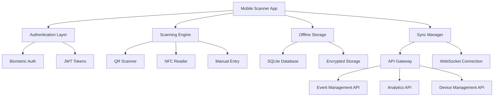
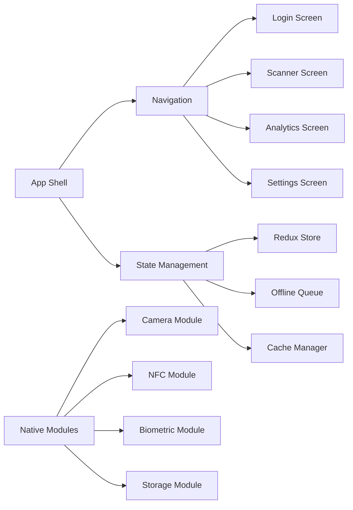
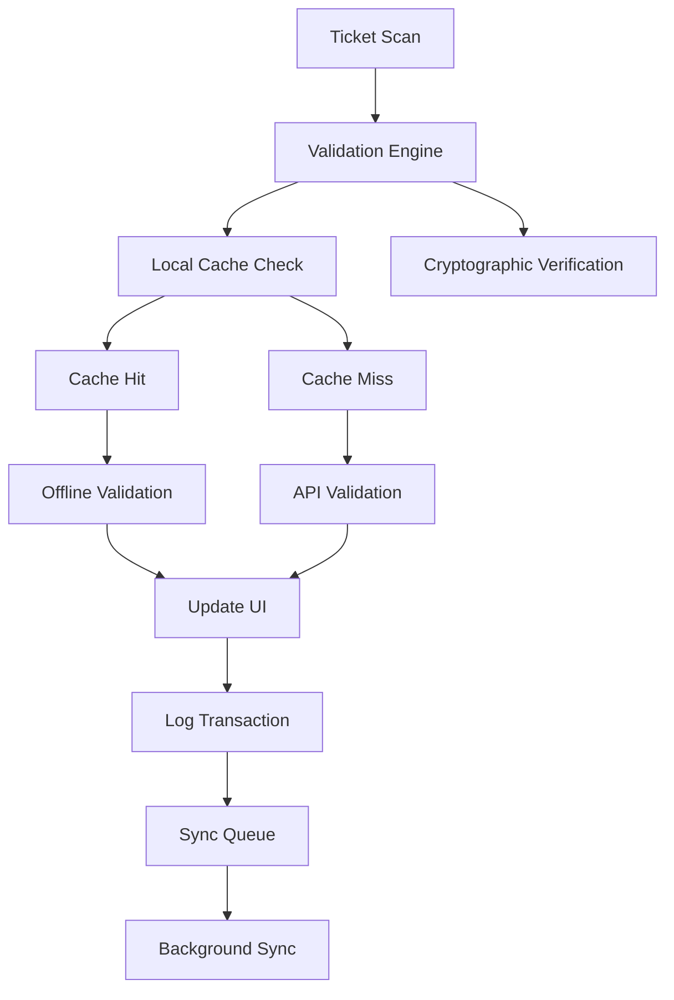

# Design Document

## Overview

The Mobile Scanner App is designed as a cross-platform mobile application built with React Native, providing robust ticket scanning and validation capabilities for event staff. The app emphasizes performance, reliability, and offline functionality while maintaining a simple, intuitive interface optimized for high-volume scanning operations in various lighting and connectivity conditions.

## Architecture

### High-Level Architecture



### Component Architecture



### Data Flow Architecture



## Core Components

### Authentication System

#### Authentication Flow
```javascript
const AuthenticationSystem = {
  methods: [
    'Username/Password authentication',
    'Biometric authentication (fingerprint, face)',
    'Device-based authentication',
    'QR code device pairing',
    'Multi-factor authentication'
  ],
  
  security: {
    tokenStorage: 'Secure keychain/keystore',
    tokenRefresh: 'Automatic background refresh',
    sessionTimeout: 'Configurable timeout with warnings',
    deviceBinding: 'Device-specific token binding'
  },
  
  offline: {
    cachedCredentials: 'Encrypted local credential cache',
    offlineValidation: 'Local biometric validation',
    gracefulDegradation: 'Limited offline functionality'
  }
}
```

#### User Management
```javascript
const UserManagement = {
  roles: [
    'scanner_operator - Basic scanning functionality',
    'security_staff - Enhanced validation and alerts',
    'supervisor - Analytics and management features',
    'admin - Full configuration and user management'
  ],
  
  permissions: {
    scan_tickets: 'Basic ticket scanning',
    view_analytics: 'Real-time analytics access',
    manage_settings: 'App configuration management',
    export_data: 'Data export capabilities',
    emergency_override: 'Emergency access controls'
  }
}
```

### Scanning Engine

#### QR Code Scanner
```javascript
const QRScanner = {
  camera: {
    autoFocus: 'Continuous autofocus for fast scanning',
    flashlight: 'Automatic and manual flashlight control',
    multiFormat: 'Support for QR, Data Matrix, PDF417',
    orientation: 'Portrait and landscape scanning'
  },
  
  performance: {
    scanSpeed: 'Sub-second scan recognition',
    batchScanning: 'Multiple ticket scanning in sequence',
    errorCorrection: 'Reed-Solomon error correction',
    preprocessing: 'Image enhancement for damaged codes'
  },
  
  validation: {
    formatValidation: 'Ticket format verification',
    checksumValidation: 'Data integrity verification',
    signatureValidation: 'Cryptographic signature check',
    timestampValidation: 'Ticket validity period check'
  }
}
```

#### Ticket Validation Logic
```javascript
class TicketValidator {
  async validateTicket(ticketData) {
    const validation = {
      format: await this.validateFormat(ticketData),
      signature: await this.validateSignature(ticketData),
      timestamp: await this.validateTimestamp(ticketData),
      usage: await this.checkUsageStatus(ticketData),
      event: await this.validateEventAccess(ticketData)
    };

    return {
      isValid: Object.values(validation).every(v => v.valid),
      validationResults: validation,
      attendeeInfo: await this.getAttendeeInfo(ticketData),
      accessLevel: await this.getAccessLevel(ticketData)
    };
  }

  async validateFormat(ticketData) {
    try {
      const decoded = this.decodeTicket(ticketData);
      return {
        valid: this.isValidFormat(decoded),
        message: 'Ticket format valid'
      };
    } catch (error) {
      return {
        valid: false,
        message: 'Invalid ticket format',
        error: error.message
      };
    }
  }

  async validateSignature(ticketData) {
    const publicKey = await this.getEventPublicKey(ticketData.eventId);
    const isValid = await this.verifySignature(
      ticketData.payload,
      ticketData.signature,
      publicKey
    );
    
    return {
      valid: isValid,
      message: isValid ? 'Signature valid' : 'Invalid signature - possible fraud'
    };
  }

  async checkUsageStatus(ticketData) {
    const usageRecord = await this.getUsageRecord(ticketData.ticketId);
    
    if (usageRecord && usageRecord.used) {
      return {
        valid: false,
        message: `Ticket already used at ${usageRecord.usedAt}`,
        previousUsage: usageRecord
      };
    }
    
    return {
      valid: true,
      message: 'Ticket available for use'
    };
  }
}
```

### Offline Storage System

#### Local Database Schema
```sql
-- SQLite schema for offline operations
CREATE TABLE events (
    id TEXT PRIMARY KEY,
    name TEXT NOT NULL,
    start_date TEXT NOT NULL,
    end_date TEXT NOT NULL,
    venue TEXT,
    capacity INTEGER,
    settings TEXT, -- JSON
    last_sync TEXT,
    created_at TEXT DEFAULT CURRENT_TIMESTAMP
);

CREATE TABLE tickets (
    id TEXT PRIMARY KEY,
    event_id TEXT NOT NULL,
    ticket_type TEXT NOT NULL,
    attendee_name TEXT,
    attendee_email TEXT,
    qr_code TEXT UNIQUE,
    signature TEXT,
    access_level TEXT,
    valid_from TEXT,
    valid_until TEXT,
    status TEXT DEFAULT 'valid',
    created_at TEXT DEFAULT CURRENT_TIMESTAMP,
    FOREIGN KEY (event_id) REFERENCES events(id)
);

CREATE TABLE scan_logs (
    id INTEGER PRIMARY KEY AUTOINCREMENT,
    ticket_id TEXT NOT NULL,
    scanner_user_id TEXT NOT NULL,
    scan_timestamp TEXT NOT NULL,
    validation_result TEXT, -- JSON
    sync_status TEXT DEFAULT 'pending',
    device_id TEXT,
    location TEXT, -- GPS coordinates if available
    created_at TEXT DEFAULT CURRENT_TIMESTAMP
);

CREATE TABLE sync_queue (
    id INTEGER PRIMARY KEY AUTOINCREMENT,
    operation_type TEXT NOT NULL, -- 'scan', 'update', 'delete'
    data TEXT NOT NULL, -- JSON
    retry_count INTEGER DEFAULT 0,
    last_attempt TEXT,
    status TEXT DEFAULT 'pending',
    created_at TEXT DEFAULT CURRENT_TIMESTAMP
);
```

#### Offline Sync Manager
```javascript
class OfflineSyncManager {
  constructor(database, apiClient) {
    this.db = database;
    this.api = apiClient;
    this.syncInterval = 30000; // 30 seconds
    this.maxRetries = 5;
  }

  async startSync() {
    this.syncTimer = setInterval(() => {
      if (this.isOnline()) {
        this.performSync();
      }
    }, this.syncInterval);
  }

  async performSync() {
    try {
      // Sync pending scan logs
      await this.syncScanLogs();
      
      // Download latest event data
      await this.syncEventData();
      
      // Download ticket updates
      await this.syncTicketUpdates();
      
      // Clean up old data
      await this.cleanupOldData();
      
    } catch (error) {
      console.error('Sync failed:', error);
      this.handleSyncError(error);
    }
  }

  async syncScanLogs() {
    const pendingScans = await this.db.query(
      'SELECT * FROM sync_queue WHERE status = ? AND operation_type = ?',
      ['pending', 'scan']
    );

    for (const scan of pendingScans) {
      try {
        await this.api.submitScanLog(JSON.parse(scan.data));
        
        await this.db.query(
          'UPDATE sync_queue SET status = ? WHERE id = ?',
          ['completed', scan.id]
        );
      } catch (error) {
        await this.handleSyncRetry(scan, error);
      }
    }
  }

  async cacheEventData(eventId) {
    try {
      const eventData = await this.api.getEventData(eventId);
      const tickets = await this.api.getEventTickets(eventId);
      
      // Store event data
      await this.db.query(
        'INSERT OR REPLACE INTO events VALUES (?, ?, ?, ?, ?, ?, ?, ?)',
        [
          eventData.id,
          eventData.name,
          eventData.startDate,
          eventData.endDate,
          eventData.venue,
          eventData.capacity,
          JSON.stringify(eventData.settings),
          new Date().toISOString()
        ]
      );
      
      // Store ticket data
      for (const ticket of tickets) {
        await this.db.query(
          'INSERT OR REPLACE INTO tickets VALUES (?, ?, ?, ?, ?, ?, ?, ?, ?, ?, ?, ?)',
          [
            ticket.id,
            ticket.eventId,
            ticket.type,
            ticket.attendeeName,
            ticket.attendeeEmail,
            ticket.qrCode,
            ticket.signature,
            ticket.accessLevel,
            ticket.validFrom,
            ticket.validUntil,
            ticket.status,
            new Date().toISOString()
          ]
        );
      }
    } catch (error) {
      throw new Error(`Failed to cache event data: ${error.message}`);
    }
  }
}
```

### User Interface Design

#### Scanner Screen Layout
```javascript
const ScannerScreen = {
  layout: {
    cameraView: {
      position: 'fullscreen',
      overlay: 'scanning reticle and guides',
      controls: 'flashlight, manual entry, settings'
    },
    
    statusBar: {
      position: 'top',
      content: 'connection status, battery, time',
      alerts: 'offline mode, sync status'
    },
    
    resultPanel: {
      position: 'bottom',
      content: 'scan results, attendee info, actions',
      animations: 'success/error feedback'
    },
    
    quickActions: {
      position: 'side',
      content: 'manual entry, analytics, help',
      accessibility: 'voice commands, gestures'
    }
  },
  
  interactions: {
    scanFeedback: {
      visual: 'Color-coded result indicators',
      audio: 'Success/error sound effects',
      haptic: 'Vibration patterns for results'
    },
    
    navigation: {
      gestures: 'Swipe navigation between screens',
      shortcuts: 'Quick access to common functions',
      accessibility: 'Voice navigation support'
    }
  }
}
```

#### Analytics Dashboard
```javascript
const AnalyticsDashboard = {
  realTimeMetrics: [
    'Current attendance count',
    'Check-in rate per minute',
    'Capacity utilization percentage',
    'Average scan time',
    'Error rate and types'
  ],
  
  visualizations: [
    'Attendance timeline chart',
    'Entry point distribution',
    'Ticket type breakdown',
    'Peak hour analysis',
    'Geographic distribution'
  ],
  
  alerts: [
    'Capacity threshold warnings',
    'Unusual scanning patterns',
    'System performance issues',
    'Security incidents',
    'Sync failures'
  ]
}
```

## Security Architecture

### Data Protection
```javascript
const SecurityMeasures = {
  encryption: {
    atRest: 'AES-256 encryption for local storage',
    inTransit: 'TLS 1.3 for all API communications',
    keys: 'Hardware security module integration'
  },
  
  authentication: {
    biometric: 'Fingerprint and face recognition',
    tokens: 'JWT with short expiration and refresh',
    deviceBinding: 'Device-specific token binding'
  },
  
  dataMinimization: {
    collection: 'Minimal necessary data collection',
    retention: 'Automatic data expiration',
    anonymization: 'PII anonymization where possible'
  },
  
  auditLogging: {
    access: 'All data access logged',
    modifications: 'Change tracking and versioning',
    security: 'Security event monitoring'
  }
}
```

### Device Management
```javascript
const DeviceManagement = {
  registration: {
    process: 'Secure device enrollment with admin approval',
    verification: 'Device identity verification',
    certificates: 'Device-specific certificates'
  },
  
  monitoring: {
    health: 'Device health and performance monitoring',
    location: 'GPS tracking for venue verification',
    usage: 'App usage analytics and optimization'
  },
  
  security: {
    remoteLock: 'Remote device locking capability',
    remoteWipe: 'Emergency data wiping',
    jailbreakDetection: 'Rooted/jailbroken device detection'
  }
}
```

## Performance Optimization

### Scanning Performance
```javascript
const PerformanceOptimizations = {
  camera: {
    preprocessing: 'Image enhancement and noise reduction',
    focusOptimization: 'Predictive focus for faster scanning',
    frameRate: 'Optimized frame rate for battery life',
    resolution: 'Dynamic resolution based on conditions'
  },
  
  processing: {
    backgroundProcessing: 'Async validation processing',
    caching: 'Intelligent result caching',
    preloading: 'Event data preloading',
    compression: 'Data compression for storage'
  },
  
  networking: {
    connectionPooling: 'HTTP connection reuse',
    requestBatching: 'Batch API requests',
    compression: 'Response compression',
    caching: 'Intelligent response caching'
  }
}
```

### Battery Optimization
```javascript
const BatteryOptimization = {
  strategies: [
    'Adaptive camera frame rate based on usage',
    'Background sync throttling',
    'Screen brightness optimization',
    'CPU usage monitoring and throttling',
    'Network request optimization'
  ],
  
  monitoring: [
    'Battery level tracking',
    'Power consumption analytics',
    'Performance vs battery trade-offs',
    'Low power mode activation'
  ]
}
```

## Accessibility Features

### Inclusive Design
```javascript
const AccessibilityFeatures = {
  visual: {
    screenReader: 'Full VoiceOver/TalkBack support',
    highContrast: 'High contrast mode for low vision',
    fontSize: 'Adjustable font sizes',
    colorBlind: 'Color-blind friendly indicators'
  },
  
  motor: {
    largeTargets: 'Minimum 44pt touch targets',
    gestures: 'Alternative gesture options',
    voiceControl: 'Voice command integration',
    switchControl: 'External switch support'
  },
  
  cognitive: {
    simplifiedUI: 'Simplified interface mode',
    instructions: 'Clear, step-by-step instructions',
    feedback: 'Immediate and clear feedback',
    errorRecovery: 'Easy error recovery options'
  }
}
```

## Integration Architecture

### API Integration
```javascript
const APIIntegration = {
  endpoints: {
    authentication: '/api/v1/auth',
    events: '/api/v1/events',
    tickets: '/api/v1/tickets',
    scanning: '/api/v1/scan',
    analytics: '/api/v1/analytics',
    sync: '/api/v1/sync'
  },
  
  protocols: {
    rest: 'RESTful APIs for standard operations',
    websocket: 'Real-time updates and notifications',
    graphql: 'Complex data queries and mutations'
  },
  
  errorHandling: {
    retryLogic: 'Exponential backoff retry strategy',
    fallbacks: 'Graceful degradation mechanisms',
    offline: 'Offline queue and sync management'
  }
}
```

### Third-Party Integrations
```javascript
const ThirdPartyIntegrations = {
  eventManagement: [
    'Eventbrite API integration',
    'Ticketmaster integration',
    'Custom event platform APIs'
  ],
  
  analytics: [
    'Google Analytics integration',
    'Custom analytics platforms',
    'Business intelligence tools'
  ],
  
  deviceManagement: [
    'Mobile device management (MDM)',
    'Enterprise mobility management (EMM)',
    'Device provisioning services'
  ]
}
```