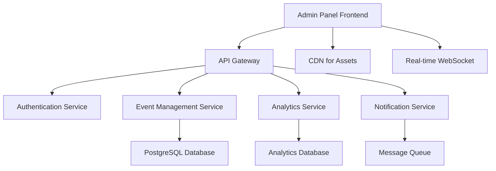

# Design Document

## Overview

The Organizer Admin Panel is designed as a modern, responsive web application built with React.js that provides event organizers with comprehensive tools for managing their events. The design emphasizes usability, performance, and scalability while maintaining consistency with the overall Bilten platform design system. The panel follows a dashboard-centric approach with modular components that can be easily extended and maintained.

## Architecture

### High-Level Architecture



### Component Architecture

The admin panel follows a hierarchical component structure:

- **Layout Components**: AdminLayout, Sidebar, Header, Footer
- **Page Components**: Dashboard, EventManagement, Analytics, Settings
- **Feature Components**: EventCreator, TicketManager, ReportsGenerator
- **UI Components**: Charts, Tables, Forms, Modals, Buttons

### State Management

The application uses React Context API combined with custom hooks for state management:

- **AuthContext**: User authentication and permissions
- **ThemeContext**: Dark/light mode and UI preferences  
- **EventContext**: Current event data and operations
- **NotificationContext**: System notifications and alerts
- **BrandingContext**: Branding settings and consistency state

### Routing Architecture

The admin panel uses React Router for navigation with protected routes:

```javascript
const AdminRoutes = {
  layout: 'AdminLayout wrapper for all admin routes',
  protection: 'Role-based route guards (admin/organizer)',
  structure: {
    '/admin/dashboard': 'Main dashboard overview',
    '/admin/events': 'Event management interface',
    '/admin/analytics': 'Analytics and reporting',
    '/admin/branding/edit': 'Branding settings configuration',
    '/admin/branding/guidelines': 'Brand guidelines management',
    '/admin/branding/domain': 'Custom domain setup',
    '/admin/branding/preview': 'Branding preview and validation'
  },
  features: [
    'Route-based component rendering',
    'URL-driven tab navigation',
    'Breadcrumb generation',
    'Deep linking support',
    'Browser history integration'
  ]
}
```

## Components and Interfaces

### Core Layout Components

#### AdminLayout Component
```javascript
// Primary layout wrapper with responsive sidebar and main content area
const AdminLayout = {
  props: {
    children: ReactNode,
    sidebarCollapsed: boolean,
    theme: 'light' | 'dark'
  },
  features: [
    'Responsive sidebar navigation',
    'Theme switching capability',
    'Breadcrumb navigation',
    'User profile dropdown',
    'Notification center'
  ]
}
```

#### Sidebar Navigation
```javascript
const Sidebar = {
  sections: [
    { name: 'Dashboard', icon: 'HomeIcon', path: '/admin' },
    { name: 'Events', icon: 'CalendarIcon', path: '/admin/events' },
    { name: 'Analytics', icon: 'ChartBarIcon', path: '/admin/analytics' },
    { name: 'Tickets', icon: 'TicketIcon', path: '/admin/tickets' },
    { name: 'Branding', icon: 'SwatchIcon', path: '/admin/branding', 
      subItems: [
        { name: 'Edit Branding', path: '/admin/branding/edit' },
        { name: 'Brand Guidelines', path: '/admin/branding/guidelines' },
        { name: 'Custom Domain', path: '/admin/branding/domain' },
        { name: 'Preview', path: '/admin/branding/preview' }
      ]
    },
    { name: 'Settings', icon: 'CogIcon', path: '/admin/settings' }
  ],
  features: [
    'Collapsible sidebar with icons',
    'Active state indication',
    'Role-based menu items',
    'Quick action buttons',
    'Hierarchical navigation with sub-items',
    'Route-based active state detection'
  ]
}
```

### Dashboard Components

#### Dashboard Overview
```javascript
const Dashboard = {
  widgets: [
    'EventSummaryCard',
    'RevenueChart',
    'TicketSalesChart', 
    'RecentActivity',
    'UpcomingEvents',
    'QuickActions'
  ],
  layout: 'responsive-grid',
  updateFrequency: 'real-time'
}
```

#### Metrics Cards
```javascript
const MetricsCard = {
  props: {
    title: string,
    value: number | string,
    change: number,
    trend: 'up' | 'down' | 'neutral',
    icon: ReactComponent
  },
  variants: [
    'TotalRevenue',
    'TicketsSold', 
    'EventsActive',
    'ConversionRate'
  ]
}
```

### Event Management Components

#### Event Creation Wizard
```javascript
const EventCreationWizard = {
  steps: [
    'BasicInformation',
    'TicketConfiguration', 
    'MediaUpload',
    'PublishingOptions'
  ],
  validation: 'step-by-step',
  persistence: 'auto-save-draft',
  features: [
    'Progress indicator',
    'Step validation',
    'Draft saving',
    'Preview mode'
  ]
}
```

#### Event List Management
```javascript
const EventListManager = {
  features: [
    'Sortable columns',
    'Filter by status/date',
    'Bulk actions',
    'Quick edit inline',
    'Export functionality'
  ],
  columns: [
    'Event Name',
    'Date',
    'Status',
    'Tickets Sold',
    'Revenue',
    'Actions'
  ]
}
```

### Analytics Components

#### Analytics Dashboard
```javascript
const AnalyticsDashboard = {
  charts: [
    'SalesOverTime',
    'RevenueBreakdown',
    'AttendeeGeographics',
    'ConversionFunnel'
  ],
  filters: [
    'DateRange',
    'EventType',
    'TicketCategory',
    'Geography'
  ],
  exports: ['PDF', 'CSV', 'Excel']
}
```

#### Chart Components
```javascript
const ChartComponents = {
  LineChart: 'Sales trends over time',
  BarChart: 'Revenue by event/category',
  PieChart: 'Ticket type distribution',
  HeatMap: 'Geographic attendance data',
  library: 'Chart.js with React wrapper'
}
```

### Branding Components

#### BrandingConsistency Component
```javascript
const BrandingConsistency = {
  routes: [
    '/admin/branding/edit',
    '/admin/branding/guidelines', 
    '/admin/branding/domain',
    '/admin/branding/preview'
  ],
  tabs: [
    'Settings - Color palette, logo, typography configuration',
    'Guidelines - Brand enforcement rules and consistency checks',
    'Domain - Custom domain setup with DNS instructions',
    'Preview - Real-time branding preview and validation'
  ],
  features: [
    'Route-based tab navigation',
    'Real-time consistency scoring',
    'Brand guidelines enforcement',
    'Custom domain configuration',
    'DNS setup instructions',
    'SSL certificate management',
    'Cross-event branding persistence'
  ]
}
```

#### Brand Settings Model
```javascript
const BrandSettingsModel = {
  primaryColor: 'string (hex)',
  secondaryColor: 'string (hex)',
  logoUrl: 'string (URL)',
  customDomain: 'string',
  fontFamily: 'string',
  brandGuidelines: {
    enforceColors: 'boolean',
    enforceLogos: 'boolean',
    enforceFonts: 'boolean',
    enforceSpacing: 'boolean'
  },
  consistencyScore: 'number (0-100)',
  domainStatus: 'pending | verified | failed',
  sslStatus: 'active | pending | failed'
}
```

## Data Models

### Event Data Model
```javascript
const EventModel = {
  id: 'uuid',
  organizerId: 'uuid',
  title: 'string',
  description: 'text',
  startDate: 'datetime',
  endDate: 'datetime',
  location: {
    venue: 'string',
    address: 'string',
    coordinates: { lat: 'number', lng: 'number' }
  },
  capacity: 'number',
  status: 'draft | published | cancelled | completed',
  ticketTypes: 'TicketType[]',
  media: 'MediaFile[]',
  settings: {
    allowWaitlist: 'boolean',
    requireApproval: 'boolean',
    isPublic: 'boolean'
  },
  createdAt: 'datetime',
  updatedAt: 'datetime'
}
```

### Ticket Type Model
```javascript
const TicketTypeModel = {
  id: 'uuid',
  eventId: 'uuid',
  name: 'string',
  description: 'string',
  price: 'decimal',
  quantity: 'number',
  sold: 'number',
  salesStart: 'datetime',
  salesEnd: 'datetime',
  settings: {
    transferable: 'boolean',
    refundable: 'boolean',
    requiresApproval: 'boolean'
  }
}
```

### Analytics Data Model
```javascript
const AnalyticsModel = {
  eventId: 'uuid',
  metrics: {
    totalRevenue: 'decimal',
    ticketsSold: 'number',
    conversionRate: 'decimal',
    averageOrderValue: 'decimal'
  },
  timeSeries: {
    date: 'date',
    sales: 'number',
    revenue: 'decimal',
    visitors: 'number'
  }[],
  demographics: {
    ageGroups: 'object',
    geography: 'object',
    referralSources: 'object'
  }
}
```

## Error Handling

### Error Boundary Implementation
```javascript
const ErrorBoundary = {
  catchErrors: [
    'Component rendering errors',
    'API call failures',
    'State update errors'
  ],
  fallbackUI: 'User-friendly error messages',
  logging: 'Automatic error reporting',
  recovery: 'Retry mechanisms where appropriate'
}
```

### API Error Handling
```javascript
const APIErrorHandling = {
  strategies: [
    'Retry with exponential backoff',
    'Graceful degradation',
    'Offline mode support',
    'User notification system'
  ],
  errorTypes: {
    network: 'Connection issues',
    authentication: 'Token expiration',
    validation: 'Form input errors',
    server: 'Internal server errors'
  }
}
```

### Form Validation
```javascript
const FormValidation = {
  clientSide: 'Real-time validation with visual feedback',
  serverSide: 'Backend validation for security',
  errorDisplay: 'Inline error messages with clear instructions',
  accessibility: 'Screen reader compatible error announcements'
}
```

## Testing Strategy

### Unit Testing
```javascript
const UnitTesting = {
  framework: 'Jest + React Testing Library',
  coverage: 'Minimum 80% code coverage',
  focus: [
    'Component rendering',
    'User interactions',
    'State management',
    'Utility functions'
  ],
  mocking: 'API calls and external dependencies'
}
```

### Integration Testing
```javascript
const IntegrationTesting = {
  scope: [
    'API integration',
    'Authentication flow',
    'Data persistence',
    'Real-time updates'
  ],
  tools: 'Cypress for E2E testing',
  environments: 'Staging environment testing'
}
```

### Performance Testing
```javascript
const PerformanceTesting = {
  metrics: [
    'Page load times < 2 seconds',
    'Bundle size optimization',
    'Memory usage monitoring',
    'Rendering performance'
  ],
  tools: [
    'Lighthouse audits',
    'React DevTools Profiler',
    'Bundle analyzer'
  ]
}
```

### Accessibility Testing
```javascript
const AccessibilityTesting = {
  standards: 'WCAG 2.1 AA compliance',
  tools: [
    'axe-core automated testing',
    'Screen reader testing',
    'Keyboard navigation testing'
  ],
  features: [
    'Semantic HTML structure',
    'ARIA labels and roles',
    'Focus management',
    'Color contrast compliance'
  ]
}
```

## Security Considerations

### Authentication & Authorization
```javascript
const Security = {
  authentication: 'JWT tokens with refresh mechanism',
  authorization: 'Role-based access control (RBAC)',
  sessionManagement: 'Secure session handling',
  tokenStorage: 'Secure token storage in httpOnly cookies'
}
```

### Data Protection
```javascript
const DataProtection = {
  encryption: 'HTTPS for all communications',
  inputSanitization: 'XSS prevention',
  csrfProtection: 'CSRF tokens for state-changing operations',
  contentSecurityPolicy: 'CSP headers for XSS prevention'
}
```

### API Security
```javascript
const APISecurity = {
  rateLimiting: 'Request rate limiting',
  inputValidation: 'Server-side validation',
  errorHandling: 'Secure error messages',
  logging: 'Security event logging'
}
```

## Performance Optimization

### Code Splitting
```javascript
const CodeSplitting = {
  strategy: 'Route-based code splitting',
  implementation: 'React.lazy() and Suspense',
  bundleOptimization: 'Webpack bundle analysis',
  lazyLoading: 'Component-level lazy loading'
}
```

### Caching Strategy
```javascript
const CachingStrategy = {
  browserCaching: 'Static asset caching',
  apiCaching: 'Response caching with cache invalidation',
  stateManagement: 'Optimized re-renders with React.memo',
  imageOptimization: 'Responsive images with lazy loading'
}
```

### Real-time Updates
```javascript
const RealTimeUpdates = {
  technology: 'WebSocket connections',
  implementation: 'Socket.io for real-time data',
  fallback: 'Polling for unsupported browsers',
  optimization: 'Selective updates to minimize re-renders'
}
```

## Responsive Design

### Breakpoint Strategy
```javascript
const ResponsiveDesign = {
  breakpoints: {
    mobile: '320px - 768px',
    tablet: '768px - 1024px', 
    desktop: '1024px+'
  },
  approach: 'Mobile-first responsive design',
  navigation: 'Collapsible sidebar on mobile',
  tables: 'Horizontal scrolling with sticky columns'
}
```

### Touch Optimization
```javascript
const TouchOptimization = {
  targets: 'Minimum 44px touch targets',
  gestures: 'Swipe navigation support',
  feedback: 'Visual feedback for touch interactions',
  accessibility: 'Touch-friendly accessibility features'
}
```

## Internationalization

### Multi-language Support
```javascript
const Internationalization = {
  framework: 'react-i18next',
  languages: ['en', 'ar', 'de', 'es', 'fr', 'it'],
  rtlSupport: 'Right-to-left language support',
  dateLocalization: 'Locale-specific date/time formatting',
  numberFormatting: 'Currency and number localization'
}
```

### Content Management
```javascript
const ContentManagement = {
  translationKeys: 'Hierarchical key structure',
  fallbacks: 'English as fallback language',
  dynamicLoading: 'Lazy loading of translation files',
  pluralization: 'Proper plural form handling'
}
```