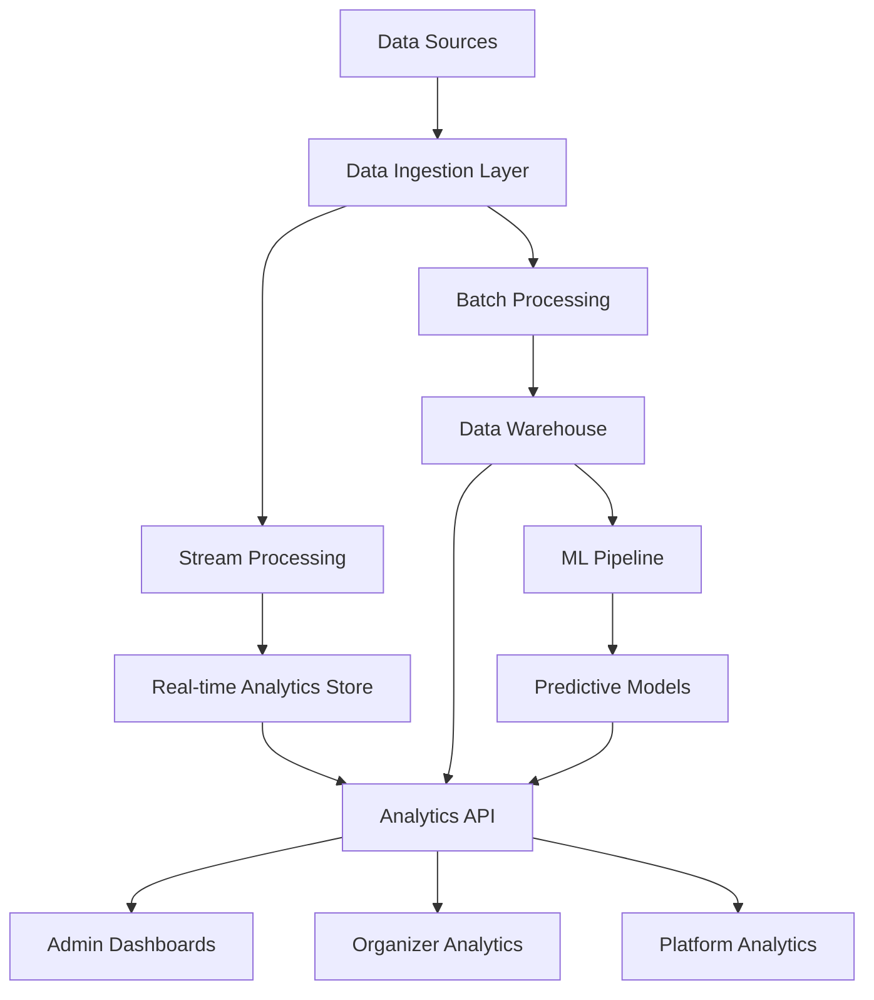
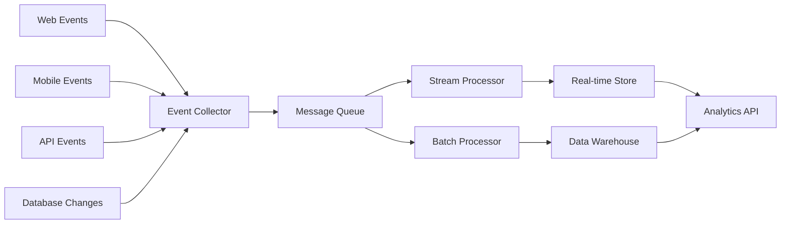

# Design Document

## Overview

The Analytics Service is designed as a scalable, real-time data processing platform that provides comprehensive analytics capabilities for the Bilten ecosystem. Built using modern data engineering practices, it handles high-volume data ingestion, real-time processing, and interactive analytics. The service supports both operational analytics for day-to-day decision making and strategic analytics for business intelligence.

## Architecture

### High-Level Architecture



### Data Flow Architecture



### Component Architecture

The analytics service follows a microservices architecture:

- **Data Ingestion**: Event collectors, message queues, data validation
- **Processing Layer**: Stream processing, batch processing, data transformation
- **Storage Layer**: Real-time stores, data warehouse, metadata management
- **Analytics Layer**: Query engine, aggregation service, ML pipeline
- **API Layer**: REST APIs, GraphQL, real-time subscriptions
- **Visualization**: Dashboard service, report generator, embedding service

## Components and Interfaces

### Data Ingestion Components

#### Event Collector Service
```javascript
const EventCollector = {
  endpoints: [
    '/events/track - General event tracking',
    '/events/page - Page view tracking',
    '/events/conversion - Conversion tracking',
    '/events/custom - Custom event tracking'
  ],
  features: [
    'High-throughput event ingestion',
    'Data validation and sanitization',
    'Duplicate detection and deduplication',
    'Schema evolution support',
    'Rate limiting and throttling'
  ],
  protocols: ['HTTP/HTTPS', 'WebSocket', 'Server-Sent Events']
}
```

#### Data Validation Pipeline
```javascript
const DataValidation = {
  stages: [
    'Schema validation against event definitions',
    'Data type validation and coercion',
    'Business rule validation',
    'Privacy compliance checking',
    'Data enrichment and normalization'
  ],
  errorHandling: [
    'Invalid data quarantine',
    'Error logging and alerting',
    'Data recovery mechanisms',
    'Schema migration support'
  ]
}
```

### Processing Components

#### Stream Processing Engine
```javascript
const StreamProcessor = {
  framework: 'Apache Kafka Streams / Apache Flink',
  capabilities: [
    'Real-time event processing',
    'Windowed aggregations',
    'Complex event pattern detection',
    'Stream joins and enrichment',
    'Exactly-once processing guarantees'
  ],
  outputs: [
    'Real-time metrics and KPIs',
    'Alert triggers and notifications',
    'Live dashboard updates',
    'Real-time recommendations'
  ]
}
```

#### Batch Processing Pipeline
```javascript
const BatchProcessor = {
  framework: 'Apache Spark / Apache Airflow',
  schedules: [
    'Hourly aggregations for recent data',
    'Daily rollups for historical analysis',
    'Weekly cohort analysis',
    'Monthly business intelligence reports'
  ],
  transformations: [
    'Data cleaning and normalization',
    'Dimension table updates',
    'Fact table population',
    'Pre-computed aggregations',
    'ML feature engineering'
  ]
}
```

### Storage Components

#### Real-time Analytics Store
```javascript
const RealTimeStore = {
  technology: 'Apache Druid / ClickHouse',
  characteristics: [
    'Sub-second query response times',
    'High ingestion throughput',
    'Automatic data rollup',
    'Time-based partitioning',
    'Approximate query capabilities'
  ],
  dataRetention: [
    'Raw data: 7 days',
    'Minute-level aggregates: 30 days',
    'Hour-level aggregates: 1 year',
    'Day-level aggregates: 5 years'
  ]
}
```

#### Data Warehouse
```javascript
const DataWarehouse = {
  technology: 'PostgreSQL / Amazon Redshift / Snowflake',
  schema: 'Star schema with fact and dimension tables',
  tables: [
    'fact_events - Core event tracking data',
    'fact_sessions - User session aggregates',
    'fact_conversions - Conversion tracking',
    'dim_users - User dimension data',
    'dim_events - Event dimension data',
    'dim_time - Time dimension for analysis'
  ],
  optimization: [
    'Columnar storage for analytics',
    'Partitioning by date and tenant',
    'Materialized views for common queries',
    'Automated vacuum and analyze'
  ]
}
```

### Analytics Components

#### Query Engine
```javascript
const QueryEngine = {
  capabilities: [
    'SQL query interface',
    'GraphQL for complex queries',
    'REST API for simple metrics',
    'Real-time query optimization',
    'Query result caching'
  ],
  features: [
    'Multi-tenant data isolation',
    'Query performance monitoring',
    'Automatic query rewriting',
    'Result set pagination',
    'Query timeout management'
  ]
}
```

#### Aggregation Service
```javascript
const AggregationService = {
  preComputedMetrics: [
    'Daily active users (DAU)',
    'Monthly active users (MAU)',
    'Event conversion rates',
    'Revenue by time period',
    'Geographic distribution'
  ],
  realTimeMetrics: [
    'Current active sessions',
    'Live event registrations',
    'Real-time revenue tracking',
    'System performance metrics'
  ],
  customMetrics: [
    'User-defined KPIs',
    'Custom funnel analysis',
    'Cohort retention rates',
    'A/B test results'
  ]
}
```

### Machine Learning Pipeline

#### Predictive Analytics Engine
```javascript
const MLPipeline = {
  models: [
    'User churn prediction',
    'Event success forecasting',
    'Revenue prediction',
    'Demand forecasting',
    'Anomaly detection'
  ],
  framework: 'Apache Spark MLlib / TensorFlow / PyTorch',
  pipeline: [
    'Feature extraction and engineering',
    'Model training and validation',
    'Model deployment and serving',
    'Performance monitoring and retraining'
  ],
  outputs: [
    'Prediction scores and probabilities',
    'Recommendation engines',
    'Automated alerts and insights',
    'Business intelligence reports'
  ]
}
```

## Data Models

### Event Tracking Model
```javascript
const EventModel = {
  eventId: 'uuid',
  sessionId: 'uuid',
  userId: 'uuid | null',
  eventType: 'page_view | click | conversion | custom',
  eventName: 'string',
  timestamp: 'datetime with timezone',
  properties: {
    page: 'string',
    referrer: 'string',
    userAgent: 'string',
    ipAddress: 'string (hashed)',
    customProperties: 'json'
  },
  context: {
    organizerId: 'uuid | null',
    eventId: 'uuid | null',
    campaignId: 'uuid | null',
    source: 'web | mobile | api'
  }
}
```

### Analytics Metrics Model
```javascript
const MetricsModel = {
  metricId: 'uuid',
  metricName: 'string',
  metricType: 'counter | gauge | histogram | timer',
  dimensions: {
    organizerId: 'uuid | null',
    eventId: 'uuid | null',
    timeGranularity: 'minute | hour | day | week | month',
    customDimensions: 'json'
  },
  value: 'decimal',
  timestamp: 'datetime',
  metadata: {
    calculationMethod: 'string',
    dataSource: 'string',
    confidence: 'decimal'
  }
}
```

### User Analytics Model
```javascript
const UserAnalyticsModel = {
  userId: 'uuid',
  organizerId: 'uuid | null',
  sessionMetrics: {
    totalSessions: 'number',
    averageSessionDuration: 'interval',
    lastSessionAt: 'datetime',
    deviceTypes: 'string[]',
    browsers: 'string[]'
  },
  engagementMetrics: {
    pageViews: 'number',
    eventsViewed: 'number',
    ticketsPurchased: 'number',
    totalSpent: 'decimal',
    averageOrderValue: 'decimal'
  },
  behaviorMetrics: {
    preferredCategories: 'string[]',
    timeOfDayActivity: 'json',
    dayOfWeekActivity: 'json',
    conversionFunnel: 'json'
  }
}
```

## API Design

### Analytics REST API
```javascript
const AnalyticsAPI = {
  endpoints: {
    'GET /analytics/metrics': 'Retrieve metric values',
    'GET /analytics/events/{eventId}': 'Event-specific analytics',
    'GET /analytics/users/{userId}': 'User behavior analytics',
    'GET /analytics/funnels': 'Conversion funnel analysis',
    'GET /analytics/cohorts': 'Cohort analysis data',
    'POST /analytics/queries': 'Custom query execution',
    'GET /analytics/reports/{reportId}': 'Scheduled report results'
  },
  authentication: 'JWT tokens with scope-based access',
  rateLimit: '1000 requests per minute per API key',
  caching: 'Redis-based result caching with TTL'
}
```

### Real-time Analytics WebSocket
```javascript
const RealTimeAPI = {
  connections: [
    '/ws/analytics/live - Live metric updates',
    '/ws/analytics/alerts - Real-time alert notifications',
    '/ws/analytics/events/{eventId} - Event-specific live data'
  ],
  messageTypes: [
    'metric_update - Real-time metric changes',
    'alert_triggered - System or business alerts',
    'data_refresh - Dashboard data updates'
  ],
  authentication: 'WebSocket token-based authentication'
}
```

## Performance Optimization

### Query Performance
```javascript
const QueryOptimization = {
  strategies: [
    'Materialized views for common queries',
    'Columnar storage for analytical workloads',
    'Partitioning by time and tenant',
    'Indexing on frequently queried dimensions',
    'Query result caching with intelligent invalidation'
  ],
  monitoring: [
    'Query execution time tracking',
    'Resource utilization monitoring',
    'Slow query identification and optimization',
    'Cache hit rate monitoring'
  ]
}
```

### Scalability Design
```javascript
const ScalabilityFeatures = {
  horizontalScaling: [
    'Microservices architecture',
    'Stateless service design',
    'Load balancing across instances',
    'Auto-scaling based on demand'
  ],
  dataPartitioning: [
    'Time-based partitioning',
    'Tenant-based data isolation',
    'Sharding for high-volume data',
    'Automated partition management'
  ],
  caching: [
    'Multi-layer caching strategy',
    'CDN for static analytics assets',
    'In-memory caching for hot data',
    'Distributed caching for scalability'
  ]
}
```

## Security and Privacy

### Data Protection
```javascript
const DataSecurity = {
  encryption: [
    'Encryption at rest for all stored data',
    'Encryption in transit for all communications',
    'Field-level encryption for sensitive data',
    'Key rotation and management'
  ],
  privacy: [
    'PII anonymization and pseudonymization',
    'Consent-based data collection',
    'Right to be forgotten implementation',
    'Data minimization principles'
  ],
  access: [
    'Role-based access control',
    'API key management and rotation',
    'Audit logging for all data access',
    'IP whitelisting for sensitive operations'
  ]
}
```

### Compliance Framework
```javascript
const ComplianceFeatures = {
  regulations: ['GDPR', 'CCPA', 'PIPEDA', 'LGPD'],
  capabilities: [
    'Consent management integration',
    'Data subject rights automation',
    'Privacy impact assessments',
    'Breach notification workflows',
    'Data retention policy enforcement'
  ],
  auditing: [
    'Comprehensive audit trails',
    'Data lineage tracking',
    'Access pattern monitoring',
    'Compliance reporting automation'
  ]
}
```