# Internationalization Design Document

## Overview

The Internationalization (i18n) system provides comprehensive multi-language and multi-region support for the Bilten platform through centralized translation management, locale-aware formatting, cultural adaptation, and regional compliance features. The system uses modern i18n frameworks and practices to deliver seamless localized experiences across web, mobile, and API interfaces.

## Architecture

```mermaid
graph TB
    Client[Client Applications] --> I18nAPI[Internationalization API]
    
    I18nAPI --> TranslationService[Translation Service]
    I18nAPI --> LocaleService[Locale Service]
    I18nAPI --> FormatService[Formatting Service]
    I18nAPI --> CultureService[Cultural Adaptation Service]
    
    TranslationService --> TranslationDB[(Translation Database)]
    TranslationService --> TranslationCache[Translation Cache - Redis]
    TranslationService --> TranslationCDN[Translation CDN]
    
    LocaleService --> LocaleDB[(Locale Configuration DB)]
    LocaleService --> GeoIP[GeoIP Service]
    LocaleService --> UserPreferences[User Preferences]
    
    FormatService --> CurrencyAPI[Currency Exchange API]
    FormatService --> TimezoneDB[Timezone Database]
    FormatService --> NumberFormats[Number Format Rules]
    
    CultureService --> CulturalRules[Cultural Rules Engine]
    CultureService --> RegionalCompliance[Regional Compliance]
    
    TranslationManagement[Translation Management Portal] --> TranslationDB
    TranslationManagement --> WorkflowEngine[Translation Workflow]
    TranslationManagement --> QualityAssurance[Translation QA]
    
    ExternalServices[External Services] --> TranslationProviders[Translation Service Providers]
    ExternalServices --> LocalizationTools[Localization Tools]
    
    Analytics[i18n Analytics] --> UsageTracking[Language Usage Tracking]
    Analytics --> QualityMetrics[Translation Quality Metrics]
```



## Components and Interfaces

### Internationalization API Service
- **Purpose**: Central API for all i18n operations and localized content delivery
- **Key Methods**:
  - `getTranslations(locale, namespace, keys)`
  - `formatCurrency(amount, currency, locale)`
  - `formatDateTime(date, locale, timezone)`
  - `detectUserLocale(request, preferences)`

### Translation Service
- **Purpose**: Manage translation content and multilingual text delivery
- **Key Methods**:
  - `translateText(key, locale, interpolations)`
  - `getTranslationBundle(locale, namespace)`
  - `updateTranslation(key, locale, value, metadata)`
  - `validateTranslationCompleteness(locale, namespace)`

### Locale Service
- **Purpose**: Handle locale detection, user preferences, and regional settings
- **Key Methods**:
  - `detectLocale(ipAddress, headers, userAgent)`
  - `getUserLocalePreferences(userId)`
  - `setUserLocale(userId, locale, timezone, currency)`
  - `getSupportedLocales()`

### Formatting Service
- **Purpose**: Provide locale-aware formatting for dates, numbers, and currencies
- **Key Methods**:
  - `formatNumber(number, locale, options)`
  - `formatCurrency(amount, currency, locale)`
  - `formatDate(date, locale, format, timezone)`
  - `formatAddress(address, countryCode)`

### Cultural Adaptation Service
- **Purpose**: Handle cultural preferences and regional compliance
- **Key Methods**:
  - `getCulturalPreferences(locale, context)`
  - `adaptContent(content, locale, culturalRules)`
  - `validateRegionalCompliance(content, region)`
  - `getLocalizedAssets(locale, assetType)`

## Data Models

### Translation Model
```typescript
interface Translation {
  id: string;
  key: string;
  namespace: string;
  
  // Content
  value: string;
  description?: string;
  context?: string;
  
  // Localization
  locale: string;
  pluralForms?: Record<string, string>;
  interpolations?: string[];
  
  // Metadata
  status: 'draft' | 'pending_review' | 'approved' | 'published' | 'deprecated';
  quality: 'machine' | 'human' | 'professional' | 'native';
  
  // Workflow
  translatedBy?: string;
  reviewedBy?: string;
  approvedBy?: string;
  
  // Versioning
  version: number;
  sourceVersion?: number;
  lastModified: Date;
  
  // Usage tracking
  usageCount: number;
  lastUsed?: Date;
  
  createdAt: Date;
  updatedAt: Date;
}
```

### Locale Configuration Model
```typescript
interface LocaleConfiguration {
  id: string;
  code: string; // e.g., 'en-US', 'fr-FR', 'ja-JP'
  
  // Language information
  language: string;
  region: string;
  displayName: string;
  nativeName: string;
  
  // Formatting preferences
  dateFormat: string;
  timeFormat: string;
  numberFormat: NumberFormatConfig;
  currencyFormat: CurrencyFormatConfig;
  
  // Cultural preferences
  textDirection: 'ltr' | 'rtl';
  firstDayOfWeek: number;
  weekendDays: number[];
  
  // Regional settings
  timezone: string;
  currency: string;
  phoneFormat: string;
  addressFormat: AddressFormatConfig;
  
  // Platform support
  isSupported: boolean;
  isDefault: boolean;
  fallbackLocale: string;
  
  // Compliance
  dataResidencyRequirements?: string[];
  legalRequirements?: string[];
  
  createdAt: Date;
  updatedAt: Date;
}

interface NumberFormatConfig {
  decimalSeparator: string;
  thousandsSeparator: string;
  decimalPlaces: number;
  negativeFormat: string;
}

interface CurrencyFormatConfig {
  symbol: string;
  position: 'before' | 'after';
  spacing: boolean;
  decimalPlaces: number;
}
```

### User Locale Preferences Model
```typescript
interface UserLocalePreferences {
  userId: string;
  
  // Primary preferences
  locale: string;
  timezone: string;
  currency: string;
  
  // Formatting preferences
  dateFormat?: string;
  timeFormat?: '12h' | '24h';
  numberFormat?: 'local' | 'international';
  
  // Language preferences
  preferredLanguages: string[];
  fallbackLanguage: string;
  
  // Cultural preferences
  culturalAdaptations: boolean;
  localizedContent: boolean;
  
  // Detection settings
  autoDetectLocale: boolean;
  autoDetectTimezone: boolean;
  
  // Accessibility
  textDirection?: 'ltr' | 'rtl';
  fontPreferences?: string[];
  
  lastUpdated: Date;
  detectedFrom?: 'browser' | 'ip' | 'manual' | 'device';
}
```

### Translation Workflow Model
```typescript
interface TranslationWorkflow {
  id: string;
  projectId: string;
  
  // Workflow details
  sourceLocale: string;
  targetLocales: string[];
  namespace: string;
  
  // Content
  keys: string[];
  totalKeys: number;
  translatedKeys: number;
  reviewedKeys: number;
  approvedKeys: number;
  
  // Status
  status: 'created' | 'in_progress' | 'review' | 'completed' | 'cancelled';
  priority: 'low' | 'medium' | 'high' | 'urgent';
  
  // Assignment
  translators: WorkflowAssignment[];
  reviewers: WorkflowAssignment[];
  
  // Timeline
  deadline?: Date;
  estimatedHours?: number;
  actualHours?: number;
  
  // Quality metrics
  qualityScore?: number;
  errorCount?: number;
  
  createdAt: Date;
  updatedAt: Date;
  completedAt?: Date;
}

interface WorkflowAssignment {
  userId: string;
  role: 'translator' | 'reviewer' | 'approver';
  languages: string[];
  assignedAt: Date;
  completedAt?: Date;
}
```

### Cultural Rule Model
```typescript
interface CulturalRule {
  id: string;
  locale: string;
  category: 'color' | 'imagery' | 'layout' | 'content' | 'behavior';
  
  // Rule definition
  name: string;
  description: string;
  rule: CulturalRuleDefinition;
  
  // Application
  contexts: string[];
  priority: number;
  
  // Status
  isActive: boolean;
  
  createdAt: Date;
  updatedAt: Date;
}

interface CulturalRuleDefinition {
  type: 'avoid' | 'prefer' | 'require' | 'adapt';
  condition: string;
  action: string;
  parameters?: Record<string, any>;
}
```

## Error Handling

### Internationalization Errors
- **TranslationNotFoundError**: When requested translation key doesn't exist
- **UnsupportedLocaleError**: When requested locale is not supported
- **FormattingError**: When locale-specific formatting fails
- **CulturalAdaptationError**: When cultural rule application fails
- **TranslationWorkflowError**: When translation workflow operations fail

### Fallback Strategies
- **Translation Fallback**: Key → Namespace default → Locale fallback → English → Key display
- **Locale Fallback**: Requested locale → Language fallback → Default locale → English
- **Formatting Fallback**: Locale format → Language format → Default format → ISO format

### Error Response Format
```json
{
  "error": {
    "code": "TRANSLATION_NOT_FOUND",
    "message": "Translation not found for key",
    "details": "Key 'event.title' not found for locale 'fr-FR'",
    "timestamp": "2024-01-15T10:30:00Z",
    "fallback": "event.title",
    "locale": "fr-FR"
  }
}
```

## Testing Strategy

### Unit Testing
- Translation key resolution and fallback logic
- Locale detection and preference handling
- Formatting functions for different locales
- Cultural rule application and validation
- Translation workflow state management

### Integration Testing
- End-to-end translation delivery pipeline
- Multi-locale user experience flows
- Currency and date formatting accuracy
- Cultural adaptation across different regions
- Translation management workflow integration

### Localization Testing
- Translation quality and completeness validation
- Cultural appropriateness verification
- Layout and UI adaptation for different languages
- Performance with large translation datasets
- Accessibility compliance across locales

### Performance Testing
- Translation cache performance and hit rates
- Large-scale translation bundle delivery
- Concurrent multi-locale request handling
- CDN performance for translation assets
- Database query optimization for translations

## Security Considerations

### Data Protection
- Encryption of translation data in transit and at rest
- Access control for translation management
- Audit logging for translation changes
- PII handling in translatable content
- Secure translation workflow management

### Regional Compliance
- GDPR compliance for EU locales
- Data residency requirements by region
- Local privacy law compliance
- Accessibility standard compliance
- Content regulation compliance

### Translation Security
- Validation of user-generated translations
- Prevention of malicious content injection
- Secure handling of translation workflows
- Protection against translation manipulation
- Audit trails for translation approvals

## Performance Optimization

### Caching Strategies
- Multi-level translation caching (memory, Redis, CDN)
- Locale-specific cache warming
- Translation bundle optimization
- Lazy loading of translation namespaces
- Cache invalidation strategies

### Delivery Optimization
- CDN distribution of translation assets
- Compression of translation bundles
- Progressive loading of translations
- Client-side translation caching
- Efficient translation key lookup

### Scalability Features
- Horizontal scaling of translation services
- Database sharding for translation data
- Asynchronous translation processing
- Batch translation operations
- Load balancing across regions

## API Endpoints

### Translation Operations
```
GET /api/i18n/translations/{locale}
GET /api/i18n/translations/{locale}/{namespace}
POST /api/i18n/translations/batch
PUT /api/i18n/translations/{key}
DELETE /api/i18n/translations/{key}
```

### Locale Management
```
GET /api/i18n/locales
GET /api/i18n/locales/{locale}
POST /api/i18n/locales/detect
GET /api/i18n/user/{userId}/preferences
PUT /api/i18n/user/{userId}/preferences
```

### Formatting Services
```
POST /api/i18n/format/currency
POST /api/i18n/format/date
POST /api/i18n/format/number
POST /api/i18n/format/address
```

### Translation Management
```
GET /api/i18n/workflows
POST /api/i18n/workflows
PUT /api/i18n/workflows/{workflowId}
GET /api/i18n/analytics/usage
GET /api/i18n/analytics/quality
```