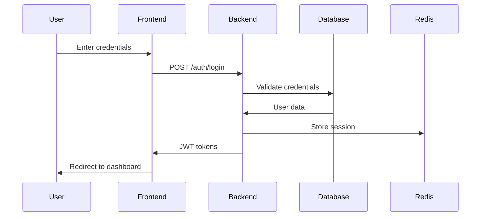
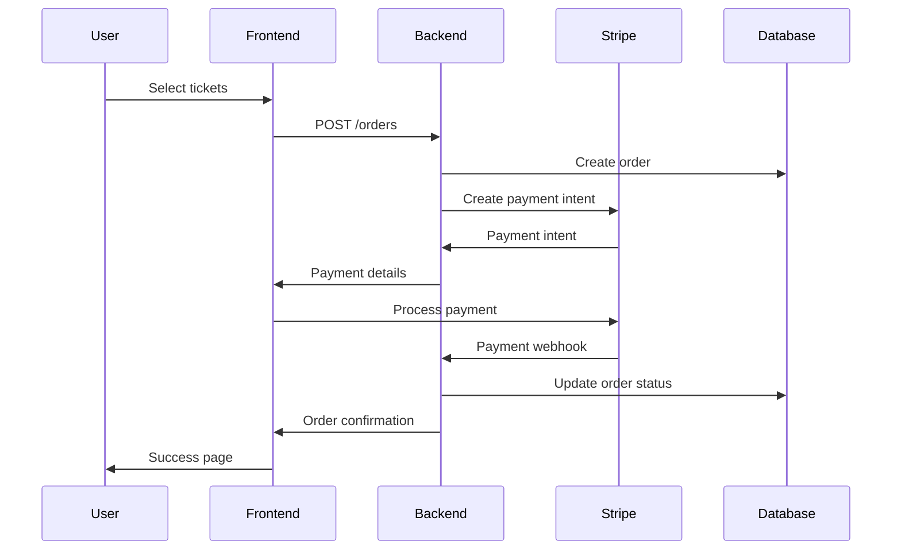
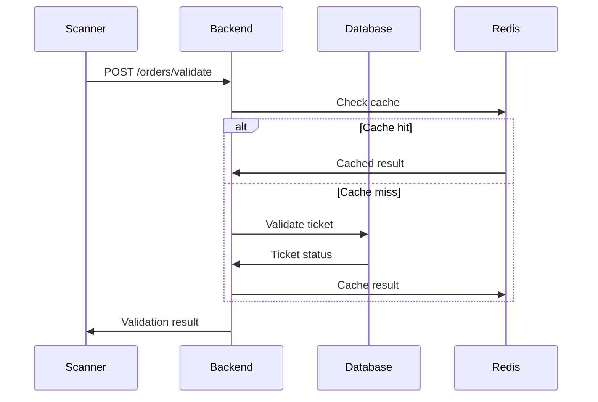
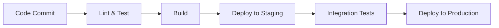

# 🏗️ System Architecture

This document provides a comprehensive overview of the Bilten platform's system architecture, including the technology stack, component interactions, and design patterns.

## 📋 Table of Contents

- [Overview](#overview)
- [Technology Stack](#technology-stack)
- [System Components](#system-components)
- [Data Flow](#data-flow)
- [Security Architecture](#security-architecture)
- [Scalability](#scalability)
- [Performance](#performance)
- [Deployment Architecture](#deployment-architecture)

## 🎯 Overview

Bilten is built as a modern, scalable, microservices-inspired architecture with three main applications:

1. **Frontend Application** - React-based web application
2. **Backend API** - Node.js/Express REST API
3. **Scanner Application** - Progressive Web App (PWA)

## 🛠️ Technology Stack

### Frontend Stack
- **Framework**: React 19.1.1
- **Language**: TypeScript/JavaScript
- **Styling**: Tailwind CSS
- **State Management**: React Context + Custom Hooks
- **Routing**: React Router v6
- **HTTP Client**: Axios
- **Internationalization**: react-i18next
- **Build Tool**: Vite

### Backend Stack
- **Runtime**: Node.js 18+
- **Framework**: Express.js
- **Language**: JavaScript/TypeScript
- **Database**: PostgreSQL 15+
- **Cache**: Redis 7+
- **ORM**: Knex.js
- **Authentication**: JWT
- **Validation**: Joi
- **Testing**: Jest

### Infrastructure
- **Containerization**: Docker & Docker Compose
- **Cloud Storage**: AWS S3
- **CDN**: CloudFront
- **Payment Processing**: Stripe
- **Email Service**: Nodemailer
- **Monitoring**: New Relic
- **Logging**: Winston

## 🧩 System Components

### High-Level Architecture

```
┌─────────────────────────────────────────────────────────────────┐
│                        Client Layer                             │
├─────────────────────────────────────────────────────────────────┤
│  Web Browser (React App)  │  Mobile Browser (Scanner PWA)      │
└─────────────────────┬───────────────────────────────────────────┘
                      │
┌─────────────────────▼───────────────────────────────────────────┐
│                      API Gateway                                │
│                    (Express.js)                                 │
└─────────────────────┬───────────────────────────────────────────┘
                      │
┌─────────────────────▼───────────────────────────────────────────┐
│                    Application Layer                            │
├─────────────────────────────────────────────────────────────────┤
│  Auth Service  │  Event Service  │  Payment Service  │  ...     │
└─────────────────────┬───────────────────────────────────────────┘
                      │
┌─────────────────────▼───────────────────────────────────────────┐
│                     Data Layer                                  │
├─────────────────────────────────────────────────────────────────┤
│  PostgreSQL  │  Redis Cache  │  AWS S3  │  External APIs       │
└─────────────────────────────────────────────────────────────────┘
```

### Component Details

#### 1. Frontend Application (`bilten-frontend`)

**Purpose**: Main web interface for users and organizers

**Key Features**:
- Responsive design with mobile-first approach
- Multi-language support (English, Arabic, German, Spanish, French, Italian)
- RTL support for Arabic
- Progressive Web App capabilities
- Real-time updates via WebSocket connections

**Architecture**:
```
src/
├── components/          # Reusable UI components
│   ├── admin/          # Admin-specific components
│   ├── analytics/      # Analytics and reporting components
│   └── common/         # Shared components
├── pages/              # Page-level components
│   ├── auth/           # Authentication pages
│   ├── events/         # Event-related pages
│   ├── admin/          # Admin dashboard pages
│   └── user/           # User profile pages
├── hooks/              # Custom React hooks
├── services/           # API service layer
├── context/            # React context providers
├── utils/              # Utility functions
└── styles/             # Global styles and themes
```

#### 2. Backend API (`src/`)

**Purpose**: RESTful API serving all client applications

**Key Features**:
- RESTful API design
- JWT-based authentication
- Role-based access control
- Rate limiting
- Request validation
- Error handling
- Logging and monitoring

**Architecture**:
```
src/
├── routes/             # API route definitions
│   ├── core/           # Core business routes
│   ├── business/       # Business logic routes
│   ├── content/        # Content management routes
│   ├── system/         # System management routes
│   └── utility/        # Utility routes
├── controllers/        # Request handlers
├── middleware/         # Express middleware
├── services/           # Business logic services
├── models/             # Data models
├── utils/              # Utility functions
└── config/             # Configuration files
```

#### 3. Scanner Application (`bilten-scanner`)

**Purpose**: Mobile-optimized PWA for ticket validation

**Key Features**:
- QR code scanning
- Offline capability
- Real-time ticket validation
- Event staff interface

**Architecture**:
```
src/
├── qr-scanner.js       # QR code scanning logic
├── ticket-validator.js # Ticket validation logic
├── ui.js              # User interface components
├── settings.js        # Application settings
└── main.js           # Application entry point
```

## 🔄 Data Flow

### User Authentication Flow



### Event Booking Flow



### Ticket Validation Flow



## 🔒 Security Architecture

### Authentication & Authorization

1. **JWT Tokens**
   - Access tokens (short-lived, 24 hours)
   - Refresh tokens (long-lived, 30 days)
   - Secure token storage in HTTP-only cookies

2. **Role-Based Access Control (RBAC)**
   - **Admin**: Full system access
   - **Organizer**: Event management access
   - **Attendee**: Basic user access

3. **API Security**
   - Rate limiting per IP and user
   - Input validation and sanitization
   - CORS configuration
   - Helmet.js security headers

### Data Protection

1. **Database Security**
   - Encrypted connections (SSL/TLS)
   - Parameterized queries (SQL injection prevention)
   - Database user permissions

2. **File Storage Security**
   - AWS S3 with signed URLs
   - File type validation
   - Virus scanning integration

3. **Payment Security**
   - PCI DSS compliance via Stripe
   - No sensitive payment data storage
   - Webhook signature verification

## 📈 Scalability

### Horizontal Scaling

1. **Load Balancing**
   - Multiple API instances behind load balancer
   - Session storage in Redis (shared across instances)
   - Database connection pooling

2. **Database Scaling**
   - Read replicas for read-heavy operations
   - Database sharding for large datasets
   - Connection pooling optimization

3. **Caching Strategy**
   - Redis for session storage
   - Redis for API response caching
   - CDN for static assets

### Vertical Scaling

1. **Resource Optimization**
   - Memory usage optimization
   - CPU utilization monitoring
   - Database query optimization

2. **Performance Monitoring**
   - New Relic APM integration
   - Custom performance metrics
   - Alert system for performance issues

## ⚡ Performance

### Frontend Performance

1. **Code Splitting**
   - Route-based code splitting
   - Component lazy loading
   - Bundle size optimization

2. **Asset Optimization**
   - Image compression and optimization
   - CSS/JS minification
   - Gzip compression

3. **Caching Strategy**
   - Browser caching
   - Service worker for offline support
   - CDN for static assets

### Backend Performance

1. **Database Optimization**
   - Indexed queries
   - Query optimization
   - Connection pooling

2. **API Optimization**
   - Response caching
   - Pagination
   - Data filtering

3. **Monitoring**
   - Response time monitoring
   - Error rate tracking
   - Resource utilization

## 🚀 Deployment Architecture

### Development Environment

```
┌─────────────────────────────────────────────────────────────────┐
│                    Development Setup                            │
├─────────────────────────────────────────────────────────────────┤
│  Frontend (Port 3000)  │  Backend (Port 3001)  │  Scanner (Port 3002) │
└─────────────────────┬───────────────────────────────────────────┘
                      │
┌─────────────────────▼───────────────────────────────────────────┐
│                    Local Services                               │
├─────────────────────────────────────────────────────────────────┤
│  PostgreSQL  │  Redis  │  Docker Compose                       │
└─────────────────────────────────────────────────────────────────┘
```

### Production Environment

```
┌─────────────────────────────────────────────────────────────────┐
│                    Production Infrastructure                    │
├─────────────────────────────────────────────────────────────────┤
│  Load Balancer (NGINX/ALB)                                      │
└─────────────────────┬───────────────────────────────────────────┘
                      │
┌─────────────────────▼───────────────────────────────────────────┐
│                    Application Servers                          │
├─────────────────────────────────────────────────────────────────┤
│  Frontend (S3 + CloudFront)  │  Backend (EC2/ECS)  │  Scanner (S3) │
└─────────────────────┬───────────────────────────────────────────┘
                      │
┌─────────────────────▼───────────────────────────────────────────┐
│                    Data Layer                                   │
├─────────────────────────────────────────────────────────────────┤
│  RDS PostgreSQL  │  ElastiCache Redis  │  S3 Storage           │
└─────────────────────────────────────────────────────────────────┘
```

### Container Architecture

```yaml
# docker-compose.yml
version: '3.8'
services:
  frontend:
    build: ./bilten-frontend
    ports:
      - "3000:3000"
    environment:
      - REACT_APP_API_URL=http://localhost:3001/v1

  backend:
    build: .
    ports:
      - "3001:3001"
    environment:
      - NODE_ENV=development
      - DB_HOST=postgres
      - REDIS_HOST=redis
    depends_on:
      - postgres
      - redis

  scanner:
    build: ./bilten-scanner
    ports:
      - "3002:3002"

  postgres:
    image: postgres:15
    environment:
      - POSTGRES_DB=bilten_db
      - POSTGRES_USER=bilten_user
      - POSTGRES_PASSWORD=password
    volumes:
      - postgres_data:/var/lib/postgresql/data

  redis:
    image: redis:7-alpine
    ports:
      - "6379:6379"
```

## 🔧 Configuration Management

### Environment Variables

```bash
# Database
DB_HOST=localhost
DB_PORT=5432
DB_NAME=bilten_db
DB_USER=bilten_user
DB_PASSWORD=secure_password

# Redis
REDIS_HOST=localhost
REDIS_PORT=6379
REDIS_PASSWORD=

# JWT
JWT_SECRET=your_jwt_secret
JWT_EXPIRES_IN=24h

# AWS
AWS_ACCESS_KEY_ID=your_key
AWS_SECRET_ACCESS_KEY=your_secret
AWS_REGION=us-east-1
AWS_S3_BUCKET=bilten-files

# Stripe
STRIPE_SECRET_KEY=sk_test_...
STRIPE_WEBHOOK_SECRET=whsec_...

# Email
SMTP_HOST=smtp.gmail.com
SMTP_PORT=587
SMTP_USER=your_email
SMTP_PASS=your_password
```

## 📊 Monitoring & Observability

### Application Monitoring

1. **New Relic Integration**
   - Performance monitoring
   - Error tracking
   - Custom metrics

2. **Logging**
   - Winston logger
   - Structured logging
   - Log aggregation

3. **Health Checks**
   - API health endpoints
   - Database connectivity
   - External service status

### Metrics & Alerts

1. **Key Metrics**
   - Response time
   - Error rate
   - Throughput
   - Resource utilization

2. **Alerting**
   - Performance degradation
   - Error rate spikes
   - Service downtime

## 🔄 CI/CD Pipeline

### Development Workflow



### Pipeline Stages

1. **Code Quality**
   - ESLint checks
   - Prettier formatting
   - TypeScript compilation

2. **Testing**
   - Unit tests
   - Integration tests
   - E2E tests

3. **Security**
   - Dependency scanning
   - Code security analysis
   - Container scanning

4. **Deployment**
   - Docker image building
   - Infrastructure provisioning
   - Application deployment

## 📚 Additional Resources

- [API Documentation](API-Documentation)
- [Database Schema](Database-Schema)
- [Security Best Practices](Security-Best-Practices)
- [Performance Optimization](Performance-Optimization)
- [Deployment Guide](Deployment-Guide)

---

**Need help?** Check our [Architecture Examples](Architecture-Examples) or create an issue on GitHub!
